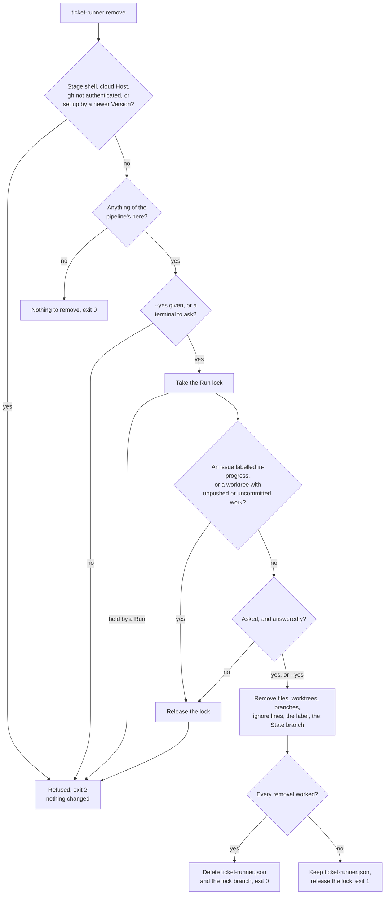

# Install and remove

A Run works unattended, so anything missing has to be caught before it starts, not halfway through a Ticket. Without a setup step, you would learn what a repository needs (ignored directories, triage labels, squash merging, the conventions a Stage reads) by reading the source, or a Run would put it there on the fly. The setup is split three ways instead. `init` puts in place what the pipeline can write itself and reports what only you can fix. `run` checks the same list and refuses a [Target](https://github.com/jjongs2/ticket-runner/blob/main/CONTEXT.md) (the repository you start it in) that is missing any of it, without repairing anything. `remove` undoes both `init` and whatever Runs left behind, so trying the pipeline on a repository of your own is safe.

| Step | Command | What it does |
|---|---|---|
| Install | `npm install -g ticket-runner` | Puts the `ticket-runner` command on the machine |
| Set a Target up | `ticket-runner init` | Writes the pipeline's files, sets up GitHub, reports the rest |
| Start work | `ticket-runner run` | Refuses a Target that is not set up; see [Running](./running.md) |
| Take it out | `ticket-runner remove` | Removes what `init` wrote and what Runs left |
| Uninstall | `npm uninstall -g ticket-runner` | Removes the command from the machine |

## Requirements

| Requirement | Why | Checked by |
|---|---|---|
| Node 22 or newer | The package's `engines` field | npm, at install |
| `git` | Every Ticket gets its own worktree and branch | – |
| [`gh`](https://cli.github.com/), authenticated for the Target | Every GitHub call goes through `gh api` | `init` reports it; `run` refuses a Host without `gh` |
| `claude`, with the `mattpocock-skills` plugin, version 1.2.3 | Each Stage is a `claude -p` session driving the plugin's skills ([ADR-0002](https://github.com/jjongs2/ticket-runner/blob/main/docs/adr/0002-claude-p-child-process-per-stage.md)) | `init` reports both |
| A GitHub repository with Tickets planned for it | The board is where Tickets come from; see [Planning](./planning.md) | – |
| `/setup-matt-pocock-skills`, run once in the repository with GitHub Issues as the tracker | The planning skills file Specs and Tickets as GitHub issues because of it | – |
| A CI workflow in `.github/workflows` | A pull request with no checks is never merged, unless [`gates.ci`](./configuration.md#gates) is off | `init` reports it |
| A Check the pipeline can run itself | `test` and `typecheck` scripts in `package.json`, or commands in [`checks`](./configuration.md#checks) | `init` reports it; `run` refuses without one |

The plugin comes from Anthropic's official marketplace, which is how an [Operator](./running.md#from-the-claude-app) installs it on a cloud Host:

```bash
claude plugin marketplace add anthropics/claude-plugins-official
claude plugin install mattpocock-skills@claude-plugins-official
```

## Install

```bash
npm install -g ticket-runner
```

The same line upgrades it.

Installing straight from GitHub's Version tags works too. The range asks for the highest tag rather than `main`, so the copy you get is always a Version it can name ([ADR-0007](https://github.com/jjongs2/ticket-runner/blob/main/docs/adr/0007-a-version-is-cut-by-a-human-and-installs-follow-tags.md)):

```bash
npm install -g "github:jjongs2/ticket-runner#semver:*"
```

`init` and `run` both look up the newest Version published as a GitHub Release, which a Version gets only once npm has it. When it is above the number this copy reports, they print one line, and refuse nothing:

```text
A newer Version is out: 0.5.0, and this is 0.4.0 — upgrade with `npm install -g ticket-runner`.
```

Nothing is printed when this copy is the latest or ahead of it, or when GitHub could not be asked at all (no network, no `gh`). A development checkout is compared by number only.

### Try it without installing

`npx` runs the package from npm's cache, so nothing is installed globally. Start it in the Target, and type `npx ticket-runner` wherever these pages, or the pipeline's own messages, say `ticket-runner`:

```bash
cd ~/code/acme
npx ticket-runner init
npx ticket-runner run
npx ticket-runner remove   # when you are done with it
```

| To | Type |
|---|---|
| Take the newest Version rather than one npm cached earlier | `npx ticket-runner@latest …` |
| Keep one Version between commands | `npx ticket-runner@<version> …` |
| Clear what `npx` left behind | delete `~/.npm/_npx` |

The first time, npm asks before it downloads the package; `npx -y` skips the question. `stop` works the same way, from another terminal on the same machine: `npx ticket-runner stop`.

## Set a Target up with `init`

```bash
cd ~/code/acme
ticket-runner init
```

Running it twice is running it once: every write first asks whether the Target already has the thing. It commits nothing, so what it wrote reaches the Target's history through whatever review that repository uses. It takes no [Run lock](https://github.com/jjongs2/ticket-runner/blob/main/CONTEXT.md), because it claims no Ticket.

### What it writes

| Item | Where | On a later `init` |
|---|---|---|
| Two ignore lines | `.gitignore`: `.worktrees/`, `.ticket-runner/` | Added unless already ignored, in any spelling |
| An empty config file | `ticket-runner.json`, containing `{}` | Never touched once it exists |
| The conventions document, stamped with its Version | `docs/agents/pipeline-conventions.md` | Rewritten when its text differs |
| A section pointing at that document | `CLAUDE.md`, created if missing | Added unless `CLAUDE.md` already names the document |
| The Operator's skill | `.claude/skills/ticket-runner/SKILL.md` | Rewritten when its text differs |

Files you own (`.gitignore`, `CLAUDE.md`) only ever gain lines. The conventions document and the skill are the pipeline's own text, so an edit there does not survive the next `init`. There is one exception. The document's first line carries a hidden `<!-- ticket-runner:version <number> -->` mark. When that mark names a *newer* Version than the one running, `init` leaves the document and the skill exactly as they are and says to upgrade instead, because rewriting them would take the Target backwards.

### What it does on GitHub

| Setting | What `init` does |
|---|---|
| The six triage labels (`needs-triage`, `needs-info`, `ready-for-agent`, `ready-for-human`, `wontfix`, `in-progress`) | Creates the missing ones, named as [`labels`](./configuration.md#labels) says; leaves the rest |
| Squash merging | Turns it on; no other merge method is touched |
| Deleting a pull request's branch when it merges | Switches it on, since a cloud Host cannot delete a branch itself ([ADR-0008](https://github.com/jjongs2/ticket-runner/blob/main/docs/adr/0008-a-cloud-host-is-a-claude-code-cloud-session.md)) |

When `gh` is not authenticated, nothing on GitHub is done and the report says so.

### What it only reports

```text
ticket-runner 0.5.2 init · /home/me/code/acme

Wrote:
  nothing to write

GitHub:
  labels: every triage label is already there
  merges: squash merging is on, and no other merge method was touched
  branches: a pull request's branch is already deleted when it merges

Checked:
  ✓ `gh` is authenticated
  ✓ `claude` runs
  ✓ the `mattpocock-skills` plugin is installed
  ✗ no CI workflow in `.github/workflows` — a pull request with no checks is never merged
  ✓ a Check is configured or inferable: npm test, npm run typecheck

Not ready: 1 item is yours to put right.
```

The five `Checked` items are the ones only you can fix: a login, two installs, a workflow the Target's CI owns, and a Check. Any `.yml` or `.yaml` file in `.github/workflows` counts as a workflow.

| Exit code | Meaning |
|---|---|
| `0` | Every reported item passed |
| `1` | At least one reported item is yours to fix |
| `2` | Refused: the shell belongs to a Stage, or `ticket-runner.json` is invalid |

So `ticket-runner init && ticket-runner run` stops before a Run that could not work.

## Target readiness: what `run` refuses

`run` repairs nothing. It asks for each item `init` would have put there, in this order, and refuses on the first one missing, with exit code `2`. Every item is asked on every Host, so a Target your workstation accepts is one a cloud Host accepts too.

| Order | Refused when |
|---|---|
| 1 | `.gitignore` does not ignore `.worktrees/` or `.ticket-runner/` |
| 2 | `docs/agents/pipeline-conventions.md` is missing, or carries no Version mark |
| 3 | `CLAUDE.md` does not mention that document's path |
| 4 | The Operator's skill is missing |
| 5 | `gh` is not installed; the refusal names the install before `init` |
| 6 | A triage label is missing, as `labels` spells it |
| 7 | The repository keeps a pull request's branch after it merges |

```text
$ ticket-runner run
This Target is not set up: `.gitignore` does not ignore `.worktrees/`. Run `ticket-runner init` here and start again; a Run puts nothing in place itself.
```

Readiness asks for presence and the Version mark, never content. A conventions document another Version wrote is only a warning, and the Run goes on:

```text
warning: This Target's `docs/agents/pipeline-conventions.md` was left by 0.4.0, and this Run is 0.5.2 — run `ticket-runner init` here to bring it up to date.
```

When the document is from a newer Version, the warning says to upgrade `ticket-runner` instead.

Two more refusals come after readiness:

- **State files in the checkout.** An early pipeline kept a Ticket's resume state under `.ticket-runner/state/`; it now lives on the Target's remote, and nothing migrates it. A Run refuses while that directory holds State files and names their Tickets. Finish those Tickets with the Version that wrote them, or hand them to a human, then delete the directory.
- **No Check.** With the [Checks gate](./configuration.md#gates) on and no Check command configured or inferable, a Run refuses rather than merge unchecked code.

## Take it out with `remove`

```bash
cd ~/code/acme
ticket-runner remove        # lists what it will remove, then asks
ticket-runner remove --yes  # the same, without asking
```

`remove` takes out only what it can prove the pipeline put there. It commits nothing, so you review the changes with `git status` and commit them yourself. It takes the Run lock while it works, so no Run starts on a Target being taken apart.


<!-- Sources: src/remove.ts, src/lock.ts, src/host.ts -->

Every refusal names what to do next. The lock is refused whoever holds it, even a Run on this Host whose process has gone: `remove` takes over no lock, so start `ticket-runner run` to finish what it held, or release it by hand ([Stopping and resuming](./stopping-and-resuming.md)). A cloud Host is refused because it cannot delete a branch on the remote; run `remove` from a workstation.

### What goes and what stays

Removed:

- `docs/agents/pipeline-conventions.md`, the Operator's skill, and any directory that leaves empty.
- The `CLAUDE.md` section `init` wrote, or the whole file when that section is all it holds.
- `.gitignore` lines still under the comment `init` wrote, or the whole file when they are all it holds.
- `.ticket-runner/`: Run logs and transcripts.
- Every `.worktrees/ticket-<n>` worktree and its branch, other local `agent/` branches, and `.worktrees/` once empty.
- The `in-progress` label, from every issue that wore it.
- The `ticket-runner/state` branch. The report names every Ticket that can no longer be resumed.
- `ticket-runner.json`, last, and only if every removal above worked.
- The `ticket-runner/lock` branch, last. It is released rather than deleted if a removal failed.

Left:

- The five triage labels other than `in-progress`: Planning uses them too. The report gives the `gh label delete` line for each.
- A `CLAUDE.md` section you reworded: it may be yours now.
- An ignore line under a comment of your own.
- `.worktrees/` when it holds anything else, and its ignore line with it.
- Squash merging and branch deletion on merge: the repository may have had them before `init`.
- `agent/` branches on GitHub, and any pull requests open on them.
- The standing Notes issue, and every comment a Run wrote: they are addressed to humans.

A removal that fails is reported and the rest carry on. Running `remove` again is a first run over what is left, which is why the config file stays until the end: it names the labels the next `remove` looks for.

| Exit code | Meaning |
|---|---|
| `0` | Everything is gone, or there was nothing to remove |
| `1` | At least one removal failed |
| `2` | Refused before anything changed |

## Uninstall

```bash
npm uninstall -g ticket-runner
```

Run `ticket-runner remove` in each Target first; the uninstalled command cannot do it afterwards.

## Related pages

- [Planning the work](./planning.md): what makes an issue a Ticket the pipeline will take.
- [Running](./running.md): starting, narrowing and stopping a Run.
- [Configuration](./configuration.md): the fields of `ticket-runner.json`, the labels among them.
- [Stopping and resuming](./stopping-and-resuming.md): the Run lock and the State branch `remove` deletes.

## References

- [`src/init.ts`](https://github.com/jjongs2/ticket-runner/blob/main/src/init.ts), [`src/labels.ts`](https://github.com/jjongs2/ticket-runner/blob/main/src/labels.ts), [`src/conventions.ts`](https://github.com/jjongs2/ticket-runner/blob/main/src/conventions.ts), [`src/operator-skill.ts`](https://github.com/jjongs2/ticket-runner/blob/main/src/operator-skill.ts)
- [`src/readiness.ts`](https://github.com/jjongs2/ticket-runner/blob/main/src/readiness.ts), [`src/start.ts`](https://github.com/jjongs2/ticket-runner/blob/main/src/start.ts), [`src/startup.ts`](https://github.com/jjongs2/ticket-runner/blob/main/src/startup.ts), [`src/staleness.ts`](https://github.com/jjongs2/ticket-runner/blob/main/src/staleness.ts), [`.github/workflows/version-tag.yml`](https://github.com/jjongs2/ticket-runner/blob/main/.github/workflows/version-tag.yml)
- [`src/remove.ts`](https://github.com/jjongs2/ticket-runner/blob/main/src/remove.ts), [`src/command-line.ts`](https://github.com/jjongs2/ticket-runner/blob/main/src/command-line.ts), [`src/cli.ts`](https://github.com/jjongs2/ticket-runner/blob/main/src/cli.ts)
- [`docs/templates/init-report.txt`](https://github.com/jjongs2/ticket-runner/blob/main/docs/templates/init-report.txt), [`docs/templates/remove-report.txt`](https://github.com/jjongs2/ticket-runner/blob/main/docs/templates/remove-report.txt)
- [ADR-0002](https://github.com/jjongs2/ticket-runner/blob/main/docs/adr/0002-claude-p-child-process-per-stage.md), [ADR-0007](https://github.com/jjongs2/ticket-runner/blob/main/docs/adr/0007-a-version-is-cut-by-a-human-and-installs-follow-tags.md), [ADR-0008](https://github.com/jjongs2/ticket-runner/blob/main/docs/adr/0008-a-cloud-host-is-a-claude-code-cloud-session.md)
