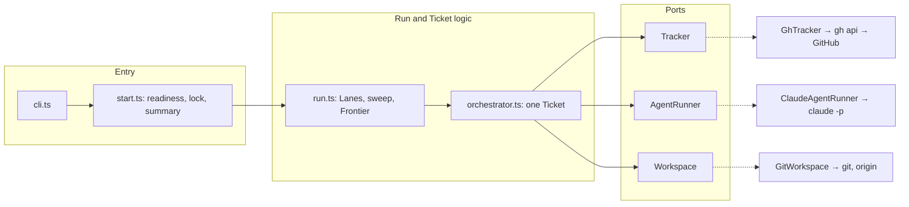
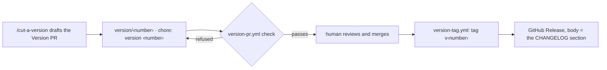

# Internals

The pipeline touches three things outside itself: GitHub, Claude and git. Each is reached through a port, an interface the orchestrator depends on, so the whole unattended flow can be tested in memory, with no subscription spent and nothing written to GitHub. The adapters behind the ports are kept thin. They build arguments and parse output; decisions live in the modules above them.

This page is for reading the source or changing it. To use the pipeline, start at [Installation](./installation.md).

## At a glance

| Port | The effect it isolates | Adapter | Fake for tests | Source |
|---|---|---|---|---|
| `Tracker` | GitHub: issues, labels, comments, pull requests, CI, merges | `GhTracker`, over `gh api` | `FakeTracker` | [`ports/tracker.ts`](https://github.com/jjongs2/ticket-runner/blob/main/src/ports/tracker.ts) |
| `AgentRunner` | Claude: one Stage session | `ClaudeAgentRunner`, one `claude -p` child per Stage | `FakeAgentRunner` | [`ports/agent-runner.ts`](https://github.com/jjongs2/ticket-runner/blob/main/src/ports/agent-runner.ts) |
| `Workspace` | git: worktrees, branches, Checks, rebase, push, and the State and Run lock on the remote | `GitWorkspace` | `FakeWorkspace` | [`ports/workspace.ts`](https://github.com/jjongs2/ticket-runner/blob/main/src/ports/workspace.ts) |


<!-- Sources: src/cli.ts, src/start.ts, src/run.ts, src/orchestrator.ts, src/ports/tracker.ts, src/ports/agent-runner.ts, src/ports/workspace.ts -->

The CLI is the only place that constructs adapters. Everything under `start.ts` receives them as interfaces.

## The adapters

| Adapter | What it does | Worth knowing |
|---|---|---|
| [`GhTracker`](https://github.com/jjongs2/ticket-runner/blob/main/src/adapters/gh-tracker.ts) | every GitHub call, through `gh api` (REST) | REST on every Host, because a cloud Host refuses GraphQL outright. The one exception is moving a pull request into or out of draft, which REST cannot do: a workstation uses the GraphQL mutation, a cloud Host the proxy's `/pulls/{n}/ccr/convert_to_draft` and `/ready_for_review` routes. CI is polled every 15 s. |
| [`ClaudeAgentRunner`](https://github.com/jjongs2/ticket-runner/blob/main/src/adapters/claude-agent-runner.ts) | runs a Stage as `claude --print <prompt> --output-format stream-json --verbose --permission-prompts none --permission-mode … --model … --effort … --max-turns …` (plus `--json-schema` where a Stage answers one) | sets `TICKET_RUNNER_STAGE`; writes `<stage>.command`, `<stage>.stdout`, `<stage>.stderr` and `<stage>.transcript.jsonl` from the moment the Stage starts; kills the child at `maxMinutes`; classifies the failure as `rate-limited`, `timed-out`, `turn-capped`, `nonzero-exit` or `invalid-result` |
| [`GitWorkspace`](https://github.com/jjongs2/ticket-runner/blob/main/src/adapters/git-workspace.ts) | worktrees under `.worktrees/`, Checks, rebase, push, the `ticket-runner/state` and `ticket-runner/lock` branches | commands in the main checkout run one at a time, because git fails on a held ref or index lock rather than waiting; commands inside a worktree stay parallel. See [Stopping and resuming](./stopping-and-resuming.md) for the two branches. |
| [`exec.ts`](https://github.com/jjongs2/ticket-runner/blob/main/src/adapters/exec.ts) | spawns a child, with a timeout and streaming sinks | `timedOut` is reported separately, because a command may exit 124 on its own |
| [`repo-root.ts`](https://github.com/jjongs2/ticket-runner/blob/main/src/adapters/repo-root.ts) | finds the main checkout, even from inside a worktree | so the lock, `.worktrees/` and the logs land in one place per clone |
| [`version.ts`](https://github.com/jjongs2/ticket-runner/blob/main/src/adapters/version.ts) | reads which [Version](#versions) this copy is | an adapter because it runs git, though no port describes it |

## A map of `src/`

Tests sit beside each module as `*.test.ts`.

**Entry**

| Module | One line |
|---|---|
| [`cli.ts`](https://github.com/jjongs2/ticket-runner/blob/main/src/cli.ts) | reads the Version, dispatches `init`, `run`, `stop`, `remove`, `-v`; builds the adapters |
| [`command-line.ts`](https://github.com/jjongs2/ticket-runner/blob/main/src/command-line.ts) | parses arguments and holds the usage text, before anything is looked at |
| [`stage-guard.ts`](https://github.com/jjongs2/ticket-runner/blob/main/src/stage-guard.ts) | refuses every command inside a Stage's shell (the Stage mark) |
| [`start.ts`](https://github.com/jjongs2/ticket-runner/blob/main/src/start.ts) | refusals, the Run lock, the Stop listener, the summary and the exit code |
| [`startup.ts`](https://github.com/jjongs2/ticket-runner/blob/main/src/startup.ts) | refuses a Run with nothing to gate a merge; warns about gates turned off |

**Run and Ticket**

| Module | One line |
|---|---|
| [`run.ts`](https://github.com/jjongs2/ticket-runner/blob/main/src/run.ts) | fills Lanes from the Stranded Tickets, then the Frontier; stops claiming on a Release or Stop |
| [`orchestrator.ts`](https://github.com/jjongs2/ticket-runner/blob/main/src/orchestrator.ts) | one Ticket from guards to merge, Hand-off or Release, with the Fix budget |
| [`frontier.ts`](https://github.com/jjongs2/ticket-runner/blob/main/src/frontier.ts) | splits candidates into the Frontier and the blocked |
| [`guards.ts`](https://github.com/jjongs2/ticket-runner/blob/main/src/guards.ts) | why a candidate is skipped: the Guards and the refusals |
| [`landing.ts`](https://github.com/jjongs2/ticket-runner/blob/main/src/landing.ts) | the Landing: one Lane between rebase and pull at a time, in arrival order |
| [`lifecycle.ts`](https://github.com/jjongs2/ticket-runner/blob/main/src/lifecycle.ts) | where a Ticket failed, and which failures a fix Stage may mend |
| [`base-branch.ts`](https://github.com/jjongs2/ticket-runner/blob/main/src/base-branch.ts) | resolves the Base branch once per Run |
| [`branch.ts`](https://github.com/jjongs2/ticket-runner/blob/main/src/branch.ts) | `agent/<n>-<slug>` and `.worktrees/ticket-<n>` |
| [`stranded.ts`](https://github.com/jjongs2/ticket-runner/blob/main/src/stranded.ts) | the sweep for Stranded Tickets |
| [`resume.ts`](https://github.com/jjongs2/ticket-runner/blob/main/src/resume.ts) | the State file's shape and name |
| [`handoff.ts`](https://github.com/jjongs2/ticket-runner/blob/main/src/handoff.ts) | marks old hand-off comments as history when a Ticket is taken again |
| [`stop.ts`](https://github.com/jjongs2/ticket-runner/blob/main/src/stop.ts) | `ticket-runner stop`, and the Run's end of SIGTERM |
| [`lock.ts`](https://github.com/jjongs2/ticket-runner/blob/main/src/lock.ts) | what the Run lock file says, and whether its holder is alive |
| [`host.ts`](https://github.com/jjongs2/ticket-runner/blob/main/src/host.ts) | workstation or cloud, and which one |

**What Stages are told and what they answer**

| Module | One line |
|---|---|
| [`prompts.ts`](https://github.com/jjongs2/ticket-runner/blob/main/src/prompts.ts) | each Stage's prompt, which expands `/mattpocock-skills:<skill>` |
| [`verdict.ts`](https://github.com/jjongs2/ticket-runner/blob/main/src/verdict.ts) | the Verdict schema and whether it passes |
| [`title.ts`](https://github.com/jjongs2/ticket-runner/blob/main/src/title.ts) | the pull request title from the Stages' answers, then the commits, then the Ticket |
| [`note-schema.ts`](https://github.com/jjongs2/ticket-runner/blob/main/src/note-schema.ts), [`notes.ts`](https://github.com/jjongs2/ticket-runner/blob/main/src/notes.ts) | Notes: how a Stage declares them and where they are routed |
| [`acceptance-criteria.ts`](https://github.com/jjongs2/ticket-runner/blob/main/src/acceptance-criteria.ts), [`criteria.ts`](https://github.com/jjongs2/ticket-runner/blob/main/src/criteria.ts) | what a criterion looks like; ticking the `met` ones after a merge |
| [`progress.ts`](https://github.com/jjongs2/ticket-runner/blob/main/src/progress.ts) | the one Progress comment per Ticket, edited in place |
| [`templates.ts`](https://github.com/jjongs2/ticket-runner/blob/main/src/templates.ts) | every shape written to GitHub, and the Run summary; `docs/templates/` is the source of truth |
| [`run-log.ts`](https://github.com/jjongs2/ticket-runner/blob/main/src/run-log.ts) | `.ticket-runner/runs/<runId>/` and what a Hand-off keeps of it |

**Target setup**

| Module | One line |
|---|---|
| [`init.ts`](https://github.com/jjongs2/ticket-runner/blob/main/src/init.ts) | `ticket-runner init`: writes, sets up GitHub, reports the rest |
| [`readiness.ts`](https://github.com/jjongs2/ticket-runner/blob/main/src/readiness.ts) | Target readiness, which `init` provides and `run` checks |
| [`conventions.ts`](https://github.com/jjongs2/ticket-runner/blob/main/src/conventions.ts) | the conventions document's text and its Version mark |
| [`operator-skill.ts`](https://github.com/jjongs2/ticket-runner/blob/main/src/operator-skill.ts) | the Operator's skill `init` writes into a Target |
| [`labels.ts`](https://github.com/jjongs2/ticket-runner/blob/main/src/labels.ts) | the six triage labels and their colours |
| [`config.ts`](https://github.com/jjongs2/ticket-runner/blob/main/src/config.ts) | `ticket-runner.json`: schema and defaults |
| [`remove.ts`](https://github.com/jjongs2/ticket-runner/blob/main/src/remove.ts) | `ticket-runner remove` |

**Versions**

| Module | One line |
|---|---|
| [`version-number.ts`](https://github.com/jjongs2/ticket-runner/blob/main/src/version-number.ts) | number comparison, shared by every Version question |
| [`staleness.ts`](https://github.com/jjongs2/ticket-runner/blob/main/src/staleness.ts) | the newer-Version line and the conventions-document warning |
| [`version-pr.ts`](https://github.com/jjongs2/ticket-runner/blob/main/src/version-pr.ts) | what a Version PR must get right; the notes a Release publishes |

**Tests only**: [`testing/`](https://github.com/jjongs2/ticket-runner/blob/main/src/testing/fakes.ts) holds the fakes and helpers described next.

## How the orchestrator is tested

No test spawns `gh` or `claude`. Each layer is tested at the seam that suits it.

| Layer | Tested against | How |
|---|---|---|
| `orchestrator.ts`, `run.ts`, `start.ts`, `stranded.ts` … | in-memory fakes of all three ports ([`testing/fakes.ts`](https://github.com/jjongs2/ticket-runner/blob/main/src/testing/fakes.ts)) | each fake keeps an ordered `calls` log; tests assert on it and on the resulting state, never on internal helpers. `FakeWorkspace` keeps the State and the lock in memory and can play [`THIS_HOST` or `ANOTHER_HOST`](https://github.com/jjongs2/ticket-runner/blob/main/src/testing/fakes.ts). |
| Lanes running side by side | the fakes plus [`Hold`](https://github.com/jjongs2/ticket-runner/blob/main/src/testing/hold.ts) and [`settle`](https://github.com/jjongs2/ticket-runner/blob/main/src/testing/settle.ts) | a `Hold` parks a Ticket at a chosen point (inside a Stage, inside a CI wait) until the test lets it go, so what another Lane does meanwhile can be observed |
| `GitWorkspace` | a real temporary repository with a bare remote | worktrees, rebases, leases and the state and lock branches run real git |
| `GhTracker`, `ClaudeAgentRunner` | recorded runs, through their `run` seam | [`testing/executions.ts`](https://github.com/jjongs2/ticket-runner/blob/main/src/testing/executions.ts) builds the `Execution` a process would have returned |

This is why every external effect goes through a port, the pipeline's own bookkeeping included: State and the lock are effects on the remote, so they are `Workspace` methods and the fakes cover them ([ADR-0004](https://github.com/jjongs2/ticket-runner/blob/main/docs/adr/0004-resume-state-is-a-local-file.md), last amendment).

## Versions

A [Version](https://github.com/jjongs2/ticket-runner/blob/main/CONTEXT.md) is a number that `main` carries as a tag `v<x.y.z>`, with a GitHub Release. An installed copy reports it. Machines install a Version, never `main`, so two machines that report `0.5.2` run the same code ([ADR-0007](https://github.com/jjongs2/ticket-runner/blob/main/docs/adr/0007-a-version-is-cut-by-a-human-and-installs-follow-tags.md)).

### How one is cut


<!-- Sources: src/version-pr.ts, scripts/version.ts, .github/workflows/version-pr.yml, .github/workflows/version-tag.yml -->

- **The number.** It goes up by a minor when a Spec has closed since the last Version, and by a patch for everything else, a small feature included. The only question is whether a Spec closed. A human decides when to cut, because that is a Planning decision.
- **The Version PR.** It raises `package.json` and the lock file, adds the Version's section to `CHANGELOG.md`, and re-marks this repository's own conventions document with `npx tsx scripts/version.ts mark`. The [`/cut-a-version`](https://github.com/jjongs2/ticket-runner/blob/main/.claude/skills/cut-a-version/SKILL.md) skill drafts it; it never merges.
- **The check** ([`version-pr.ts` · `versionPrRefusals`](https://github.com/jjongs2/ticket-runner/blob/main/src/version-pr.ts)) lists every reason at once: the number is not above every tag, the lock file disagrees, the section is missing, or the section has no `### After upgrading` heading. A pull request that leaves the number alone passes untouched.
- **The tag workflow** tags the merge commit and publishes the section as the Release, or GitHub's generated notes if the section is missing. It finishes whichever half is missing, so a re-run heals a half-cut Version.

release-please and Changesets were both turned down. The first needed a yearly-expiring token, a repository setting and a rule that only `feat`/`fix` cut a Version. The second would have put a changeset file into every Stage's job.

### The stamp

The Version is resolved once, in the CLI, and handed down. Every stamp one Run writes is therefore the same string ([`adapters/version.ts` · `pipelineVersion`](https://github.com/jjongs2/ticket-runner/blob/main/src/adapters/version.ts)).

| `-v` prints | When |
|---|---|
| `0.5.2` | an installed copy: the number is the whole of it |
| `0.5.2+331d79c` | a development checkout, clean |
| `0.5.2+331d79c.dirty` | a development checkout with uncommitted changes |
| `unknown` | no readable `package.json` |

The same string is stamped on:

| Where | So that |
|---|---|
| the Run summary's header, `ticket-runner <version> run <runId> · <n>m`, and the `init` report's first line | a terminal says which pipeline ran |
| each Run's section of a Progress comment | the board says which pipeline wrote it |
| each State file's `version` | an unreadable file can still name what wrote it |
| `.ticket-runner/runs/<runId>/version.txt`, kept with a Hand-off's transcripts | a transcript sits beside the pipeline that wrote it |
| the conventions document's first line, `<!-- ticket-runner:version <number> -->` (the number only) | `init` and a Run can tell which side is behind |
| the refusal of a config key the install does not know | a stale install is told apart from a wrong config |

The conventions document's mark has a direction. An older pipeline leaves a newer document alone and asks to be upgraded. A Run behind the document warns, and a Run ahead of it names `init`. Neither ever refuses ([`staleness.ts` · `conventionsWarning`](https://github.com/jjongs2/ticket-runner/blob/main/src/staleness.ts)).

### The newer-Version check

A Run and `init` each look up the highest published Version of the pipeline's own repository. They read it from `package.json`'s `repository` field, so a fork asks about itself. The lookup reads GitHub Releases, skipping drafts and prereleases, because a tag whose Release is not out yet is not installable. Only numbers are compared, so a checkout running past the latest Version is not stale.

When a newer one is out, [`staleness.ts` · `newerVersionLine`](https://github.com/jjongs2/ticket-runner/blob/main/src/staleness.ts) prints one line, at the top of the Run log and again at the head of the summary:

```
A newer Version is out: 0.6.0, and this is 0.5.2 — upgrade with `npm install -g "github:jjongs2/ticket-runner#semver:*"`.
```

A lookup that cannot be made (no network, no `gh`, a repository nobody can see) prints nothing. Nothing is ever refused over it.

Install and upgrade with `npm install -g ticket-runner`, or try it with `npx ticket-runner init` without a global install. The GitHub tag range the message names, `npm install -g "github:jjongs2/ticket-runner#semver:*"`, also installs the highest Version tag. See [Installation](./installation.md).

## The ADRs in brief

The full records are in [`docs/adr/`](https://github.com/jjongs2/ticket-runner/tree/main/docs/adr). Several have amendments; this is where they stand now.

| ADR | Decision | Why | Cost accepted |
|---|---|---|---|
| [0001](https://github.com/jjongs2/ticket-runner/blob/main/docs/adr/0001-humans-plan-the-pipeline-executes.md) | Humans plan; only Execution is unattended | a wrong answer to a grilling question hardens into a Spec, Tickets and merged code with no gate left | Planning quality is a human's job; the pipeline only guards against known defects |
| [0002](https://github.com/jjongs2/ticket-runner/blob/main/docs/adr/0002-claude-p-child-process-per-stage.md) | One `claude -p` child process per Stage | only headless mode expands a user-invoked `/plugin:skill`; a process also gives per-Stage limits, `--json-schema`, and a command line to replay | 1–2 s startup per Stage; no shared context, so Stages read the Ticket and the branch |
| [0003](https://github.com/jjongs2/ticket-runner/blob/main/docs/adr/0003-github-native-relations-only.md) | Only GitHub-native blockers and sub-issues count | two sources of truth would let a stale body silently block or unblock work | humans must create the native edges; body-only blockers are skipped with a warning |
| [0004](https://github.com/jjongs2/ticket-runner/blob/main/docs/adr/0004-resume-state-is-a-local-file.md) | Resume state is a State file kept off the board, now on the Target's remote; a Hand-off keeps it too | the board is for humans; a cloud Host is discarded, so state must outlive it; a relabel should resume a Ticket | no migration of old local State; the State branch goes through `Workspace` |
| [0005](https://github.com/jjongs2/ticket-runner/blob/main/docs/adr/0005-landing-is-a-serialized-section.md) | The Landing is a serialized section, not a merge queue | what CI graded is exactly what lands, without paying for CI twice | one slow CI or Conflict Stage holds every other Lane's Landing; GitHub's merge queue would add a per-repository setting |
| [0006](https://github.com/jjongs2/ticket-runner/blob/main/docs/adr/0006-stop-is-a-signal-and-ctrl-c-is-a-kill.md) | A Stop is SIGTERM and nothing else; Ctrl+C stays a kill; only the Run's own Host can send it | a signal arrives at once and leaves nothing to clean up; Stages share the Run's process group | a Stop cannot be taken back; a Run on another Host cannot be stopped from here |
| [0007](https://github.com/jjongs2/ticket-runner/blob/main/docs/adr/0007-a-version-is-cut-by-a-human-and-installs-follow-tags.md) | A human cuts a Version by merging a Version PR; installs follow tags | when to cut is a Planning decision; a number is only a useful stamp if two machines with it run the same code | Version notes are written by hand, with an agent's help |
| [0008](https://github.com/jjongs2/ticket-runner/blob/main/docs/adr/0008-a-cloud-host-is-a-claude-code-cloud-session.md) | A cloud Host is a Claude Code cloud session with an Operator; the Run lock lives on GitHub | no Actions minutes, and steered from the app; every Host must see the lock | REST only; nothing on the remote may depend on deleting a ref; a lock from a vanished Host needs a human to release it |

## Working on the pipeline itself

To change the pipeline, run it from a checkout. `bin/ticket-runner.js` loads the TypeScript through `tsx`, so there is no build step:

```bash
git clone https://github.com/jjongs2/ticket-runner && cd ticket-runner
npm install
npm run ticket-runner -- run         # drain this repository's Frontier
npm run ticket-runner -- run 3 7     # a Run narrowed to #3 and #7
npm test                             # vitest
npm run typecheck                    # tsc --noEmit
```

A checkout reports its commit beside the number (see [the stamp](#the-stamp)). CI runs `npm run typecheck` and `npm test` on every pull request, and the Version PR check beside them.

This repository is a Target of its own pipeline, so it follows the same rules as any other Target. Read these before committing, not a copy here:

- [`CONTRIBUTING.md`](https://github.com/jjongs2/ticket-runner/blob/main/CONTRIBUTING.md): branches, commits, pull requests, Version PRs, issues, and code rules (strict ESM TypeScript, tests beside the code, every effect through a port, `scripts/` kept thin)
- [`docs/agents/pipeline-conventions.md`](https://github.com/jjongs2/ticket-runner/blob/main/docs/agents/pipeline-conventions.md): what the pipeline requires of any Target
- [`CONTEXT.md`](https://github.com/jjongs2/ticket-runner/blob/main/CONTEXT.md): name things with the glossary; a concept that needs a new word goes there first
- [`docs/templates/`](https://github.com/jjongs2/ticket-runner/tree/main/docs/templates): change a shape there before the code that writes it

A Stage may not run the pipeline. Its shell carries `TICKET_RUNNER_STAGE`, and every command refuses while it is set. Exercise the pipeline through the tests and fakes instead.

## Related pages

- [Stopping and resuming](./stopping-and-resuming.md): the State branch and the Run lock that `GitWorkspace` keeps
- [From Ticket to merge](./ticket-to-merge.md): the lifecycle `orchestrator.ts` drives
- [Running](./running.md): the commands `cli.ts` dispatches, and `-v`
- [Installation](./installation.md): installing a Version, `init`, and `remove`

## References

- [`src/ports/`](https://github.com/jjongs2/ticket-runner/tree/main/src/ports), [`src/adapters/`](https://github.com/jjongs2/ticket-runner/tree/main/src/adapters), [`src/testing/`](https://github.com/jjongs2/ticket-runner/tree/main/src/testing)
- [`src/cli.ts`](https://github.com/jjongs2/ticket-runner/blob/main/src/cli.ts), [`src/start.ts`](https://github.com/jjongs2/ticket-runner/blob/main/src/start.ts), [`src/run.ts`](https://github.com/jjongs2/ticket-runner/blob/main/src/run.ts), [`src/orchestrator.ts`](https://github.com/jjongs2/ticket-runner/blob/main/src/orchestrator.ts)
- [`src/adapters/version.ts`](https://github.com/jjongs2/ticket-runner/blob/main/src/adapters/version.ts), [`src/version-number.ts`](https://github.com/jjongs2/ticket-runner/blob/main/src/version-number.ts), [`src/version-pr.ts`](https://github.com/jjongs2/ticket-runner/blob/main/src/version-pr.ts), [`src/staleness.ts`](https://github.com/jjongs2/ticket-runner/blob/main/src/staleness.ts)
- [`scripts/version.ts`](https://github.com/jjongs2/ticket-runner/blob/main/scripts/version.ts), [`.github/workflows/`](https://github.com/jjongs2/ticket-runner/tree/main/.github/workflows)
- [`CONTRIBUTING.md`](https://github.com/jjongs2/ticket-runner/blob/main/CONTRIBUTING.md), [`CHANGELOG.md`](https://github.com/jjongs2/ticket-runner/blob/main/CHANGELOG.md)
- [ADR-0001](https://github.com/jjongs2/ticket-runner/blob/main/docs/adr/0001-humans-plan-the-pipeline-executes.md) to [ADR-0008](https://github.com/jjongs2/ticket-runner/blob/main/docs/adr/0008-a-cloud-host-is-a-claude-code-cloud-session.md)
