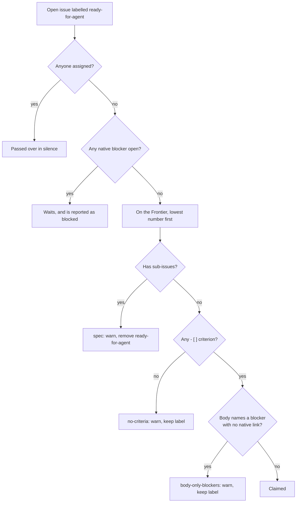

# Planning the work

The pipeline does not plan. Deciding what to build takes judgement, and a wrong assumption made while planning hardens into a Spec, Tickets and merged code with no gate left to catch it. So Planning stays with humans, and the pipeline only takes what Planning hands it ([ADR-0001](https://github.com/jjongs2/ticket-runner/blob/main/docs/adr/0001-humans-plan-the-pipeline-executes.md)). Because it trusts what it is handed, it reads only a few things off an issue, reads them strictly, and refuses an issue that gets one of them wrong rather than guess.

| A Ticket needs | Why |
|---|---|
| The `ready-for-agent` label | It is how a Run finds the Ticket |
| No assignee | Anyone assigned has claimed it |
| Acceptance Criteria: `- [ ]` lines in the body or any comment | They are the only thing the verify Stage grades |
| Blockers as native `blocked by` links, all closed | They decide which Tickets may run, and in what order |
| No native sub-issues | An issue with sub-issues is a Spec, not a Ticket |

The same list, written for the agents that plan, is the conventions document `init` puts in every Target: [`docs/agents/pipeline-conventions.md`](https://github.com/jjongs2/ticket-runner/blob/main/docs/agents/pipeline-conventions.md).

## Specs and Tickets

Planning is a chain of skills from the `mattpocock-skills` plugin, run in your own sessions:

| Skill | Produces |
|---|---|
| `grilling` | A plan whose questions you, not an agent, have answered |
| `to-spec` | A **Spec**: one parent issue describing a whole feature |
| `to-tickets` | **Tickets**: native sub-issues of the Spec, each one agent session of work, labelled `ready-for-agent` |
| `triage` | Tickets from issues that arrived some other way, with the brief (and its criteria) posted as a comment |

A [Spec](https://github.com/jjongs2/ticket-runner/blob/main/CONTEXT.md) is never implemented itself; only its Tickets are. If a Spec is left labelled `ready-for-agent`, the `spec` Guard below takes the label off it. A [Ticket](https://github.com/jjongs2/ticket-runner/blob/main/CONTEXT.md) should be small enough for one implement Stage, which by default has 300 turns and 60 minutes ([Configuration](./configuration.md#stages)).

To file one by hand with its parent and blockers in place:

```bash
gh issue create --title "Drain the Frontier" --parent 12 --blocked-by 14,15 --label ready-for-agent
```

## Acceptance Criteria

One criterion is an unticked task list item at the head of a line: optional indent, a `-`, `*` or `+` bullet, one space, then `[ ]`. Nothing else is one, however much it reads like a promise.

```markdown
- [ ] `run 3 7` takes only #3 and #7            ← a criterion
  * [ ] a nested item counts too                ← a criterion
- [x] already ticked                            ← not: nothing left to grade
The command must refuse bad input.              ← not: prose
1. [ ] a numbered item                          ← not: no bullet
```

Criteria may be in the issue body or in any comment, because `triage` posts its brief as a comment. The verify Stage grades each one as `met`, `unmet` or `unverifiable`. When the Ticket merges, the `met` ones are ticked where they are written; an `unverifiable` one stays unticked, since nobody gathered evidence for it. [From Ticket to merge](./ticket-to-merge.md) covers the grading.

Write criteria that a session can check by running or reading code. A criterion that needs a human's eyes (a screenshot, a feel) comes back `unverifiable`.

## Blockers

Only GitHub's native `blocked by` links count ([ADR-0003](https://github.com/jjongs2/ticket-runner/blob/main/docs/adr/0003-github-native-relations-only.md)), so what a Run takes is what GitHub's own UI shows as unblocked. Reading the body as well would give the pipeline two sources of truth, and a stale body could silently block or unblock work.

```bash
gh issue edit 23 --add-blocked-by 14,15      # add links to an existing issue
gh issue edit 23 --remove-blocked-by 15      # take one off
```

A Ticket waits while any of its blockers is open. A blocker that another Lane of the same Run is still working on is open too, and that is the whole of what keeps two Tickets out of each other's way: nothing else decides which Tickets are safe to run side by side. The moment a blocker merges, the Ticket it held back can be taken in the same Run.

A `Blocked by` section in the body is fine as a human-readable copy, as long as every issue it names has a native link as well. When it names one without, the `body-only-blockers` Guard refuses the Ticket. The Guard reads only the section itself, so issue references elsewhere in the body are prose:

| Written as | Where the section ends |
|---|---|
| `Blocked by: #14, #15` on one line | At the end of that line |
| A `## Blocked by` heading followed by a list | At the end of the first list under it |

A reference to another repository (`other/repo#12`) is never read as a blocker.

## Labels

The labels are the triage state machine: one state label per issue at a time. `init` creates all six; [`labels`](./configuration.md#labels) renames them.

| Label | Put on by | What the pipeline does with it |
|---|---|---|
| `needs-triage` | Humans; the pipeline on its standing Notes issue | Nothing, except opening the Notes issue with it |
| `needs-info` | Humans | Nothing |
| `ready-for-agent` | Planning; a Release; a human handing a Ticket back | Takes the issue as a candidate. Removed at the Claim |
| `in-progress` | Only a Run, at the Claim | Marks a Ticket a Run holds. Removed at merge, Hand-off and Release |
| `ready-for-human` | A Hand-off | Leaves the Ticket alone until a human relabels it |
| `wontfix` | Humans | Nothing |

To keep the pipeline off a Ticket, take `ready-for-agent` off it, or assign someone: a candidate with any assignee is treated as claimed and passed over in silence.

## Guards

Planning goes wrong in a few known ways. `to-spec` can leave its Spec labelled `ready-for-agent`, an issue can arrive with no checkbox criteria, and `to-tickets` sometimes writes `Blocked by: #n` into the body without creating the native link. Taken as they are, these would have the pipeline implement a whole Spec as one giant Ticket, work on something verify cannot grade, or start a Ticket before its prerequisites exist. A [Guard](https://github.com/jjongs2/ticket-runner/blob/main/CONTEXT.md) passes such a candidate over before it is claimed and says once why, so you fix the Planning output and run again.


<!-- Sources: src/frontier.ts, src/guards.ts, src/orchestrator.ts -->

| Reason | What the candidate did | What the pipeline does |
|---|---|---|
| `spec` | It has native sub-issues, so it is a Spec | Skips it and removes `ready-for-agent`: its Tickets are picked up one by one |
| `no-criteria` | No `- [ ]` line in its body or comments, so verify has nothing to grade | Skips it and keeps the label, since a comment can still add criteria |
| `body-only-blockers` | Its `Blocked by` section names an issue with no native link | Skips it and keeps the label; the body line is never read as a blocker |

Each skip posts one warning comment saying what to fix, and appears in the Run summary as `skipped  #<n> <reason>`. The warning carries a hidden `<!-- ticket-runner:guard:<reason> -->` marker, so it is posted at most once per reason: a nightly Run that meets the same unfixed issue again says nothing more. Fix the issue and the next Run takes it. The comment's wording is in [`docs/templates/guard-comment.md`](https://github.com/jjongs2/ticket-runner/blob/main/docs/templates/guard-comment.md).

The Guards also grade a [Stranded Ticket](https://github.com/jjongs2/ticket-runner/blob/main/CONTEXT.md) before it is resumed, since they are about the issue, not about who holds it.

## Related pages

- [Running](./running.md): the Frontier a Run drains, and a Run narrowed to named Tickets.
- [From Ticket to merge](./ticket-to-merge.md): what happens once a Ticket is claimed, and how verify grades the criteria.
- [Configuration](./configuration.md): renaming the labels.
- [Install and remove](./installation.md): `init` creates the labels and the conventions document.

## References

- [`src/guards.ts`](https://github.com/jjongs2/ticket-runner/blob/main/src/guards.ts), [`src/frontier.ts`](https://github.com/jjongs2/ticket-runner/blob/main/src/frontier.ts), [`src/acceptance-criteria.ts`](https://github.com/jjongs2/ticket-runner/blob/main/src/acceptance-criteria.ts), [`src/criteria.ts`](https://github.com/jjongs2/ticket-runner/blob/main/src/criteria.ts)
- [`src/orchestrator.ts` · `passOver`](https://github.com/jjongs2/ticket-runner/blob/main/src/orchestrator.ts), [`src/labels.ts`](https://github.com/jjongs2/ticket-runner/blob/main/src/labels.ts), [`src/adapters/gh-tracker.ts`](https://github.com/jjongs2/ticket-runner/blob/main/src/adapters/gh-tracker.ts)
- [`docs/agents/pipeline-conventions.md`](https://github.com/jjongs2/ticket-runner/blob/main/docs/agents/pipeline-conventions.md), [`docs/agents/triage-labels.md`](https://github.com/jjongs2/ticket-runner/blob/main/docs/agents/triage-labels.md), [`docs/templates/guard-comment.md`](https://github.com/jjongs2/ticket-runner/blob/main/docs/templates/guard-comment.md), [`CONTRIBUTING.md`](https://github.com/jjongs2/ticket-runner/blob/main/CONTRIBUTING.md)
- [ADR-0001](https://github.com/jjongs2/ticket-runner/blob/main/docs/adr/0001-humans-plan-the-pipeline-executes.md), [ADR-0003](https://github.com/jjongs2/ticket-runner/blob/main/docs/adr/0003-github-native-relations-only.md)
