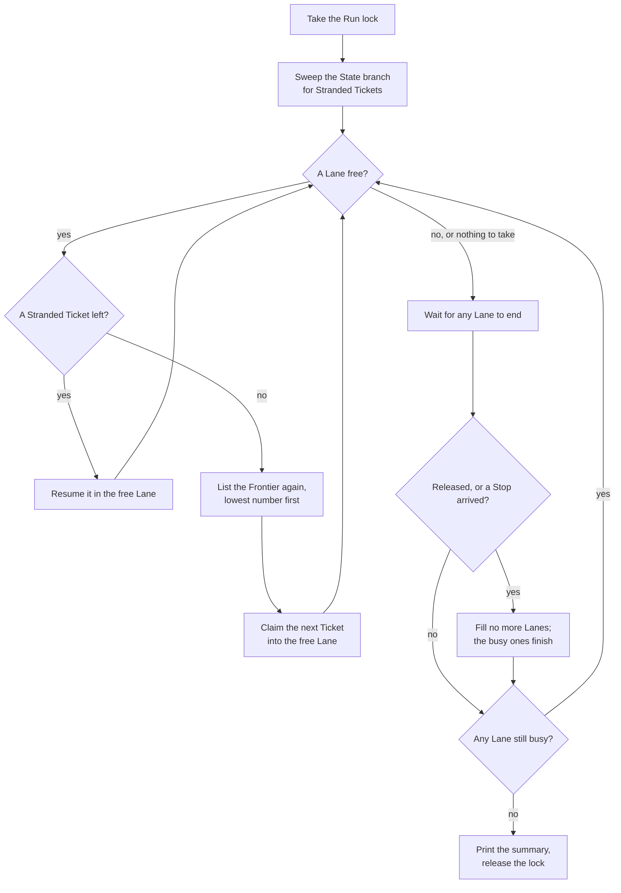

# Running

A [Run](https://github.com/jjongs2/ticket-runner/blob/main/CONTEXT.md) exists so you can start one command and walk away. It takes every Ticket that is ready, carries each to a merge or to a human, and ends on its own when nothing it may take is left. Everything you might want to know afterwards is in its summary, on the board, and in the transcripts it leaves on disk.

| Command | What it does | Exit codes |
|---|---|---|
| `ticket-runner run` | Drains the Frontier | `0` · `1` a Hand-off · `2` nothing taken |
| `ticket-runner run 3 7` | The same Run, narrowed to #3 and #7 | as above |
| `ticket-runner run --lanes 2` | The same Run, two Tickets at once | as above |
| `ticket-runner stop` | Asks the Run in this Target to finish what it holds and take no more | `0` sent · `2` nobody to send it to |
| `ticket-runner -v` | Prints which Version this is | `0` |
| `ticket-runner -h` | Prints the usage | `0` (`2` when no command is given) |

`init` and `remove` are on [Install and remove](./installation.md). An unknown command or option, or a bad argument, is refused with the usage and exit code `2`.

## `run`

`run` drains the [Frontier](https://github.com/jjongs2/ticket-runner/blob/main/CONTEXT.md): the open Tickets labelled `ready-for-agent` that nobody is assigned to and whose native blockers have all closed ([Planning](./planning.md)). Before it takes anything it passes, in order, every refusal a Run can meet: [Target readiness](./installation.md#target-readiness-what-run-refuses), leftover local State files, a missing Check, and the Run lock. Each of these exits `2` and leaves nothing behind.

It then takes Tickets through its [Lanes](https://github.com/jjongs2/ticket-runner/blob/main/CONTEXT.md), one Ticket per Lane, one Lane by default:


<!-- Sources: src/run.ts, src/start.ts, src/stranded.ts, src/frontier.ts -->

- **The Frontier is listed again at every refill**, never snapshotted. A merge that closes a blocker puts the Ticket it unblocked into the same Run.
- **A Ticket that fails is handed off** and its Lane takes the next one; one bad Ticket does not cost the rest of the night.
- **A Release stops the filling.** A Ticket the rate limit stopped is released, and the Run claims nothing else, since the same limit would stop the next Stage too. The Lanes still busy finish what they hold.
- **The Run ends** when no Lane is busy and nothing is left to take: the Frontier is empty, or everything on it is blocked.

What happens to each Ticket inside a Lane is on [From Ticket to merge](./ticket-to-merge.md). Stranded Tickets and Releases are on [Stopping and resuming](./stopping-and-resuming.md).

### `--lanes`

With one Lane a Run takes the Frontier one Ticket at a time. Most of a Ticket's time is its implement and verify Stages, up to an hour and twenty minutes of sessions that no other Ticket on the Frontier would collide with, so six independent Tickets take six times as long as one. Tickets on the Frontier do not block one another, so more Lanes can take several at once; only the [Landing](./ticket-to-merge.md#the-landing), from the rebase to the merge, takes one Lane at a time.

`--lanes <n>` gives this one Run `n` Lanes, over whatever [`lanes`](./configuration.md#lanes) in `ticket-runner.json` says. How many Tickets a machine can carry at once is that machine's business, not the repository's, so the override lives on the command line. It may go before or after Ticket numbers, and a count above the number of Tickets named is not refused.

Lanes run their Checks at the same time in separate worktrees. Keep one Lane on a Target whose Checks need a port, a database or anything else they would share.

### A narrowed Run

`ticket-runner run 12 13 14` is the same Run in every way (its Lanes, the Landing, the Run lock, a Release, a Stop) except that it takes only #12, #13 and #14, from the Stranded Tickets and the Frontier alike. Every other Ticket is left exactly as it was, stranded ones included.

- The numbers say which Tickets, not the order: stranded ones first, then the rest lowest number first.
- `#12` reads as `12`, and a number given twice is taken once.
- Anything that is not a whole number of one or more is refused with exit code `2`, before the lock is taken.
- Blockers still hold. A named Ticket blocked by another named Ticket is taken once that one merges in the same Run.

Every named Ticket the Run did not take gets a `skipped` row saying why. Only a Guard's reason is also commented on the issue.

| Row | Meaning |
|---|---|
| `blocked` | An open blocker still held it back when the Run ended |
| `claimed` | Somebody else is assigned to it |
| `not-ready` | It is not labelled `ready-for-agent`, or it has closed |
| `no-issue` | No issue has that number |
| `pull-request` | The number is a pull request |
| `spec`, `no-criteria`, `body-only-blockers` | A [Guard](./planning.md#guards) refused it |

A named Ticket that a Stop or a Release kept the Run from reaching has no row; the last line of the summary says why the Run stopped.

## `stop`

```bash
ticket-runner stop
```

A Stop asks the Run to finish the Tickets its Lanes hold, to merge or Hand-off, and take no more. `stop` reads the Run lock from GitHub, sends SIGTERM to the process it names, and says which Run it asked:

```text
`ticket-runner run` (run 2026-09-17T09-00-00-000, pid 4321) will stop once the Tickets it holds are finished. It claims no more.
Ctrl+C in that Run's own terminal stops it at once instead, at the cost of killing the Stages it is running and leaving their Tickets stranded for the next Run.
```

It needs nothing of the Target but the lock: no config, no `gh` login, no readiness. It exits `2` and sends nothing when no Run holds the lock, when the Run it names on this Host is gone, or when the Run is on another Host, which only that Host can signal. A second `stop` prints the same and the Run ignores the second signal. Why a Stop is a signal and Ctrl+C a kill, and what each leaves behind: [Stopping and resuming](./stopping-and-resuming.md).

## `-v`

`-v`, or `--version`, prints one line. An installed copy prints its number alone, because a machine installs a Version tag: two machines that say `0.5.2` run the same code. A development checkout runs whatever commit it has, so it adds that commit, and `dirty` when the tree has uncommitted changes:

```text
0.5.2
0.5.2+331d79c
0.5.2+331d79c.dirty
```

The same string heads the Run summary, every Progress comment, the `init` report, each State file and each Run's `version.txt`, so anything the pipeline wrote can be traced to the pipeline that wrote it ([ADR-0007](https://github.com/jjongs2/ticket-runner/blob/main/docs/adr/0007-a-version-is-cut-by-a-human-and-installs-follow-tags.md)).

## Refused before it starts

| Situation | What you see |
|---|---|
| Another Run holds the Target, on this Host | ``Another ticket-runner is running on this Host: `ticket-runner run` as run … Wait for it to finish, or ask it to with `ticket-runner stop`.`` |
| Another Run holds the Target, on another Host | The Host, the Run and when it started, and how to release the lock if that Run is gone |
| The shell belongs to a Stage | ``Refusing to start: TICKET_RUNNER_STAGE is set to `implement`, …`` |

One Run at a time per Target, whichever Host it is on. A lock left by a Run on this same Host whose process has gone (a Run ended by Ctrl+C) is taken over by the next Run here by itself. The lock, and releasing one another Host left: [Stopping and resuming](./stopping-and-resuming.md).

Every Stage session runs with `TICKET_RUNNER_STAGE` set to its Stage's name, and while it is set the command refuses everything, `--help` and `--version` included, so a Stage cannot start a Run inside a Run. It is a tripwire against an honest mistake, not a sandbox.

## The summary

When a Run ends it prints one row per Ticket, in the order the Tickets ended, then one line saying why it stopped:

```text
ticket-runner 0.5.2 run 2026-09-17T09-00-00-000 · 84m

  merged   #4 Planning guards (PR #12)
  noted    #8 comment · from #4 implement · the CLI help drifts
  handed   #5 Fix Stage with a single retry · verify · 1 unmet
  skipped  #7 no-criteria
  skipped  #9 blocked

Frontier blocked.
```

A newer-Version line, when there is one, comes above the header ([Install and remove](./installation.md#install)). A Run that took nothing prints `  nothing to do` in place of the rows.

| Row | Meaning |
|---|---|
| `merged` | Merged; the pull request is named |
| `handed` | Handed off to a human: the Stage it stopped at, and why |
| `released` | Released by the rate limit, at the named Stage. Nobody has to do anything |
| `skipped` | Passed over, with the reason ([Guards](./planning.md#guards), or the table above) |
| `noted` | A [Note](https://github.com/jjongs2/ticket-runner/blob/main/CONTEXT.md) the row above made, and where it went: `comment` on an issue already there, the Notes issue included, or `new` for the one Note that opened the Notes issue |

| Last line | Why the Run ended |
|---|---|
| `Frontier empty.` | Nothing left to take |
| `Frontier blocked.` | Everything left has an open blocker |
| `Rate limited.` | A Release stopped it |
| `Stopped at 22:07 · finishing #4 #9.` | A Stop arrived at that time (UTC), while those Tickets were in its Lanes |

A Run a Stop or a Release ended prints no `blocked` rows, since it never reached the end of the Frontier.

## Exit codes

| Code | `run` |
|---|---|
| `0` | Nothing was handed off. A Release counts as taken, and so does a Run given no numbers that skipped everything |
| `1` | At least one Ticket was handed off |
| `2` | Nothing was taken: the Run was refused, or it was given numbers and took none of them |

A stopped Run exits with its outcomes' code as usual. `stop` exits `0` when the Stop was sent and `2` when there was nobody to send it to. `-v` and `-h` exit `0`; any refused command line exits `2`. The codes of `init` and `remove` are on [Install and remove](./installation.md).

## Logs and transcripts

The Run's own lines go to the terminal. It opens with `ticket-runner run <runId> · 1 lane`, adding the named Tickets for a narrowed Run, and every line about a Ticket starts with its number, so interleaved Lanes can be read one Ticket at a time. Warnings and refusals go to stderr.

Everything a Stage did goes to disk, under the Target's gitignored `.ticket-runner/`. The run id is the start time in UTC, such as `2026-09-17T09-00-00-000`.

| Path under `.ticket-runner/runs/<runId>/` | Holds |
|---|---|
| `version.txt` | The Version that ran, written before the first Stage |
| `<n>/<stage>.command` | The exact command line, environment included, to rerun the Stage by hand |
| `<n>/<stage>.stdout`, `<n>/<stage>.stderr` | Output as the Stage printed it, appended live |
| `<n>/<stage>.transcript.jsonl` | The session's stream-json events |
| `<n>/retry/` | The fix Stage and the pass it bought, so the failing pass's files survive beside them |

The command line is written before the Stage starts and output as it arrives, so a Run killed mid-Stage still leaves what it had reached. A Ticket that is handed off also keeps its Stages' command lines and transcripts, with `version.txt`, on the Target's remote, under `ticket-<n>/<runId>/` on the `ticket-runner/state` branch, because the Host that wrote them may be gone by the time a human looks. The hand-off comment names that directory ([Stopping and resuming](./stopping-and-resuming.md)).

## From the Claude app

On a workstation, a Run lasts only while the machine stays on: one that sleeps, reboots or is switched off stops the Frontier draining until you are back, and the Run can be watched or stopped only from the terminal that started it. A Run started from the Claude app has neither limit: open a Claude Code cloud session on the Target from the app and say "run it". The session's own Claude is the [Operator](https://github.com/jjongs2/ticket-runner/blob/main/CONTEXT.md): it follows the skill `init` wrote into the Target, `.claude/skills/ticket-runner/SKILL.md`, because a cloud session carries nothing over but the repository ([ADR-0008](https://github.com/jjongs2/ticket-runner/blob/main/docs/adr/0008-a-cloud-host-is-a-claude-code-cloud-session.md)).

| You say | The Operator |
|---|---|
| "run it" | Readies the Host, then starts `ticket-runner run` in the background |
| "run 12 and 14" | Starts `ticket-runner run 12 14` |
| "three at once" | Passes `--lanes 3`, so the cloud can carry a different count from your workstation |
| "stop" | Runs `ticket-runner stop` and keeps reporting until the Run ends |
| "release the lock" | Commits a free `lock.json` to `ticket-runner/lock`, only when no Run of its own is running |

Readying the Host installs only what the cloud environment's setup script did not:

1. **The pipeline.** A copy the setup script installed is used as it is, whichever Version it is. Otherwise the Operator installs the Version stamped on the Target's conventions document; with no stamp, it installs nothing and asks you to run `init` from a workstation.
2. **The `mattpocock-skills` plugin**, from the official marketplace.
3. **`gh`**, from apt. The pipeline reaches GitHub through `gh api` alone, so the older apt version is enough.
4. **The Target's own dependencies**, in the main checkout, where every worktree's Checks find them.

It reports each Ticket as the Run ends it, then the summary and what the exit code means. It leaves the checkout and `.worktrees/` alone while its Run holds the Target, and touches no issue or pull request: anything else about a Ticket goes through the board.

A cloud Host differs from a workstation in a few ways the pipeline accounts for:

- **Nothing can be deleted on the remote.** That is why `init` switches on deleting a pull request's branch at merge, and why `remove` refuses to run on a cloud Host.
- **Every issue body, comment and pull request body gets a "Generated by Claude Code" line**, which the proxy appends and nobody can turn off. The squash commit is composed by the pipeline, so none of it reaches the base branch.
- **A reclaimed VM is a kill.** It leaves Stranded Tickets, which the next Run on any Host resumes, and a lock no other Host will presume dead: a human releases it, through an Operator or on GitHub.
- **Transcripts go with the VM**, except a handed-off Ticket's, which are kept on the State branch.

## Related pages

- [Planning the work](./planning.md): what puts a Ticket on the Frontier.
- [Configuration](./configuration.md): `lanes`, the Checks and the Stage limits a Run uses.
- [From Ticket to merge](./ticket-to-merge.md): what a Lane does with one Ticket.
- [Stopping and resuming](./stopping-and-resuming.md): Stop against kill, Releases, Stranded Tickets, the Run lock.
- [Install and remove](./installation.md): what a Run refuses before it starts.

## References

- [`src/cli.ts`](https://github.com/jjongs2/ticket-runner/blob/main/src/cli.ts), [`src/command-line.ts`](https://github.com/jjongs2/ticket-runner/blob/main/src/command-line.ts), [`src/start.ts`](https://github.com/jjongs2/ticket-runner/blob/main/src/start.ts), [`src/run.ts`](https://github.com/jjongs2/ticket-runner/blob/main/src/run.ts)
- [`src/stop.ts`](https://github.com/jjongs2/ticket-runner/blob/main/src/stop.ts), [`src/lock.ts`](https://github.com/jjongs2/ticket-runner/blob/main/src/lock.ts), [`src/stage-guard.ts`](https://github.com/jjongs2/ticket-runner/blob/main/src/stage-guard.ts), [`src/host.ts`](https://github.com/jjongs2/ticket-runner/blob/main/src/host.ts)
- [`src/templates.ts` · `runSummary`](https://github.com/jjongs2/ticket-runner/blob/main/src/templates.ts), [`src/run-log.ts`](https://github.com/jjongs2/ticket-runner/blob/main/src/run-log.ts), [`src/adapters/version.ts`](https://github.com/jjongs2/ticket-runner/blob/main/src/adapters/version.ts)
- [`docs/templates/run-summary.txt`](https://github.com/jjongs2/ticket-runner/blob/main/docs/templates/run-summary.txt), [`docs/templates/stop-report.txt`](https://github.com/jjongs2/ticket-runner/blob/main/docs/templates/stop-report.txt), [`docs/templates/operator-skill.md`](https://github.com/jjongs2/ticket-runner/blob/main/docs/templates/operator-skill.md)
- [ADR-0006](https://github.com/jjongs2/ticket-runner/blob/main/docs/adr/0006-stop-is-a-signal-and-ctrl-c-is-a-kill.md), [ADR-0007](https://github.com/jjongs2/ticket-runner/blob/main/docs/adr/0007-a-version-is-cut-by-a-human-and-installs-follow-tags.md), [ADR-0008](https://github.com/jjongs2/ticket-runner/blob/main/docs/adr/0008-a-cloud-host-is-a-claude-code-cloud-session.md)
