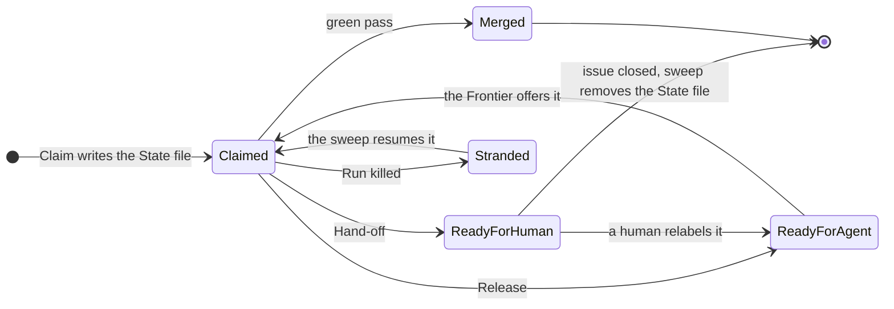
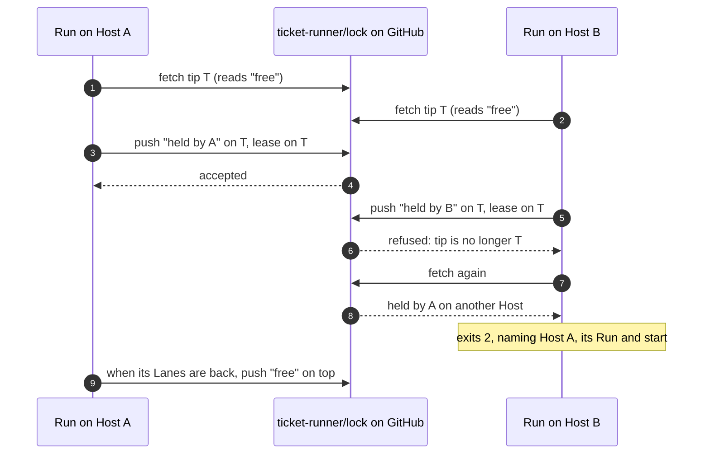
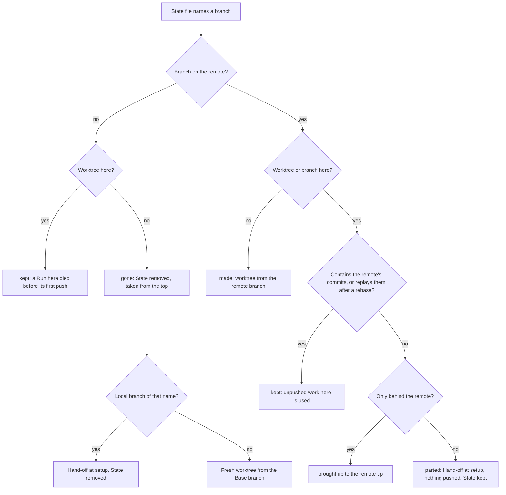

# Stopping and resuming

Nobody watches a Run, so it has to end well when something goes wrong: a Ticket it cannot finish, a subscription that runs out, a human who wants it to stop, a machine that disappears. Each of these leaves the Ticket where a later Run can pick it up, on this Host or another. That Run does not pay again for Stages already done, and no human has to unpick labels first.

This page covers what each ending leaves behind, and how the pipeline gets back from it.

## At a glance

| Ending | Caused by | Leaves behind |
|---|---|---|
| Merge | a green pass through every gate | a closed issue; branch and State file gone |
| [Hand-off](#hand-off) | a failure the Fix budget cannot cover | `ready-for-human`, a comment, a draft pull request; work and State kept |
| [Release](#release-on-a-rate-limit) | the subscription rate limit | `ready-for-agent`, no comment; work and State kept |
| [Stop](#stop-and-kill) | `ticket-runner stop` (SIGTERM) | nothing new |
| [Kill](#stop-and-kill) | Ctrl+C, SIGKILL, a vanished Host | the Claim; work as last pushed, and State |

After a merge or a Hand-off the Run refills the Lane. After a Release or a Stop it claims nothing more, and the busy Lanes finish what they hold. A kill ends it on the spot.

Each Ticket that is still unfinished then comes back by one road. The board decides which:


<!-- Sources: src/orchestrator.ts, src/stranded.ts, src/run.ts, src/resume.ts -->

A resumed Ticket carries on from the state it had reached. It does not start over.

## Hand-off

A [Hand-off](https://github.com/jjongs2/ticket-runner/blob/main/CONTEXT.md) gives a Ticket to a human. It is how every ending goes that is neither a merge nor a Release: a second failure after the Fix budget is spent, a Stage that timed out, CI that never finished, a branch in the way at setup. Not every one of them is somebody's defect.

A Hand-off does this, in order:

1. Opens a pull request, or reuses one. A pull request that is already open goes back into draft. Otherwise, when the worktree is one this Run may push from, the branch is pushed and a draft pull request opens under the Ticket's title. A failure here is logged; it never costs the relabel.
2. Records the State file, with the draft pull request in it and the Fix budget unspent. Where no Stage of this Run could have left work, it removes the file instead (see below).
3. Keeps the transcripts on the remote. It takes each Stage's `.command` and `.transcript.jsonl` file (the retries' too, under `retry/`) and the Run's `version.txt`, and puts them under `ticket-<n>/<runId>/` on the `ticket-runner/state` branch.
4. Rewrites the draft's body so it names where the transcripts are.
5. Posts the hand-off comment.
6. Takes off `in-progress`, puts on `ready-for-human`, and unassigns.

The comment follows [`docs/templates/handoff-comment.md`](https://github.com/jjongs2/ticket-runner/blob/main/docs/templates/handoff-comment.md):

```md
<!-- ticket-runner:handoff -->
**Handed off.** Failed at **verify**, after the fix budget was used.

- Failure: 1 of 6 criteria unmet
- Branch `agent/8-rate-limit-release` on the remote · worktree `/home/me/acme/.worktrees/ticket-8` · PR #31 (draft)
- Transcripts: `ticket-8/2026-09-17T09-00-00-000/` on the `ticket-runner/state` branch

<details><summary>Evidence</summary>
…
</details>
```

"On the remote" appears only when the remote has the branch. The worktree, pull request, transcripts and evidence parts are each dropped when there is nothing to name.

### When a Hand-off does less

A Hand-off at `setup` pushes nothing: there is either nothing to push, or what is in the way may be a human's work or another Host's.

| Case | Draft pull request | State file |
|---|---|---|
| Taken from the top, failed before its worktree existed | none: nothing to push | **removed**: nothing was branched |
| Taken from the top, a local branch of that name exists | none | **removed**: no Stage of this Run worked there |
| Resumed, this Host's branch has parted from the remote's | none opened; an open one goes to draft | kept: both copies are the pipeline's |
| Any failure after the worktree was ready | opened, or an open one back to draft | kept |

The comment names a worktree wherever there is one: this Run's, or the one the branch in the way is checked out in. The failure line says what to do, for example `delete it with git branch -D <branch> if the work on it is abandoned, or finish it by hand, then relabel the Ticket ready-for-agent`. The State file goes only where no Stage of this Run worked on the branch. Keeping it over a branch in the way would let a later Run resume into a human's work and run an implement Stage over it.

### What stays where

The Host a Ticket was worked on may be gone by the time a human looks, for example a cloud Host's VM. So everything a human or a later Run needs is on the Target's remote.

| What | Where | Lasts until |
|---|---|---|
| The Ticket's commits | branch `agent/<n>-<slug>` on the remote | the merge deletes it |
| State file | `ticket-<n>.json` on `ticket-runner/state` | the work merges or leaves the pipeline ([below](#the-state-file)) |
| Handed-off Stages' transcripts | `ticket-<n>/<runId>/` on `ticket-runner/state` | the State file goes |
| Worktree | `.worktrees/ticket-<n>` on that Host | the merge, or a human deletes it |
| Every Stage's full log (stdout, stderr too) | `.ticket-runner/runs/<runId>/<n>/` on that Host | a human deletes it |

Every Stage that commits pushes the branch. `.worktrees/` and `.ticket-runner/` are safe to delete whenever no Run is running: everything a Run needs is on the remote, and the next Run remakes a worktree from it.

## Handing a Ticket back

To hand a Ticket back, move its label from `ready-for-human` to `ready-for-agent`. The next Run finds it on the Frontier, reads its State file and carries on from what it reached. A Ticket that reached `implemented` goes straight to the Checks, so the implement Stage is not paid for twice.

A few things differ from the Run that handed it off:

- **Fix budget**: fresh. The Ticket went through a human's hands, and whatever they did is what the new budget is for. The old comment still says the budget was spent, because it was.
- **Draft pull request**: taken out of draft before CI is awaited, since a draft often runs no workflows and the wait would read "no checks". One that will not come out of draft, such as a pull request a human closed, is a Hand-off at `pr`: closing it said the work should not go on.
- **Hand-off comments**: each is marked `_Taken again by a later Run; this hand-off is history._` under its marker, which notifies nobody.
- **Progress comment**: a new one. The comment the human read is left exactly as they read it.

Until the relabel, the State file is inert. No Frontier offers a `ready-for-human` Ticket, the sweep passes over it without a word, and a Run given its number skips it as `not-ready`. Once the issue closes, the sweep removes the file, so a Ticket finished by hand leaves nothing behind.

Why a Hand-off keeps the State at all: the Run once misread the rate limit as an ordinary failure and handed off every Ticket it reached. Each of those cost a human a deleted branch. With the State kept, each costs one relabel ([ADR-0004](https://github.com/jjongs2/ticket-runner/blob/main/docs/adr/0004-resume-state-is-a-local-file.md), second amendment).

## Release on a rate limit

A Stage that hits the subscription rate limit has failed at nothing. Handing the Ticket off would make a human relabel a Ticket nothing was wrong with, and a fix Stage would only meet the same limit. So the Ticket is [released](https://github.com/jjongs2/ticket-runner/blob/main/CONTEXT.md) instead: it goes back on the board, and the next Run resumes it from the last Stage it finished, with its Fix budget as it was.

The pipeline decides this only for a session that failed. Any one of three signs is enough:

| Sign | Why it is there |
|---|---|
| the `result` event carries `api_error_status: 429` | the API's own answer |
| a `rate_limit_event` whose status is `rejected` | a warning-only event is not a stop: a session near the limit prints those and finishes |
| the result or stderr says `usage limit`, `session limit`, `rate limit` or `rate_limit` | read last because its wording has changed before |

A session that succeeds is never rate-limited, however often it mentions rate limits.

What the Release does:

- writes a `⏸ rate limited` row in the Progress comment, which is the whole report
- brings the State file up to date: `claimed` if the implement Stage was stopped, `implemented` if a later Stage was. The Fix budget stays as it was, except that a fix Stage stopped by the limit spends nothing.
- undoes the Claim: adds `ready-for-agent`, removes `in-progress`, then unassigns. The assignee comes off last because it is what another Run reads to tell a taken Ticket from a free one.
- posts no comment and opens no draft pull request

The Run then claims nothing more, because the limit that stopped one Stage would stop the next. The Lanes already busy finish their own Tickets, and the Run ends when the last one comes back. It does not wait for the limit to reset. The summary ends `Rate limited.`. A released Ticket counts as taken, so the exit code is `0` unless something was handed off.

Start a Run once the limit has reset and the Ticket is back on the Frontier, resumed from its State file.

## Stop and kill

A Run can end early in two ways, and they leave opposite things behind ([ADR-0006](https://github.com/jjongs2/ticket-runner/blob/main/docs/adr/0006-stop-is-a-signal-and-ctrl-c-is-a-kill.md)).

| | Stop | Kill |
|---|---|---|
| Sent by | SIGTERM, from `ticket-runner stop` or the Operator | Ctrl+C, SIGKILL, out of memory, a vanished Host |
| Busy Lanes | finish, to merge, Hand-off or Release | end with the Run |
| New Tickets | none, from the Frontier or the Stranded Tickets | none |
| Left behind | nothing stranded | a [Stranded Ticket](#stranded-tickets-and-the-sweep) per busy Lane, and the Run lock |
| Written to the board | nothing | nothing; the Claims simply stay |
| Exit code | the outcomes', as usual | none |

`ticket-runner stop` works only on the Run's own Host; on a cloud Host the Operator sends the signal. A lock a kill left behind is taken over by the next Run on the same Host by itself; from another Host it waits for a human ([The Run lock](#the-run-lock)).

On a Stop the Run logs one line naming what its Lanes hold, `#4 #9 left to finish · stopped`. The summary ends `Stopped at 22:07 · finishing #4 #9.`, with the time in UTC like the run id. A second SIGTERM is ignored rather than turned into a kill. A Stop cannot be taken back: the lock stays held until the Lanes are back, and starting a new Run is how to carry on. A narrowed Run stopped before it took any of its Tickets exits `2`.

Ctrl+C stays a kill on purpose. The Stages run in the Run's own process group, so the terminal sends SIGINT to every `claude` session as well as to the Run. A signal sent to the Run's pid alone leaves the Stages running with nobody to read them. Making Ctrl+C graceful would mean detaching the Stages into their own group, which reopens a kill path that took two bugs to get right.

### `ticket-runner stop`

`ticket-runner stop` reads the Run lock and signals the process it names. It needs no config, no `gh` and no Target readiness: the Run it stops passed all of those when it started.

```
$ ticket-runner stop
`ticket-runner run` (run 2026-09-17T09-00-00-000, pid 4321) will stop once the Tickets it holds are finished. It claims no more.
Ctrl+C in that Run's own terminal stops it at once instead, at the cost of killing the Stages it is running and leaving their Tickets stranded for the next Run.
```

| Finds | Prints | Exit |
|---|---|---|
| a Run on this Host | the two lines above | `0` |
| nobody holds the lock, or its Run on this Host is gone | `No Run to stop: …`. A dead lock is left for the next Run to take over. | `2` |
| a Run on another Host | names the Host, the Run and its start; `Nothing was sent.` | `2` |
| the signal could not be delivered | `Could not ask … to stop: <reason>` | `2` |

There is no stop file, so a second `stop` prints the same thing as the first.

## Stranded Tickets and the sweep

A killed Run releases nothing. Its Tickets keep their Claim, and their work stays on the remote as of the last push. That is why the State file is written as part of the Claim, not by the Release: a killed Run would never get to write it.

A [Stranded Ticket](https://github.com/jjongs2/ticket-runner/blob/main/CONTEXT.md) is one whose State file is still there while it still carries this pipeline's Claim (assigned to the current `gh` user, and labelled `in-progress`). No Frontier offers it, because it is claimed. So every Run sweeps the State files before it looks at the Frontier:

| The State file's Ticket | What the sweep does |
|---|---|
| still carries this user's Claim | stranded: queued and resumed in place. Claim untouched, nobody notified. |
| Claim has come off (`ready-for-agent` or `ready-for-human`) | nothing. The Frontier picks up the first; the second waits for a human. |
| has closed | removes the State file and any kept transcripts |
| is assigned to someone else | logs `#<n> is resumable, but <user> holds it now` and leaves it |
| the tracker cannot be asked about it | logs it and leaves it. A Run never resumes, or forgets, a Ticket on a guess. |
| the State file cannot be read | logs `#<n> has a State file this Version cannot use, written by <version>`; leaves the file and the Claim alone |

An unreadable State file was probably written by a newer pipeline.

Stranded Tickets fill free Lanes first, lowest number first, before anything the Frontier offers. While they fill every Lane, the Frontier is not asked for at all. With more than one Lane, a stranded Ticket and a Frontier Ticket can run side by side. A Run given Ticket numbers sweeps only those, and leaves every other stranded Ticket for the next unnarrowed Run.

Nothing records a process id. Only one Run holds the [Run lock](#the-run-lock) at a time. A Run that holds it and sees this pipeline's Claim on a Ticket knows the Run that claimed it is not running: on this Host because the lock's own liveness check said so, and on another because a human released the lock that Run left.

A kill still costs more than a Stop. Whatever the Stage had not yet committed and pushed is lost. A worktree left in the middle of a rebase is aborted back to the branch tip before the Checks grade it.

## The State file

Without a record of how far a Ticket got, a released or stranded Ticket would start over when it came back: its implement Stage paid for again, and a spent Fix budget fresh again. The State file is that record.

The file is JSON a human can read without the pipeline:

```json
{
  "ticket": 8,
  "branch": "agent/8-rate-limit-release-and-resume",
  "state": "implemented",
  "fixUsed": false,
  "pullRequest": 31,
  "title": "feat: release a rate-limited Ticket (#8)",
  "runId": "2026-09-17T09-00-00-000",
  "version": "0.5.2",
  "updatedAt": "2026-09-17T10:14:02.511Z"
}
```

| Field | Meaning |
|---|---|
| `ticket` | the Ticket, repeated so the file reads on its own |
| `branch` | where the work is, used as-is rather than derived from the title again |
| `state` | `claimed` (the implement Stage has not finished) or `implemented` (its work is on the branch) |
| `fixUsed` | whether the Fix budget is spent. Resuming buys no second chance, except after a Hand-off. |
| `pullRequest` | the pull request already open, so a resumed Run does not open a second one |
| `title` | the latest title the implement or fix Stage gave for the whole branch, which names the pull request |
| `runId`, `version`, `updatedAt` | which Run and which [Version](./internals.md#versions) wrote it, and when |

There are only two states. Everything after the implement Stage (Checks, Verify, rebase, pull request, CI, merge) is run again from the Checks by a Run that resumes at `implemented`. None of those steps is worth a state a resume could land on halfway.

| When | What happens to the file |
|---|---|
| the Claim, before any label changes | written. A remote that refuses it ends the Ticket at `setup` with nothing claimed. |
| the implement Stage commits | `state` becomes `implemented` |
| a code Stage gives a title | `title` |
| a pull request opens | `pullRequest` |
| a fix Stage comes back | `fixUsed: true` |
| Release, Hand-off | updated, as above |
| merge; sweep finds the issue closed; the branch is in neither the worktree here nor on the remote; Hand-off over a branch in the way | removed |

Every write but the first is logged and nothing more when it fails. The remote then holds an earlier state of the same Ticket, and resuming from further back costs a Stage rather than being wrong.

### The `ticket-runner/state` branch

A State file kept in one checkout can be resumed only on that machine. A Ticket a cloud Run released, left stranded or handed off would be lost with the VM, and a Run on a workstation would never know of it. So the State lives on the Target's remote, where a Run on any Host can resume a Ticket another Host left ([ADR-0004](https://github.com/jjongs2/ticket-runner/blob/main/docs/adr/0004-resume-state-is-a-local-file.md), last amendment). It is kept off the issue because the board is written for humans, and a machine record there would be noise and a second source of truth beside the labels.

- Each change rewrites the branch as one snapshot commit with no parent. Nothing reads its history, and a branch that grew with every Stage would grow the Target with it.
- The push uses `--force-with-lease` on the tip it read, so another writer's newer snapshot is never overwritten. It is read again and the edit reapplied, up to three tries.
- It is built from git objects and a scratch index, so the main checkout's tree is never touched. It is pushed unsigned and with `--no-verify`, because it holds no code.
- Within one Run, changes take turns, so two Lanes never push snapshots that each miss the other's Ticket.

Never commit to this branch by hand while a Run is running.

A Target upgraded from a pipeline that kept State files under `.ticket-runner/state/` is refused, with the Tickets named. Nothing migrates them: finish those Tickets with the old Version, or hand them to a human, then delete the directory.

## The Run lock

Two Runs sharing a Target would fight over its Base branch, its Frontier and its worktrees. So one Run at a time holds a Target, whichever Host it is on. A lock only one machine's processes can see would not keep out a Run on another Host, so the lock lives on the Target's GitHub repository, where every Host and every human can see it ([ADR-0008](https://github.com/jjongs2/ticket-runner/blob/main/docs/adr/0008-a-cloud-host-is-a-claude-code-cloud-session.md)).

It is `lock.json` at the tip of the `ticket-runner/lock` branch. That branch always exists once a Run has started. The file names the holder: `host` (kind, id, name), `pid`, `command`, `runId`, `startedAt`, and the process's start time as the OS reports it. Otherwise it reads `{ "held": false }`. The commit message says the same thing in words, for example ``Held by run 2026-09-17T09-00-00-000 on the workstation `desk`: ticket-runner run`` or `Free`.

Taking it is a compare-and-swap. Unlike the state branch, the lock keeps its history, so GitHub shows who held the Target and when:


<!-- Sources: src/adapters/git-workspace.ts, src/lock.ts, src/start.ts -->

What a Run makes of a held lock depends on where the holder is:

| Holder | Standing | The new Run |
|---|---|---|
| on this Host, its process alive, start time matching | running | refused: `Another ticket-runner is running on this Host: …` |
| on this Host, its process gone (or its pid reused by another program) | abandoned | takes the lock over by itself, so a Run ended by Ctrl+C costs nothing |
| on another Host | elsewhere | refused, never presumed dead |

Nothing on one Host can see another Host's processes. A lease that expires unless it is renewed was rejected: a live Run would lose its Target to one missed heartbeat. So a lock left from another Host stays until a human releases it. Ask an Operator, or commit a `lock.json` that reads `{ "held": false }` to the branch on GitHub, and only when no Run is running. A cloud VM reclaimed mid-Run costs exactly one such release.

A Host is told apart by a stable id. A workstation uses its machine id, or its hostname where it has none. A cloud Host uses its session id. A cloud Host that names no session gets a random id, so even its own later Runs see its lock as a stranger's.

A Run's refusals come before the lock: a Target `init` has not set up, State files left in the checkout, no Check to run. None of them leaves a lock behind. A Run that cannot release the lock when it ends says so, and keeps its own exit code.

## Resuming into a worktree

The branch on the remote carries a Ticket's work between Hosts, so a resumed Ticket starts from it rather than from whatever this Host has. Every Stage that commits (implement, fix, conflict) pushes the branch at once, whatever became of the Stage, since a session the limit stopped may already have committed. A failed push is logged and nothing more.

Before resuming, a rebase that a killed Run left in progress is aborted. Then the pipeline compares this Host's copy with the remote branch:


<!-- Sources: src/adapters/git-workspace.ts, src/orchestrator.ts -->

"Parted" means each side holds commits the other lacks: another Host moved on while this one held work it never pushed. The pipeline does not pick a side silently. The Hand-off names both copies and the two ways to make them one: throw this Host's copy away, or force-push it over the remote by hand. Then relabel the Ticket. Both copies are the pipeline's work, so the State file stays, and the next Run resumes from whichever side the human kept.

Pushes use `--force-with-lease`, so a rebase can rewrite the branch but can never overwrite another Host's newer work.

## Related pages

- [From Ticket to merge](./ticket-to-merge.md): the lifecycle, the Fix budget and the Landing that these endings interrupt
- [Running](./running.md): `run`, `stop`, a narrowed Run, the summary and exit codes, and the Operator on a cloud Host
- [Configuration](./configuration.md): Stage limits and timeouts, which decide when a Stage "did not finish"
- [Internals](./internals.md): the `Workspace` port that keeps the State and the lock, and the ADRs behind this page

## References

- [`src/orchestrator.ts`](https://github.com/jjongs2/ticket-runner/blob/main/src/orchestrator.ts): `takeTicket`, `resumable`, `ResumeRecord`, `release`, `handOff`
- [`src/run.ts`](https://github.com/jjongs2/ticket-runner/blob/main/src/run.ts): `processRun`
- [`src/stranded.ts`](https://github.com/jjongs2/ticket-runner/blob/main/src/stranded.ts): `strandedTickets`, `holdsClaim`
- [`src/resume.ts`](https://github.com/jjongs2/ticket-runner/blob/main/src/resume.ts): `readStateFile`, `STATE_BRANCH`, `localStateTickets`
- [`src/handoff.ts`](https://github.com/jjongs2/ticket-runner/blob/main/src/handoff.ts): `markHandoffsTaken`, `carriesCurrentHandoff`
- [`src/stop.ts`](https://github.com/jjongs2/ticket-runner/blob/main/src/stop.ts): `requestStop`, `StopSignal`, `listenForStop`
- [`src/lock.ts`](https://github.com/jjongs2/ticket-runner/blob/main/src/lock.ts), [`src/host.ts`](https://github.com/jjongs2/ticket-runner/blob/main/src/host.ts), [`src/start.ts`](https://github.com/jjongs2/ticket-runner/blob/main/src/start.ts): `startRun`
- [`src/adapters/git-workspace.ts`](https://github.com/jjongs2/ticket-runner/blob/main/src/adapters/git-workspace.ts): `worktreeFromRemote`, `changeState`, `acquireLock`, `keepTranscripts`
- [`src/adapters/claude-agent-runner.ts`](https://github.com/jjongs2/ticket-runner/blob/main/src/adapters/claude-agent-runner.ts): `rateLimited`
- [`src/run-log.ts`](https://github.com/jjongs2/ticket-runner/blob/main/src/run-log.ts): `transcriptFiles`
- [`docs/templates/handoff-comment.md`](https://github.com/jjongs2/ticket-runner/blob/main/docs/templates/handoff-comment.md), [`docs/templates/draft-pr-body.md`](https://github.com/jjongs2/ticket-runner/blob/main/docs/templates/draft-pr-body.md), [`docs/templates/stop-report.txt`](https://github.com/jjongs2/ticket-runner/blob/main/docs/templates/stop-report.txt)
- [ADR-0004](https://github.com/jjongs2/ticket-runner/blob/main/docs/adr/0004-resume-state-is-a-local-file.md), [ADR-0006](https://github.com/jjongs2/ticket-runner/blob/main/docs/adr/0006-stop-is-a-signal-and-ctrl-c-is-a-kill.md), [ADR-0008](https://github.com/jjongs2/ticket-runner/blob/main/docs/adr/0008-a-cloud-host-is-a-claude-code-cloud-session.md)
