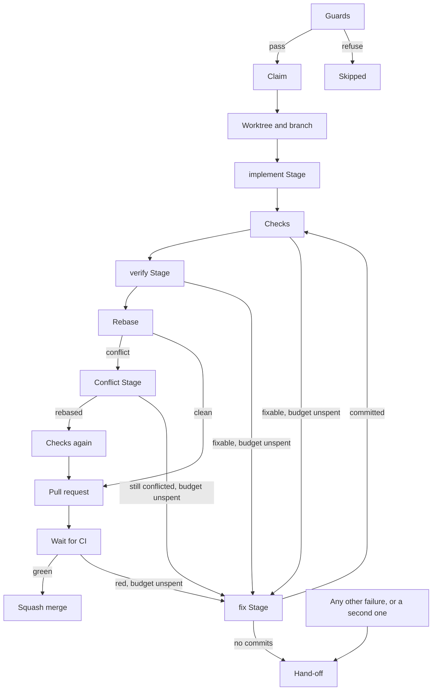
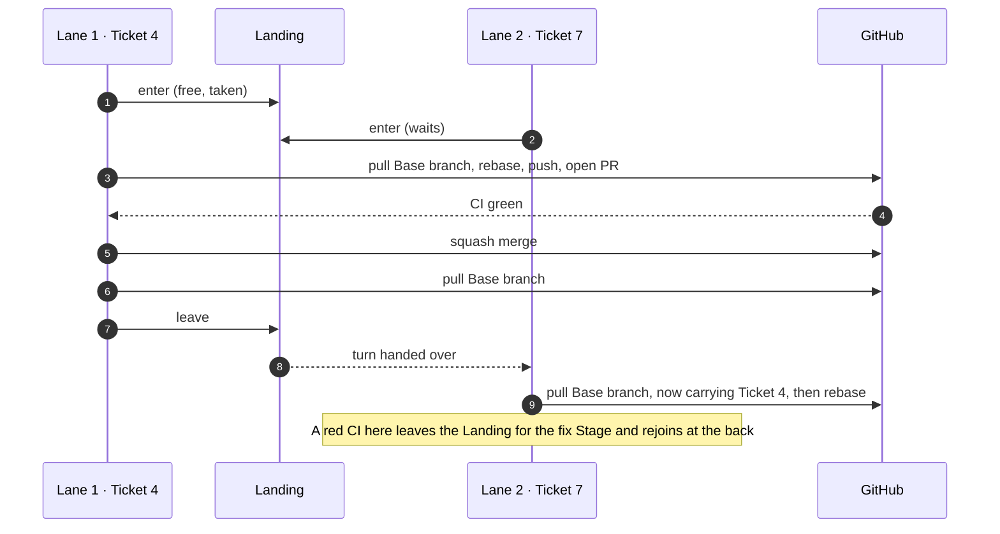

# From Ticket to merge

Nobody watches a Run, so nothing may merge on a single session's word. Every [Ticket](https://github.com/jjongs2/ticket-runner/blob/main/CONTEXT.md) goes through the same gates in the same order: deterministic Checks, a second session that tries to prove the work wrong, and CI. A failure a fresh session could mend buys exactly one fix Stage; anything else goes to a human. The Tickets of a Run are implemented side by side, but they land one at a time, so what CI graded is what reaches the Base branch.

This page follows one Ticket from its Claim to its merge. What happens when it stops short, whether by a Hand-off, a Release, a Stop or a Run that never came back, is on [Stopping and resuming](./stopping-and-resuming.md).

| Step | What happens | Who decides |
|---|---|---|
| Claim | Guards, State file, assign, `ready-for-agent` → `in-progress` | the pipeline |
| Worktree | `agent/<n>-<slug>` in `.worktrees/ticket-<n>` | git |
| implement Stage | `/mattpocock-skills:implement` in the worktree | an agent |
| Checks | Nothing uncommitted, then each Check command | exit codes |
| verify Stage | Adversarial grading of the Acceptance Criteria | the pipeline, from the Verdict |
| fix Stage | One fresh session given the failure, once per Ticket | the Fix budget |
| Landing | Rebase, Conflict Stage, pull request, CI, squash merge | one Lane at a time |
| After the merge | Tick met criteria, clean up | the pipeline |


<!-- Sources: src/orchestrator.ts, src/lifecycle.ts -->

Every edge to the fix Stage is taken at most once per Ticket. A second failure of any kind, or any failure the fix Stage cannot act on, is a Hand-off. A rate-limited Stage leaves this diagram entirely: it releases the Ticket (see [Stopping and resuming](./stopping-and-resuming.md)).

## The Claim

The [Guards](./planning.md) run before anything is written. An issue the pipeline will not take is never marked as taken, and the guards ask again even though the Frontier already dropped claimed issues, because a Ticket can change hands between the listing and the Claim.

Then, in this order:

1. The **State file** is written: the Ticket's branch, the state it reached (`claimed`) and whether the Fix budget is spent. It comes first because a Claim that no State file names is the one outcome to rule out. It is also the only bookkeeping write allowed to fail the Ticket; later writes that fail are logged and the Run goes on.
2. The Ticket is assigned to the `gh` user, `in-progress` goes on and `ready-for-agent` comes off. A Stranded Ticket already wears this Claim, so it is not written again.
3. Any hand-off comment still current on the Ticket gains a line marking it as history: _Taken again by a later Run; this hand-off is history._

## The worktree and branch

| | Value |
|---|---|
| Branch | `agent/<n>-<slug>`: the title in lowercase kebab-case, cut at a word boundary to 40 characters |
| Worktree | `.worktrees/ticket-<n>` under the Target's root, gitignored |
| Branched from | The remote's Base branch, freshly fetched, with no upstream set |

A branch of that name that already exists is never reused. The Ticket is handed off at `setup`, and the comment says whose branch it is and the command that clears it. A resumed Ticket carries on in the branch its State file names instead; see [Stopping and resuming](./stopping-and-resuming.md).

## How a Stage runs

A [Stage](https://github.com/jjongs2/ticket-runner/blob/main/CONTEXT.md) is one `claude -p` child process with one job ([ADR-0002](https://github.com/jjongs2/ticket-runner/blob/main/docs/adr/0002-claude-p-child-process-per-stage.md)). Headless mode expands `/plugin:skill` in the prompt, which is the only way to drive a user-invoked skill of the `mattpocock-skills` plugin (version 1.2.3). A process per Stage also gives each Stage its own limits, a JSON schema for its answer, and a command line a human can paste to reproduce it.

Every Stage runs in the Ticket's worktree with `--permission-prompts none`, the configured `permissionMode`, and its own `model`, `effort`, `maxTurns` and `maxMinutes` (see [Configuration](./configuration.md)). The wall-clock limit is enforced by killing the process.

| Stage | Prompt opens with | Structured answer |
|---|---|---|
| implement | `/mattpocock-skills:implement <issue URL>` | optional `title` and [`notes`](#notes) |
| verify | `Ticket: <issue URL>`, no skill | the Verdict, optional `notes` |
| fix | `Ticket: <issue URL>`, no skill | optional `title` and `notes` |
| conflict | `/mattpocock-skills:resolving-merge-conflicts` | none |

Every prompt then carries the same self-hosting guidance (never run the pipeline's own commands, never kill processes the Stage did not start), and ends with the Stage's `extraPrompt` from the config. The implement prompt adds guidance that works around the skill in an unattended session: commit before the review, invoke `/mattpocock-skills:code-review` by its full name, run the review sub-agents in the foreground, and leave the worktree clean.

**The Stage mark.** Every Stage's shell carries `TICKET_RUNNER_STAGE=<stage>`, and the CLI refuses to start while it is set. A Stage therefore cannot claim a Ticket or start a nested Run by mistake. It is a tripwire, not a sandbox: a session that unsets the variable gets through, which is why the prompt says the same thing in words.

**Transcripts.** Each Stage writes `<stage>.command`, `.stdout`, `.stderr` and `.transcript.jsonl` under `.ticket-runner/runs/<runId>/<n>/`. The command line is written before the process starts, and the output as it arrives, so a killed Run still leaves them. The fix Stage and the pass it buys write to `<n>/retry/`, so the failing pass keeps its files. See [Running](./running.md) for reading them.

**How a Stage can end.** The runner reads the session's last `result` event, never what the session talked about:

| Failure | Progress cell | Meaning |
|---|---|---|
| `timed-out` | `❌ timed out` | Killed at `maxMinutes` |
| `turn-capped` | `❌ turn capped` | Reached `maxTurns` |
| `rate-limited` | `⏸ rate limited` | A 429, a rejected `rate_limit_event`, or a message naming the limit. Releases the Ticket |
| `nonzero-exit` | `❌ exited non-zero` | Any other failed session |
| `invalid-result` | `❌ invalid result` | The verify Stage answered no Verdict at all |

## The implement Stage

The implement skill reads the Ticket, builds it and reviews it. When the session ends, the pipeline routes its [Notes](#notes), records its `title`, and pushes the branch if it has commits, so a Run on another Host can resume from it. Then:

- A Stage that did not finish is a Hand-off at `implement`.
- A branch with no commits beyond the Base branch is a Hand-off: an agent that gave up silently leaves nothing to grade.
- Otherwise the State file moves to `implemented`, so no later Run pays for this Stage again.

## The Checks

Two gates, run by the pipeline itself rather than by an agent:

1. **Nothing uncommitted.** A worktree holding changes no commit carries fails, naming every path. Gitignored files, such as installed dependencies, do not count.
2. **The Check commands**, in order, each through a shell in the worktree, each under `checkTimeoutMinutes` (default 15). The first failure stops the rest. A command killed at the limit is reported as timed out, with a line appended to its output saying it hung rather than failed.

The commands come from `checks` in the config, or else `npm test` and `npm run typecheck`, whichever `package.json` defines. With `gates.checks` on and no command at all, the Run refuses to start. Turning `gates.checks` off only lets a Run start with no commands. In the code, commands that are configured still run.

Both failures spend the Fix budget. A Check runs the branch's own code, so a hang is a defect in that code, which is what a fix Stage is for.

## The verify Stage and its Verdict

No human reviews the code before it merges, and the session that wrote it is the last one to trust on whether it works. So a fresh session, with no plugin skill, tries to prove each Acceptance Criterion is **not** met. It reads the criteria from the body and the comments, runs the code, may write throwaway tests, and must not commit. Afterwards the pipeline runs `git reset --hard` and `git clean -fd` in the worktree, so its scratch files never reach the pull request. Its Notes are routed first, because the scratch work goes with the discard.

The **Verdict** is one entry per criterion: `text`, `status` (`met`, `unmet` or `unverifiable`) and `evidence`, plus the agent's own `pass`. The agent's `pass` is advisory. The pipeline decides for itself: **no criterion unmet and at least one met.**

| Verdict | Progress cell | Result |
|---|---|---|
| Passes | `✅ <k> met · <v> unverifiable` | On to the Landing |
| Some `unmet` | `❌ <u> unmet` | Spends the Fix budget; the fix Stage gets each unmet criterion with its evidence |
| All `unverifiable` | `❌ no evidence` | Hand-off: there is nothing to merge on |
| Missing or malformed | `❌ no Verdict` | Hand-off |

## The fix Stage and the Fix budget

Without a cap, an unattended pipeline could loop on a Ticket it cannot solve, paying for a session on every pass. So the [Fix budget](https://github.com/jjongs2/ticket-runner/blob/main/CONTEXT.md) is one fix Stage per Ticket, and whatever still fails after it goes to a human. The fix Stage is a fresh session on the same branch, with no plugin skill: the implement skill would re-read the Ticket and start over, and what is wanted is one concrete defect mended. Its prompt names the kind of failure, the one-line summary, and the evidence in a fence. It is asked to reproduce the failure, fix the cause, add a regression test for an unmet criterion, and stay inside the Ticket.

Only a defect a fresh session could mend spends the budget:

| Failure | At | Spends the budget? |
|---|---|---|
| Changes no commit carries | checks | Yes |
| A Check failed or timed out | checks | Yes |
| A criterion `unmet` | verify | Yes |
| The Conflict Stage did not finish the rebase | rebase | Yes |
| A pull request check failed | ci | Yes |
| A Stage that did not finish (timed out, turn-capped, non-zero, invalid result) | its Stage | No, Hand-off |
| implement left no commits | implement | No, Hand-off |
| A Verdict with no evidence, or none at all | verify | No, Hand-off |
| The Conflict Stage could not be run, or git could not be asked | rebase | No, Hand-off |
| The Base branch could not be pulled | rebase | No, Hand-off |
| Pushing or opening the pull request failed | pr | No, Hand-off |
| CI timed out, found conflicting, or had no checks | ci | No, Hand-off |
| The merge failed | merge | No, Hand-off |
| A rate limit, anywhere | any | No, a Release |

After a fix Stage, the Ticket starts again at the Checks. Every gate grades the fix, the verify Stage included, so a fix is held to the same bar as the first attempt. A fix Stage whose branch did not grow is a Hand-off straight away: re-grading an untouched branch could only fail the same way. A squashed or amended branch counts as not grown. A second failure of any kind is a Hand-off, and the hand-off comment says the budget was already used.

The budget is recorded in the State file once the fix Stage comes back. A fix Stage stopped by the rate limit spends nothing. A Release carries a spent budget over to the next Run; a Hand-off gives it back, because the Ticket only returns through a human's hands.

## Lanes and the Frontier refill

Most of a Ticket's time goes on its implement and verify sessions, and nothing they do collides with another Ticket's. Taken one at a time, a Frontier of six independent Tickets would take six times as long as one, and planning a Spec into small Tickets would only lengthen the wait. The Frontier already holds nothing but Tickets that do not depend on each other, so a Run takes several at once.

A Run holds as many Tickets at once as it has [Lanes](https://github.com/jjongs2/ticket-runner/blob/main/CONTEXT.md): `--lanes`, else `lanes` in the config, else one. Every free Lane is filled at the start, and a Lane is refilled the moment its Ticket ends:

1. [Stranded Tickets](./stopping-and-resuming.md) first, found once before the first fill.
2. Then the Frontier, **recomputed at every refill**: open `ready-for-agent` issues nobody is assigned to, whose native blockers are all closed, lowest number first.

Recomputing is what keeps Tickets apart. A merge that closes a blocker puts the Ticket it unblocked into the same Run, and a Ticket another Lane is still working on is still an open blocker. No heuristic decides which Tickets are safe together; the `blocked by` edges do. A Run given Ticket numbers applies the same rules to those numbers only ([Running](./running.md)).

Lanes run their Checks at the same time in different worktrees, so a Target whose Checks share a port or a database keeps one Lane. A Release or a Stop stops the refills; the busy Lanes finish what they hold.

## The Landing

Lanes that each rebased and merged on their own would merge branches that CI graded against a Base branch another Lane had since moved, so what landed would be code no gate had seen. Rebasing again just before the merge would pay for the Checks and CI twice. So the [Landing](https://github.com/jjongs2/ticket-runner/blob/main/CONTEXT.md), from the pull of the Base branch before the rebase to the pull after the merge, holds one Ticket at a time, in arrival order. The Base branch cannot move between a Ticket's rebase and its merge, and what CI graded is what lands ([ADR-0005](https://github.com/jjongs2/ticket-runner/blob/main/docs/adr/0005-landing-is-a-serialized-section.md)). implement and verify, where the time goes, stay parallel. The cost is that one Lane's Conflict Stage or slow CI holds the others' Landing. GitHub's merge queue was rejected, because it would make a repository setting part of Target readiness.


<!-- Sources: src/landing.ts, src/orchestrator.ts -->

A Ticket also leaves the Landing for a fix Stage, a Hand-off or a Release, so nobody waits behind a session.

### Rebase

The Base branch is first brought up to the remote's: `git pull --ff-only` when it is checked out, a ref fetch otherwise. Then `git rebase <base>` runs in the worktree. A clean rebase goes straight to the pull request. A conflict is left exactly where git stopped, for the Conflict Stage.

### The Conflict Stage

A conflict is not a defect in the branch: the Base branch moved on underneath it. So one [Conflict Stage](https://github.com/jjongs2/ticket-runner/blob/main/CONTEXT.md) runs in the stopped rebase with git's output, driving `/mattpocock-skills:resolving-merge-conflicts`, and **it does not spend the Fix budget.** It is told to finish the rebase and never abort it, to keep both intents where they are compatible and the Ticket's where they are not, and to touch no file the conflict did not.

**The worktree decides, not the session's exit.** The rebase counts as resolved only when all of these hold:

- No rebase is still in progress.
- The Base branch is an ancestor of the branch, which catches a session that quietly ran `git rebase --abort`.
- No merge commit sits between the Base branch and the branch: merging would satisfy the ancestry without a rebase.
- No path is unmerged.
- No conflict marker is left in any file, tracked or untracked (ignored files and binaries aside).

| What the worktree shows | Result |
|---|---|
| Resolved, however the session ended (even rate-limited) | `✅ rebased`; push, then **the Checks again** |
| Unresolved, session rate-limited | Abort the rebase, Release |
| Unresolved otherwise | `❌ unresolved`; abort the rebase, spend the Fix budget |
| The Stage could not run, or git could not be asked | `❌ unknown`; abort the rebase, Hand-off |

The Checks run again because the resolution is code no gate has seen. verify is not asked again: the Stage changes no behaviour the criteria cover. An unresolved rebase hands the fix Stage the conflict and what is still wrong as its evidence. The abort always happens, so a fix Stage or a human never inherits a half-finished rebase.

### Pull request

The branch is pushed with `--force-with-lease`, since the rebase rewrote it. The pipeline opens a ready (non-draft) pull request against the Base branch, or updates the one it already has: a new title and body, and out of draft (a draft often runs no workflows, so a draft left from a Hand-off would read as "no checks").

**The title** is the first of these in the commit convention's shape, `<type>(<scope>): <summary>` on one line (a trailing `(#<n>)` is dropped):

1. The latest `title` the implement or fix Stage answered for the whole branch, in this Run or recorded in the State file by an earlier one.
2. The branch's first commit subject.
3. The Ticket title, as it is.

A Stage answers a title rather than having it read off a commit because a commit subject describes only its own commit: a fix Stage that did most of the work could not otherwise retitle a branch whose first commit is already pushed.

**The body** is `Closes #<n>`, the Verdict counts, the criteria in a folded list (evidence shown for any not `met`), and a line naming the Run. On a workstation that line also points at `.ticket-runner/runs/<runId>/<n>/`; a cloud Host's run directory does not outlive its session, so there it names the Run alone.

### CI wait and grace period

The pipeline polls the head commit's check runs and commit statuses every 15 seconds until they settle or `ciTimeoutMinutes` (default 30) runs out.

| What GitHub shows | Progress cell | Result |
|---|---|---|
| Every check passed or skipped | `✅ passed` | Merge |
| A check failed, was cancelled, timed out, needs action or could not start | `❌ failed` | Spends the Fix budget |
| Checks still pending at the timeout | `❌ timed out` | Hand-off |
| No checks, and GitHub finds the pull request conflicting | `❌ conflicting` | Hand-off at once |
| No checks after the grace period, `gates.ci` on | `❌ no checks` | Hand-off |
| No checks after the grace period, `gates.ci` off | `⚠️ no checks` | Merge, with the warning row |

A failed check hands the fix Stage the tail of up to three failing Actions jobs' logs. A conflicting pull request is handed off without waiting, because GitHub runs no checks on it; only a human merging meanwhile can cause it.

**The grace period.** Right after a pull request opens, GitHub reports no checks for a while before the workflow's check run exists; it has taken over three minutes. So "no checks" counts only after `ciGraceMinutes` (default 5, never longer than the CI timeout). A Target with no CI workflow pays this once per Landing.

### Squash merge and its commit

The pipeline squash-merges through GitHub's REST API with a commit message it composed itself:

```text
<title> (#<pr>)

Closes #<n>

Verdict: <k> met · <u> unmet · <v> unverifiable

- <branch commit subject>
- <branch commit subject>

Co-authored-by: <name> <email>
```

The subject is the pull request title. Commit subjects and `Co-authored-by` trailers are read after the rebase, since those are the commits that land. `git log` renders no HTML, so the per-criterion evidence stays in the pull request body.

### After the merge

The Ticket is merged, so nothing below can hand it off. Each step's failure is logged and the next step still runs:

1. Remove the State file, so the Ticket never looks resumable again.
2. Tick the met criteria (below).
3. Remove `in-progress`. The merge closed the issue.
4. Pull the Base branch. This ends the Landing, and the next Lane's Ticket rebases onto a Base branch that already carries this one.
5. Remove the worktree and the local branch, and delete the remote branch unless GitHub already did.

## What the board is told

**The Progress comment.** A Ticket gets one [Progress comment](https://github.com/jjongs2/ticket-runner/blob/main/CONTEXT.md), found again by a hidden marker and rewritten in place as each step ends, so only the first write notifies anyone. It is posted when the first row is recorded. Each Run that works the Ticket has its own section below earlier Runs' sections, headed by the Version, the Run id and the branch:

```text
**ticket-runner** `0.4.0` · run `2026-09-17T09-00-00-000` · `agent/4-planning-guards`

| Stage | Outcome | Turns | Duration |
|---|---|---|---|
| implement | ✅ committed | 46 | 21m |
| checks | ❌ `npm test` failed | – | 2m |
| fix | ✅ committed | 12 | 6m |
| checks | ✅ passed | – | 2m |
| verify | ✅ 6 met · 1 unverifiable | 9 | 4m |
| ci | ✅ passed | – | 3m |
| merge | ✅ #31 | – | – |
```

Rows carry a few words only. Anything a human has to act on is its own comment, since those are worth a notification: a hand-off, a guard warning, a Note. A Run taking a Ticket back from a human starts a fresh Progress comment and leaves the one the human read untouched. A failure to write the comment never costs the Ticket.

**Ticking met criteria.** After the merge, every criterion the Verdict marked `met` is ticked (`- [ ]` → `- [x]`) wherever it is written: the body, or any comment, such as the one triage posted its brief in. Matching forgives differences in whitespace and case only. An `unverifiable` criterion stays unticked, because nobody gathered evidence for it. A criterion the Stage reworded past matching is left unticked, and the Run log says how many were not matched.

## Notes

A Stage keeps meeting defects that are not its Ticket's. Fixing them widens the Ticket past what verify grades; ignoring them loses them in a transcript. So the implement, verify and fix Stages end with a list of [Notes](https://github.com/jjongs2/ticket-runner/blob/main/CONTEXT.md), and the pipeline posts each one where a human will meet it. A Note is a defect, never a preference, a refactor or a nice-to-have test. It is never acted on in the current Ticket. For verify, a judgement on a criterion belongs in the Verdict, not in a Note.

Each Note has a `summary` (required), and optional `evidence`, `impact`, `next` and `ticket`. Notes are routed before the Stage's own outcome is judged, so a Stage that ran out of turns still reports what it noticed.

| The Note names | Where it goes |
|---|---|
| An open, unclaimed Ticket that is not a Spec | A comment on that Ticket |
| No Ticket, or the Stage's own Ticket (about to close) | The standing Notes issue |
| A closed, claimed (`in-progress`) or Spec issue | The standing Notes issue, saying which Ticket it was meant for and why it did not go there |
| A number that will not take the comment (invented, locked) | The standing Notes issue, with the number it was meant for |

**The standing Notes issue** is one open `needs-triage` issue, titled "Notes from the pipeline", that collects Notes as comments. It is found by a marker in its body, not by its title, so renaming it opens no second one. It is opened by the first Note that needs it and shared by every Lane of the Run. Triage empties it by hand and closes it, and the next Note opens a fresh one. When one is open, each noting Stage's prompt carries its number, so the Stage can read what is already reported and add only what would change a reader's action.

Every Note comment opens with where it came from (`From #<origin> <stage>`), then the summary in bold and each part under its label. A `- [ ]` at the head of a line is escaped, so a Note is never read as Acceptance Criteria. A Note that cannot be posted costs that Note alone, never the Ticket. The Run summary lists each Note as a `noted` row under the Ticket that made it.

## Related pages

- [Planning](./planning.md): the Guards that run before the Claim, and how to write Acceptance Criteria verify can grade.
- [Running](./running.md): starting a Run, `--lanes`, a narrowed Run, the summary, exit codes and transcripts.
- [Configuration](./configuration.md): `checks`, `gates`, the Stage limits, `ciTimeoutMinutes`, `ciGraceMinutes`.
- [Stopping and resuming](./stopping-and-resuming.md): Hand-off, Release, Stop, Stranded Tickets and handing a Ticket back.
- [Internals](./internals.md): the ports and adapters behind each step.

## References

- [`src/orchestrator.ts`](https://github.com/jjongs2/ticket-runner/blob/main/src/orchestrator.ts): `processTicket`, `takeTicket`, `verify`, `fix`, `resolveConflict`, `requireGreenCi`
- [`src/run.ts`](https://github.com/jjongs2/ticket-runner/blob/main/src/run.ts), [`src/frontier.ts`](https://github.com/jjongs2/ticket-runner/blob/main/src/frontier.ts), [`src/landing.ts`](https://github.com/jjongs2/ticket-runner/blob/main/src/landing.ts)
- [`src/prompts.ts`](https://github.com/jjongs2/ticket-runner/blob/main/src/prompts.ts), [`src/verdict.ts`](https://github.com/jjongs2/ticket-runner/blob/main/src/verdict.ts), [`src/title.ts`](https://github.com/jjongs2/ticket-runner/blob/main/src/title.ts), [`src/lifecycle.ts`](https://github.com/jjongs2/ticket-runner/blob/main/src/lifecycle.ts)
- [`src/progress.ts`](https://github.com/jjongs2/ticket-runner/blob/main/src/progress.ts), [`src/criteria.ts`](https://github.com/jjongs2/ticket-runner/blob/main/src/criteria.ts), [`src/notes.ts`](https://github.com/jjongs2/ticket-runner/blob/main/src/notes.ts), [`src/templates.ts`](https://github.com/jjongs2/ticket-runner/blob/main/src/templates.ts), [`src/handoff.ts`](https://github.com/jjongs2/ticket-runner/blob/main/src/handoff.ts)
- [`src/stage-guard.ts`](https://github.com/jjongs2/ticket-runner/blob/main/src/stage-guard.ts), [`src/run-log.ts`](https://github.com/jjongs2/ticket-runner/blob/main/src/run-log.ts), [`src/startup.ts`](https://github.com/jjongs2/ticket-runner/blob/main/src/startup.ts), [`src/config.ts`](https://github.com/jjongs2/ticket-runner/blob/main/src/config.ts)
- [`src/adapters/claude-agent-runner.ts`](https://github.com/jjongs2/ticket-runner/blob/main/src/adapters/claude-agent-runner.ts), [`src/adapters/git-workspace.ts`](https://github.com/jjongs2/ticket-runner/blob/main/src/adapters/git-workspace.ts), [`src/adapters/gh-tracker.ts`](https://github.com/jjongs2/ticket-runner/blob/main/src/adapters/gh-tracker.ts)
- [ADR-0002](https://github.com/jjongs2/ticket-runner/blob/main/docs/adr/0002-claude-p-child-process-per-stage.md): one `claude -p` child process per Stage
- [ADR-0005](https://github.com/jjongs2/ticket-runner/blob/main/docs/adr/0005-landing-is-a-serialized-section.md): the Landing is a serialized section
- [`docs/templates/`](https://github.com/jjongs2/ticket-runner/blob/main/docs/templates/README.md): the exact shapes of the Progress comment, pull request body, squash commit and Note comment
