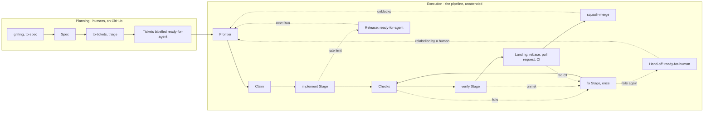

# ticket-runner

Humans plan, the pipeline executes.

Planning a feature takes judgement, so it stays with humans: they write the issues on GitHub, give each one checkbox [Acceptance Criteria](https://github.com/jjongs2/ticket-runner/blob/main/CONTEXT.md), link its blockers, and label it `ready-for-agent`. Carrying an issue from there to a merge is repetitive, so the pipeline does it unattended. For each [Ticket](https://github.com/jjongs2/ticket-runner/blob/main/CONTEXT.md) it has a headless Claude Code session implement the work, runs the repository's own tests, has a second session try to prove the criteria are not met, opens a pull request, waits for CI and squash-merges. Whatever it cannot finish goes back to a human with a draft pull request and a comment.

::: warning Published as it is
ticket-runner is a personal tool, published under the MIT licence as it is. There is no promise of support, fixes or compatibility between Versions. Read the code before you trust it with a repository you care about.
:::

## Quick Start

You need Node 22 or newer, `git`, an authenticated [`gh`](https://cli.github.com/), and `claude` with the `mattpocock-skills` plugin, version 1.2.3. [Installation](./guide/installation.md) has the full list.

```bash
npm install -g ticket-runner   # or try it first: npx ticket-runner init

cd ~/code/acme                 # the repository you want it to work in
ticket-runner init             # set it up, and report what only you can fix
ticket-runner run              # take every ready Ticket to a merge
```

`init` exits `1` while anything it reports is still yours to fix, so `ticket-runner init && ticket-runner run` stops before a Run that could not work. A Run takes only issues that [Planning](./guide/planning.md) made usable: labelled `ready-for-agent`, with `- [ ]` criteria, and blocked only through GitHub's own `blocked by` links.

## The whole flow


<!-- Sources: src/run.ts, src/orchestrator.ts, src/frontier.ts, src/guards.ts -->

Any Stage can be rate-limited, not only implement; every one of them ends in a Release. [From Ticket to merge](./guide/ticket-to-merge.md) walks the Execution half one step at a time.

## The guide

| Page | Read it for |
|---|---|
| [Install and remove](./guide/installation.md) | Requirements, the npm install, `init`, what a Run requires of a Target, `remove`, uninstalling |
| [Planning the work](./guide/planning.md) | What makes an issue a Ticket: Specs, Acceptance Criteria, native blockers, labels, the Guards |
| [Running](./guide/running.md) | `run`, `--lanes`, a narrowed Run, `stop`, `-v`, the summary and exit codes, logs, running from the Claude app |
| [Configuration](./guide/configuration.md) | Every field of `ticket-runner.json` |
| [From Ticket to merge](./guide/ticket-to-merge.md) | The Stages, the Fix budget, Lanes and the Landing, rebase conflicts, what the board is told, Notes |
| [Stopping and resuming](./guide/stopping-and-resuming.md) | Hand-off, Release, Stop against kill, Stranded Tickets, handing a Ticket back, the Run lock and the State branch |
| [Internals](./guide/internals.md) | Ports and adapters, a map of the modules, Versions, the ADRs, working on the pipeline itself |

The words the pipeline uses (Ticket, Run, Stage, Lane and the rest) are defined once, in the [glossary](https://github.com/jjongs2/ticket-runner/blob/main/CONTEXT.md).
