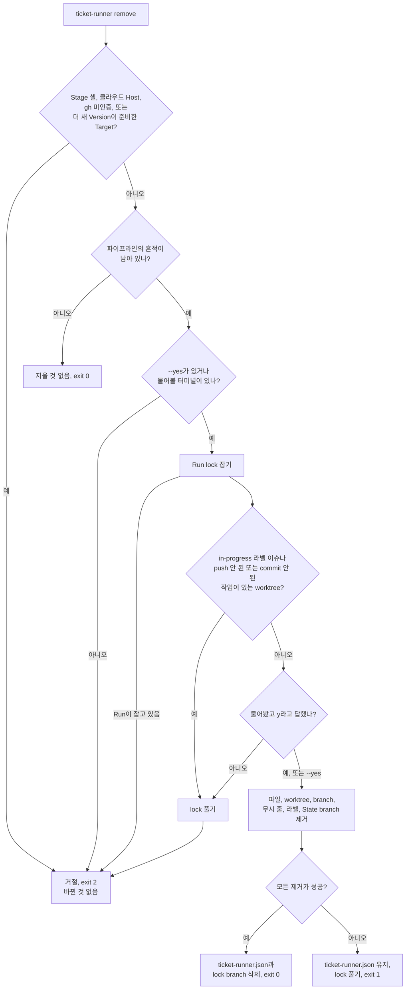

# 설치와 제거

Run은 무인으로 돌기 때문에, 빠진 게 있다면 Ticket 도중이 아니라 시작하기 전에 잡아내야 합니다. 준비 단계가 없다면 저장소에 무엇이 있어야 하는지(무시할 디렉터리, triage 라벨, squash merge, Stage가 읽는 규칙)를 소스를 읽어 가며 알아내거나, Run이 도중에 즉석으로 만들어 넣어야 합니다. 그래서 준비를 셋으로 나눴습니다. `init`은 파이프라인이 직접 쓸 수 있는 것은 제자리에 두고, 사람만 고칠 수 있는 것은 알려 줍니다. `run`은 같은 목록을 확인해서 하나라도 빠진 [Target](https://github.com/jjongs2/ticket-runner/blob/main/CONTEXT.md)(명령을 실행한 저장소)은 아무것도 고치지 않고 거절합니다. `remove`는 `init`이 한 일과 Run이 남긴 것을 모두 되돌리니, 내 저장소에 파이프라인을 시험해 봐도 안전합니다.

| 단계 | 명령 | 하는 일 |
|---|---|---|
| 설치 | `npm install -g ticket-runner` | 머신에 `ticket-runner` 명령을 설치 |
| Target 준비 | `ticket-runner init` | 파이프라인 파일을 쓰고, GitHub를 설정하고, 나머지를 알려 줌 |
| 작업 시작 | `ticket-runner run` | 준비되지 않은 Target은 거절. [실행하기](./running.md) 참고 |
| 걷어 내기 | `ticket-runner remove` | `init`이 쓴 것과 Run이 남긴 것을 제거 |
| 삭제 | `npm uninstall -g ticket-runner` | 머신에서 명령을 삭제 |

## 요구 사항 {#requirements}

| 요구 사항 | 이유 | 확인하는 곳 |
|---|---|---|
| Node 22 이상 | 패키지의 `engines` 필드 | 설치할 때 npm |
| `git` | Ticket마다 worktree와 branch를 따로 만듦 | – |
| Target에 인증된 [`gh`](https://cli.github.com/) | GitHub 호출은 모두 `gh api`로 감 | `init`이 알려 주고, `gh`가 없는 Host에서는 `run`이 거절 |
| `mattpocock-skills` 플러그인 1.2.3 버전이 설치된 `claude` | Stage 하나하나가 이 플러그인의 스킬을 부리는 `claude -p` 세션 ([ADR-0002](https://github.com/jjongs2/ticket-runner/blob/main/docs/adr/0002-claude-p-child-process-per-stage.md)) | 둘 다 `init`이 알려 줌 |
| Ticket이 계획되어 있는 GitHub 저장소 | Ticket은 보드에서 옴. [계획](./planning.md) 참고 | – |
| 저장소에서 GitHub Issues를 tracker로 한 번 돌려 둔 `/setup-matt-pocock-skills` | 이 설정이 있어야 계획용 skill이 Spec과 Ticket을 GitHub 이슈로 만듦 | – |
| `.github/workflows`의 CI 워크플로 | check가 하나도 없는 pull request는 merge되지 않음. [`gates.ci`](./configuration.md#gates)를 끄면 예외 | `init`이 알려 줌 |
| 파이프라인이 직접 돌릴 Check | `package.json`의 `test`, `typecheck` 스크립트, 또는 [`checks`](./configuration.md#checks)에 적은 명령 | `init`이 알려 주고, 없으면 `run`이 거절 |

플러그인은 Anthropic 공식 마켓플레이스에서 받습니다. 클라우드 Host에서 [Operator](./running.md#from-the-claude-app)가 설치하는 방법도 같습니다.

```bash
claude plugin marketplace add anthropics/claude-plugins-official
claude plugin install mattpocock-skills@claude-plugins-official
```

## 설치 {#install}

```bash
npm install -g ticket-runner
```

업그레이드도 같은 명령입니다.

GitHub의 Version 태그에서 바로 설치해도 됩니다. 이 범위는 `main`이 아니라 가장 높은 태그를 가리키므로, 받은 사본은 언제나 스스로 이름을 댈 수 있는 Version입니다([ADR-0007](https://github.com/jjongs2/ticket-runner/blob/main/docs/adr/0007-a-version-is-cut-by-a-human-and-installs-follow-tags.md)).

```bash
npm install -g "github:jjongs2/ticket-runner#semver:*"
```

`init`과 `run`은 GitHub Release로 공개된 가장 새로운 Version을 찾아봅니다. GitHub Release는 npm에 올라간 Version에만 생깁니다. 그게 지금 사본이 보고하는 번호보다 높으면 한 줄을 출력할 뿐, 아무것도 거절하지 않습니다.

```text
A newer Version is out: 0.5.0, and this is 0.4.0 — upgrade with `npm install -g ticket-runner`.
```

지금 사본이 최신이거나 더 앞서 있을 때, 또는 GitHub에 물어볼 수조차 없을 때(네트워크나 `gh`가 없을 때)는 아무것도 출력하지 않습니다. 개발용 체크아웃은 번호로만 비교합니다.

### 설치 없이 써 보기 {#try-it-without-installing}

`npx`는 npm 캐시에서 패키지를 실행하므로 전역에 아무것도 설치하지 않습니다. Target에서 시작하고, 이 문서나 파이프라인의 메시지가 `ticket-runner`라고 하는 자리에 `npx ticket-runner`를 입력하세요.

```bash
cd ~/code/acme
npx ticket-runner init
npx ticket-runner run
npx ticket-runner remove   # 다 써 봤으면
```

| 하려는 일 | 입력 |
|---|---|
| 예전에 캐시된 것 말고 가장 새 Version 쓰기 | `npx ticket-runner@latest …` |
| 명령마다 같은 Version 쓰기 | `npx ticket-runner@<version> …` |
| `npx`가 남긴 것 지우기 | `~/.npm/_npx` 삭제 |

처음 한 번은 npm이 패키지를 내려받기 전에 묻습니다. `npx -y`를 주면 묻지 않습니다. `stop`도 같은 머신의 다른 터미널에서 `npx ticket-runner stop`으로 보냅니다.

## `init`으로 Target 준비하기 {#set-a-target-up-with-init}

```bash
cd ~/code/acme
ticket-runner init
```

두 번 실행해도 한 번 실행한 것과 같습니다. 무언가를 쓰기 전에 Target에 이미 있는지부터 확인하기 때문입니다. commit은 하지 않으니, 쓴 내용은 그 저장소의 평소 리뷰 절차를 거쳐 히스토리에 들어갑니다. Ticket을 claim하지 않으므로 [Run lock](https://github.com/jjongs2/ticket-runner/blob/main/CONTEXT.md)도 잡지 않습니다.

### 쓰는 것 {#what-it-writes}

| 항목 | 위치 | 다음 `init`에서는 |
|---|---|---|
| 무시 줄 두 개 | `.gitignore`: `.worktrees/`, `.ticket-runner/` | 어떤 표기로든 이미 무시하고 있으면 추가하지 않음 |
| 빈 설정 파일 | `{}`만 담긴 `ticket-runner.json` | 한번 생기면 건드리지 않음 |
| Version이 찍힌 conventions 문서 | `docs/agents/pipeline-conventions.md` | 내용이 다르면 다시 씀 |
| 그 문서를 가리키는 섹션 | `CLAUDE.md`, 없으면 새로 만듦 | `CLAUDE.md`가 이미 문서를 가리키면 추가하지 않음 |
| Operator의 스킬 | `.claude/skills/ticket-runner/SKILL.md` | 내용이 다르면 다시 씀 |

사람이 관리하는 파일(`.gitignore`, `CLAUDE.md`)에는 줄이 더해지기만 합니다. conventions 문서와 스킬은 파이프라인의 글이라, 거기서 고친 내용은 다음 `init`에서 사라집니다. 예외가 하나 있습니다. 문서 첫 줄에는 숨은 `<!-- ticket-runner:version <number> -->` 표시가 있는데, 이 표시가 지금 실행 중인 것보다 *새* Version을 가리키면 `init`은 문서와 스킬을 그대로 두고 업그레이드하라고만 알립니다. 다시 쓰면 Target을 과거로 되돌리는 셈이기 때문입니다.

### GitHub에서 하는 일 {#what-it-does-on-github}

| 설정 | `init`이 하는 일 |
|---|---|
| triage 라벨 여섯 개(`needs-triage`, `needs-info`, `ready-for-agent`, `ready-for-human`, `wontfix`, `in-progress`) | 없는 것만 [`labels`](./configuration.md#labels)가 정한 이름으로 만들고, 나머지는 그대로 둠 |
| squash merge | 켬. 다른 merge 방식은 건드리지 않음 |
| merge될 때 pull request branch 삭제 | 켬. 클라우드 Host는 branch를 직접 지울 수 없기 때문([ADR-0008](https://github.com/jjongs2/ticket-runner/blob/main/docs/adr/0008-a-cloud-host-is-a-claude-code-cloud-session.md)) |

`gh`가 인증되어 있지 않으면 GitHub에서는 아무것도 하지 않고, 보고서에 그렇게 적습니다.

### 알려 주기만 하는 것 {#what-it-only-reports}

```text
ticket-runner 0.5.2 init · /home/me/code/acme

Wrote:
  nothing to write

GitHub:
  labels: every triage label is already there
  merges: squash merging is on, and no other merge method was touched
  branches: a pull request's branch is already deleted when it merges

Checked:
  ✓ `gh` is authenticated
  ✓ `claude` runs
  ✓ the `mattpocock-skills` plugin is installed
  ✗ no CI workflow in `.github/workflows` — a pull request with no checks is never merged
  ✓ a Check is configured or inferable: npm test, npm run typecheck

Not ready: 1 item is yours to put right.
```

`Checked`의 다섯 항목은 사람만 고칠 수 있는 것들입니다. 로그인 하나, 설치 둘, Target의 CI가 관리하는 워크플로, 그리고 Check입니다. `.github/workflows`에 `.yml`이나 `.yaml` 파일이 하나라도 있으면 워크플로가 있다고 봅니다.

| 종료 코드 | 뜻 |
|---|---|
| `0` | 알려 준 항목이 모두 통과 |
| `1` | 사람이 고칠 항목이 하나 이상 남음 |
| `2` | 거절: Stage의 셸이거나 `ticket-runner.json`이 잘못됨 |

그래서 `ticket-runner init && ticket-runner run`은 어차피 안 될 Run을 시작하기 전에 멈춥니다.

## Target readiness: `run`이 거절하는 경우 {#target-readiness-what-run-refuses}

`run`은 아무것도 고치지 않습니다. `init`이 뒀어야 할 항목을 이 순서로 물어보고, 처음 빠진 항목에서 종료 코드 `2`로 거절합니다. 모든 Host에서 같은 항목을 물으니, 내 워크스테이션이 받아 주는 Target은 클라우드 Host도 받아 줍니다.

| 순서 | 거절하는 경우 |
|---|---|
| 1 | `.gitignore`가 `.worktrees/`나 `.ticket-runner/`를 무시하지 않음 |
| 2 | `docs/agents/pipeline-conventions.md`가 없거나 Version 표시가 없음 |
| 3 | `CLAUDE.md`가 그 문서의 경로를 언급하지 않음 |
| 4 | Operator의 스킬이 없음 |
| 5 | `gh`가 설치되어 있지 않음. 이때는 `init`보다 설치를 먼저 안내 |
| 6 | `labels`가 정한 이름의 triage 라벨이 하나라도 없음 |
| 7 | 저장소가 merge된 pull request의 branch를 남겨 둠 |

```text
$ ticket-runner run
This Target is not set up: `.gitignore` does not ignore `.worktrees/`. Run `ticket-runner init` here and start again; a Run puts nothing in place itself.
```

readiness는 있는지와 Version 표시만 보고, 내용은 보지 않습니다. 다른 Version이 쓴 conventions 문서는 경고만 하고 Run은 그대로 진행합니다.

```text
warning: This Target's `docs/agents/pipeline-conventions.md` was left by 0.4.0, and this Run is 0.5.2 — run `ticket-runner init` here to bring it up to date.
```

문서가 더 새 Version에서 온 것이라면 경고는 `ticket-runner`를 업그레이드하라고 말합니다.

readiness 다음에 거절이 두 가지 더 있습니다.

- **체크아웃에 남은 State 파일.** 초기 파이프라인은 Ticket의 재개 상태를 `.ticket-runner/state/`에 뒀는데, 지금은 Target의 원격에 두고, 옮겨 주는 것은 없습니다. 이 디렉터리에 State 파일이 남아 있으면 Run은 해당 Ticket을 나열하며 거절합니다. 그 파일을 쓴 Version으로 Ticket을 마무리하거나 사람에게 넘긴 다음, 디렉터리를 지우세요.
- **Check 없음.** [Checks 게이트](./configuration.md#gates)가 켜져 있는데 설정하거나 추론할 수 있는 Check 명령이 없으면, 검사하지 않은 코드를 merge하느니 Run을 거절합니다.

## `remove`로 걷어 내기 {#take-it-out-with-remove}

```bash
cd ~/code/acme
ticket-runner remove        # 지울 목록을 보여 주고 물어봄
ticket-runner remove --yes  # 묻지 않고 그대로
```

`remove`는 파이프라인이 뒀다고 증명할 수 있는 것만 걷어 냅니다. commit은 하지 않으니 `git status`로 바뀐 내용을 살펴보고 직접 commit하세요. 작업하는 동안 Run lock을 잡아서, 해체 중인 Target에서 Run이 시작되지 않게 합니다.


<!-- Sources: src/remove.ts, src/lock.ts, src/host.ts -->

거절할 때는 언제나 다음에 할 일을 알려 줍니다. lock은 누가 잡고 있든 거절합니다. 이 Host에서 프로세스가 사라진 Run이라도 마찬가지입니다. `remove`는 lock을 넘겨받지 않으니, `ticket-runner run`을 시작해 그 Run이 쥐고 있던 일을 마무리하거나 직접 lock을 푸세요([멈추고 이어 하기](./stopping-and-resuming.md)). 클라우드 Host는 원격의 branch를 지울 수 없어서 거절합니다. `remove`는 워크스테이션에서 실행하세요.

### 사라지는 것과 남는 것 {#what-goes-and-what-stays}

제거하는 것:

- `docs/agents/pipeline-conventions.md`, Operator의 스킬, 그 결과 비게 된 디렉터리.
- `init`이 쓴 `CLAUDE.md` 섹션. 그 섹션뿐인 파일이면 파일째 지웁니다.
- `init`이 쓴 주석 아래 그대로 있는 `.gitignore` 줄. 그 줄뿐인 파일이면 파일째 지웁니다.
- `.ticket-runner/`: Run 로그와 transcript.
- `.worktrees/ticket-<n>` worktree와 그 branch, 다른 로컬 `agent/` branch, 비게 된 `.worktrees/`.
- `in-progress` 라벨. 달고 있던 모든 이슈에서 뗍니다.
- `ticket-runner/state` branch. 이제 재개할 수 없게 된 Ticket을 보고서가 모두 알려 줍니다.
- `ticket-runner.json`. 맨 마지막에, 앞의 제거가 모두 성공했을 때만 지웁니다.
- `ticket-runner/lock` branch. 맨 마지막에 지우고, 실패한 제거가 있으면 지우지 않고 lock만 풉니다.

남겨 두는 것:

- `in-progress`를 뺀 triage 라벨 다섯 개. 계획에서도 쓰기 때문입니다. 보고서가 라벨마다 `gh label delete` 명령을 알려 줍니다.
- 문구를 고친 `CLAUDE.md` 섹션. 이제 사람의 것일 수 있어서입니다.
- 사람이 단 주석 아래 있는 무시 줄.
- 다른 것이 들어 있는 `.worktrees/`, 그리고 그 무시 줄.
- squash merge와 merge 시 branch 삭제 설정. `init` 전부터 켜져 있었을 수 있습니다.
- GitHub의 `agent/` branch와 거기 열린 pull request.
- 상설 Notes 이슈, 그리고 Run이 쓴 모든 코멘트. 사람에게 쓴 글이라서입니다.

실패한 제거는 보고하고 나머지는 계속 진행합니다. `remove`를 다시 실행하면 남은 것을 대상으로 처음부터 다시 하는 셈인데, 그래서 설정 파일을 끝까지 남겨 둡니다. 다음 `remove`가 찾을 라벨 이름이 거기 있기 때문입니다.

| 종료 코드 | 뜻 |
|---|---|
| `0` | 모두 사라졌거나, 지울 것이 없었음 |
| `1` | 제거가 하나 이상 실패 |
| `2` | 아무것도 바꾸기 전에 거절 |

## 삭제 {#uninstall}

```bash
npm uninstall -g ticket-runner
```

Target마다 먼저 `ticket-runner remove`를 실행하세요. 명령을 지운 뒤에는 할 수 없습니다.

## 관련 페이지 {#related-pages}

- [일 계획하기](./planning.md): 파이프라인이 가져가는 Ticket이 되려면.
- [실행하기](./running.md): Run을 시작하고, 좁히고, 멈추기.
- [설정](./configuration.md): 라벨을 포함한 `ticket-runner.json`의 필드.
- [멈추고 이어 하기](./stopping-and-resuming.md): `remove`가 지우는 Run lock과 State branch.

## 참고 자료 {#references}

- [`src/init.ts`](https://github.com/jjongs2/ticket-runner/blob/main/src/init.ts), [`src/labels.ts`](https://github.com/jjongs2/ticket-runner/blob/main/src/labels.ts), [`src/conventions.ts`](https://github.com/jjongs2/ticket-runner/blob/main/src/conventions.ts), [`src/operator-skill.ts`](https://github.com/jjongs2/ticket-runner/blob/main/src/operator-skill.ts)
- [`src/readiness.ts`](https://github.com/jjongs2/ticket-runner/blob/main/src/readiness.ts), [`src/start.ts`](https://github.com/jjongs2/ticket-runner/blob/main/src/start.ts), [`src/startup.ts`](https://github.com/jjongs2/ticket-runner/blob/main/src/startup.ts), [`src/staleness.ts`](https://github.com/jjongs2/ticket-runner/blob/main/src/staleness.ts), [`.github/workflows/version-tag.yml`](https://github.com/jjongs2/ticket-runner/blob/main/.github/workflows/version-tag.yml)
- [`src/remove.ts`](https://github.com/jjongs2/ticket-runner/blob/main/src/remove.ts), [`src/command-line.ts`](https://github.com/jjongs2/ticket-runner/blob/main/src/command-line.ts), [`src/cli.ts`](https://github.com/jjongs2/ticket-runner/blob/main/src/cli.ts)
- [`docs/templates/init-report.txt`](https://github.com/jjongs2/ticket-runner/blob/main/docs/templates/init-report.txt), [`docs/templates/remove-report.txt`](https://github.com/jjongs2/ticket-runner/blob/main/docs/templates/remove-report.txt)
- [ADR-0002](https://github.com/jjongs2/ticket-runner/blob/main/docs/adr/0002-claude-p-child-process-per-stage.md), [ADR-0007](https://github.com/jjongs2/ticket-runner/blob/main/docs/adr/0007-a-version-is-cut-by-a-human-and-installs-follow-tags.md), [ADR-0008](https://github.com/jjongs2/ticket-runner/blob/main/docs/adr/0008-a-cloud-host-is-a-claude-code-cloud-session.md)
