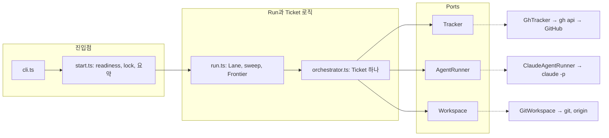
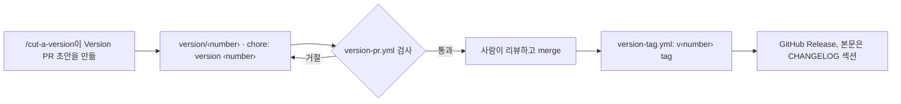

# 내부 구조

pipeline이 바깥에서 건드리는 것은 셋입니다. GitHub, Claude, git. 셋 모두 orchestrator가 의존하는 interface인 port를 거쳐서 닿습니다. 덕분에 무인으로 도는 흐름 전체를 메모리 안에서 테스트할 수 있습니다. 구독 한도를 쓰지도, GitHub에 무언가를 쓰지도 않고요. port 뒤의 adapter는 얇게 유지합니다. 인자를 만들고 출력을 해석할 뿐이고, 판단은 그 위의 모듈이 맡습니다.

이 페이지는 소스를 읽거나 고치려는 분을 위한 것입니다. pipeline을 쓰기만 하려면 [설치](./installation.md)부터 보세요.

## 한눈에 보기 {#at-a-glance}

| Port | 떼어 내는 효과 | Adapter | 테스트용 fake | Source |
|---|---|---|---|---|
| `Tracker` | GitHub: issue, 라벨, 댓글, pull request, CI, merge | `GhTracker`, `gh api` 사용 | `FakeTracker` | [`ports/tracker.ts`](https://github.com/jjongs2/ticket-runner/blob/main/src/ports/tracker.ts) |
| `AgentRunner` | Claude: Stage 세션 하나 | `ClaudeAgentRunner`, Stage마다 `claude -p` 자식 프로세스 하나 | `FakeAgentRunner` | [`ports/agent-runner.ts`](https://github.com/jjongs2/ticket-runner/blob/main/src/ports/agent-runner.ts) |
| `Workspace` | git: worktree, branch, Check, rebase, push, 그리고 remote의 State와 Run lock | `GitWorkspace` | `FakeWorkspace` | [`ports/workspace.ts`](https://github.com/jjongs2/ticket-runner/blob/main/src/ports/workspace.ts) |


<!-- Sources: src/cli.ts, src/start.ts, src/run.ts, src/orchestrator.ts, src/ports/tracker.ts, src/ports/agent-runner.ts, src/ports/workspace.ts -->

adapter를 만드는 곳은 CLI 하나뿐입니다. `start.ts`부터 아래는 모두 interface로 받습니다.

## Adapter {#the-adapters}

| Adapter | 하는 일 | 알아 둘 점 |
|---|---|---|
| [`GhTracker`](https://github.com/jjongs2/ticket-runner/blob/main/src/adapters/gh-tracker.ts) | GitHub 호출 전부를 `gh api`(REST)로 | cloud Host가 GraphQL을 아예 막으니 모든 Host에서 REST를 씁니다. 예외는 pull request를 draft로 넣고 빼는 일 하나입니다. REST로는 할 수 없어서 workstation은 GraphQL mutation을, cloud Host는 proxy의 `/pulls/{n}/ccr/convert_to_draft`와 `/ready_for_review` 경로를 씁니다. CI는 15초마다 확인합니다. |
| [`ClaudeAgentRunner`](https://github.com/jjongs2/ticket-runner/blob/main/src/adapters/claude-agent-runner.ts) | Stage를 `claude --print <prompt> --output-format stream-json --verbose --permission-prompts none --permission-mode … --model … --effort … --max-turns …`로 실행(답할 schema가 있으면 `--json-schema`도) | `TICKET_RUNNER_STAGE`를 설정하고, Stage가 시작되는 순간부터 `<stage>.command`, `<stage>.stdout`, `<stage>.stderr`, `<stage>.transcript.jsonl`을 씁니다. `maxMinutes`가 지나면 자식을 죽이고, 실패를 `rate-limited`, `timed-out`, `turn-capped`, `nonzero-exit`, `invalid-result`로 분류합니다. |
| [`GitWorkspace`](https://github.com/jjongs2/ticket-runner/blob/main/src/adapters/git-workspace.ts) | `.worktrees/` 아래 worktree, Check, rebase, push, `ticket-runner/state`와 `ticket-runner/lock` branch | git은 ref나 index lock이 잡혀 있으면 기다리지 않고 실패하므로, main checkout에서의 명령은 한 번에 하나씩 돌립니다. worktree 안의 명령은 병렬로 둡니다. 두 branch는 [멈추고 이어 하기](./stopping-and-resuming.md)에서 다룹니다. |
| [`exec.ts`](https://github.com/jjongs2/ticket-runner/blob/main/src/adapters/exec.ts) | timeout과 스트리밍 sink를 붙여 자식 프로세스를 띄움 | 명령이 스스로 124로 끝날 수도 있으니 `timedOut`을 따로 알려 줍니다 |
| [`repo-root.ts`](https://github.com/jjongs2/ticket-runner/blob/main/src/adapters/repo-root.ts) | worktree 안에서 실행해도 main checkout을 찾음 | lock, `.worktrees/`, 로그가 clone마다 한 곳에 모이도록 |
| [`version.ts`](https://github.com/jjongs2/ticket-runner/blob/main/src/adapters/version.ts) | 이 사본이 어느 [Version](#versions)인지 읽음 | port는 없지만 git을 실행하니 adapter에 둡니다 |

## `src/` 지도 {#a-map-of-src}

테스트는 각 모듈 옆에 `*.test.ts`로 있습니다.

**진입점**

| 모듈 | 한 줄 |
|---|---|
| [`cli.ts`](https://github.com/jjongs2/ticket-runner/blob/main/src/cli.ts) | Version을 읽고 `init`, `run`, `stop`, `remove`, `-v`로 나눔. adapter를 만듦 |
| [`command-line.ts`](https://github.com/jjongs2/ticket-runner/blob/main/src/command-line.ts) | 아무것도 보기 전에 인자를 해석하고, usage 문구를 가짐 |
| [`stage-guard.ts`](https://github.com/jjongs2/ticket-runner/blob/main/src/stage-guard.ts) | Stage의 셸 안에서는 모든 명령을 거절(Stage mark) |
| [`start.ts`](https://github.com/jjongs2/ticket-runner/blob/main/src/start.ts) | 거절, Run lock, Stop 수신, 요약과 exit code |
| [`startup.ts`](https://github.com/jjongs2/ticket-runner/blob/main/src/startup.ts) | merge를 막을 관문이 없는 Run을 거절하고, 꺼 둔 관문을 경고 |

**Run과 Ticket**

| 모듈 | 한 줄 |
|---|---|
| [`run.ts`](https://github.com/jjongs2/ticket-runner/blob/main/src/run.ts) | Stranded Ticket, 그다음 Frontier로 Lane을 채움. Release나 Stop이면 claim을 멈춤 |
| [`orchestrator.ts`](https://github.com/jjongs2/ticket-runner/blob/main/src/orchestrator.ts) | Ticket 하나를 guard부터 merge, Hand-off, Release까지. Fix budget 포함 |
| [`frontier.ts`](https://github.com/jjongs2/ticket-runner/blob/main/src/frontier.ts) | 후보를 Frontier와 막힌 것으로 나눔 |
| [`guards.ts`](https://github.com/jjongs2/ticket-runner/blob/main/src/guards.ts) | 후보를 건너뛰는 이유: Guard와 거절 |
| [`landing.ts`](https://github.com/jjongs2/ticket-runner/blob/main/src/landing.ts) | Landing: rebase부터 pull까지 한 번에 한 Lane, 도착 순서대로 |
| [`lifecycle.ts`](https://github.com/jjongs2/ticket-runner/blob/main/src/lifecycle.ts) | Ticket이 어디서 실패했는지, fix Stage가 고칠 수 있는 실패는 무엇인지 |
| [`base-branch.ts`](https://github.com/jjongs2/ticket-runner/blob/main/src/base-branch.ts) | Run마다 한 번 Base branch를 정함 |
| [`branch.ts`](https://github.com/jjongs2/ticket-runner/blob/main/src/branch.ts) | `agent/<n>-<slug>`와 `.worktrees/ticket-<n>` |
| [`stranded.ts`](https://github.com/jjongs2/ticket-runner/blob/main/src/stranded.ts) | Stranded Ticket을 찾는 sweep |
| [`resume.ts`](https://github.com/jjongs2/ticket-runner/blob/main/src/resume.ts) | State file의 모양과 이름 |
| [`handoff.ts`](https://github.com/jjongs2/ticket-runner/blob/main/src/handoff.ts) | Ticket을 다시 가져갈 때 예전 hand-off 댓글을 지난 일로 표시 |
| [`stop.ts`](https://github.com/jjongs2/ticket-runner/blob/main/src/stop.ts) | `ticket-runner stop`, 그리고 Run 쪽에서 받는 SIGTERM |
| [`lock.ts`](https://github.com/jjongs2/ticket-runner/blob/main/src/lock.ts) | Run lock 파일의 내용, 쥔 쪽이 살아 있는지 |
| [`host.ts`](https://github.com/jjongs2/ticket-runner/blob/main/src/host.ts) | workstation인지 cloud인지, 어느 것인지 |

**Stage에 주는 것과 Stage가 답하는 것**

| 모듈 | 한 줄 |
|---|---|
| [`prompts.ts`](https://github.com/jjongs2/ticket-runner/blob/main/src/prompts.ts) | 각 Stage의 prompt. `/mattpocock-skills:<skill>`을 펼침 |
| [`verdict.ts`](https://github.com/jjongs2/ticket-runner/blob/main/src/verdict.ts) | Verdict schema와 통과 여부 |
| [`title.ts`](https://github.com/jjongs2/ticket-runner/blob/main/src/title.ts) | pull request 제목: Stage의 답, 그다음 commit, 그다음 Ticket |
| [`note-schema.ts`](https://github.com/jjongs2/ticket-runner/blob/main/src/note-schema.ts), [`notes.ts`](https://github.com/jjongs2/ticket-runner/blob/main/src/notes.ts) | Note: Stage가 적는 방식과 보내지는 곳 |
| [`acceptance-criteria.ts`](https://github.com/jjongs2/ticket-runner/blob/main/src/acceptance-criteria.ts), [`criteria.ts`](https://github.com/jjongs2/ticket-runner/blob/main/src/criteria.ts) | criterion의 모양, merge 뒤 `met`인 것에 체크 |
| [`progress.ts`](https://github.com/jjongs2/ticket-runner/blob/main/src/progress.ts) | Ticket마다 하나인 Progress comment를 제자리에서 고침 |
| [`templates.ts`](https://github.com/jjongs2/ticket-runner/blob/main/src/templates.ts) | GitHub에 쓰는 모든 모양과 Run 요약. 원본은 `docs/templates/` |
| [`run-log.ts`](https://github.com/jjongs2/ticket-runner/blob/main/src/run-log.ts) | `.ticket-runner/runs/<runId>/`와, Hand-off가 그중 무엇을 남기는지 |

**Target 준비**

| 모듈 | 한 줄 |
|---|---|
| [`init.ts`](https://github.com/jjongs2/ticket-runner/blob/main/src/init.ts) | `ticket-runner init`: 파일을 쓰고, GitHub를 설정하고, 나머지를 보고 |
| [`readiness.ts`](https://github.com/jjongs2/ticket-runner/blob/main/src/readiness.ts) | Target readiness. `init`이 갖추고 `run`이 확인 |
| [`conventions.ts`](https://github.com/jjongs2/ticket-runner/blob/main/src/conventions.ts) | conventions 문서의 본문과 Version 표시 |
| [`operator-skill.ts`](https://github.com/jjongs2/ticket-runner/blob/main/src/operator-skill.ts) | `init`이 Target에 써 넣는 Operator의 skill |
| [`labels.ts`](https://github.com/jjongs2/ticket-runner/blob/main/src/labels.ts) | triage 라벨 여섯 개와 그 색 |
| [`config.ts`](https://github.com/jjongs2/ticket-runner/blob/main/src/config.ts) | `ticket-runner.json`: schema와 기본값 |
| [`remove.ts`](https://github.com/jjongs2/ticket-runner/blob/main/src/remove.ts) | `ticket-runner remove` |

**Version**

| 모듈 | 한 줄 |
|---|---|
| [`version-number.ts`](https://github.com/jjongs2/ticket-runner/blob/main/src/version-number.ts) | 번호 비교. 모든 Version 질문이 함께 씀 |
| [`staleness.ts`](https://github.com/jjongs2/ticket-runner/blob/main/src/staleness.ts) | 새 Version 안내 줄과 conventions 문서 경고 |
| [`version-pr.ts`](https://github.com/jjongs2/ticket-runner/blob/main/src/version-pr.ts) | Version PR이 지켜야 할 것, GitHub Release에 올릴 notes |

**테스트 전용**: [`testing/`](https://github.com/jjongs2/ticket-runner/blob/main/src/testing/fakes.ts)에는 아래에서 설명하는 fake와 도우미가 있습니다.

## orchestrator를 테스트하는 방법 {#how-the-orchestrator-is-tested}

어떤 테스트도 `gh`나 `claude`를 띄우지 않습니다. 층마다 맞는 경계에서 테스트합니다.

| 층 | 테스트 대상 | 방법 |
|---|---|---|
| `orchestrator.ts`, `run.ts`, `start.ts`, `stranded.ts` … | 세 port 모두의 메모리 fake([`testing/fakes.ts`](https://github.com/jjongs2/ticket-runner/blob/main/src/testing/fakes.ts)) | fake마다 순서가 있는 `calls` 로그를 두고, 테스트는 내부 helper가 아니라 이 로그와 결과 상태를 확인합니다. `FakeWorkspace`는 State와 lock을 메모리에 두고, [`THIS_HOST`나 `ANOTHER_HOST`](https://github.com/jjongs2/ticket-runner/blob/main/src/testing/fakes.ts) 역할을 할 수 있습니다. |
| 나란히 도는 Lane | fake에 [`Hold`](https://github.com/jjongs2/ticket-runner/blob/main/src/testing/hold.ts)와 [`settle`](https://github.com/jjongs2/ticket-runner/blob/main/src/testing/settle.ts)을 더해서 | `Hold`는 Ticket 하나를 원하는 지점(Stage 안, CI 대기 안)에 세워 두었다가 테스트가 풀어 줄 때 보냅니다. 그 사이 다른 Lane이 하는 일을 관찰할 수 있습니다. |
| `GitWorkspace` | bare remote를 붙인 실제 임시 저장소 | worktree, rebase, lease, state와 lock branch를 진짜 git으로 돌립니다 |
| `GhTracker`, `ClaudeAgentRunner` | `run` seam으로 넣는 녹화된 실행 결과 | [`testing/executions.ts`](https://github.com/jjongs2/ticket-runner/blob/main/src/testing/executions.ts)가 프로세스가 돌려줬을 `Execution`을 만들어 줍니다 |

그래서 pipeline 자신의 기록까지 포함해 모든 바깥 효과가 port를 거칩니다. State와 lock도 remote에 대한 효과이니 `Workspace`의 메서드이고, fake가 이를 다룹니다([ADR-0004](https://github.com/jjongs2/ticket-runner/blob/main/docs/adr/0004-resume-state-is-a-local-file.md)의 마지막 amendment).

## Version {#versions}

[Version](https://github.com/jjongs2/ticket-runner/blob/main/CONTEXT.md)은 `main`이 `v<x.y.z>` tag와 GitHub Release로 달고 있는 번호입니다. 설치된 사본이 이 번호를 알려 줍니다. 머신에는 `main`이 아니라 Version을 설치하니, `0.5.2`라고 말하는 두 머신은 같은 코드를 돌립니다([ADR-0007](https://github.com/jjongs2/ticket-runner/blob/main/docs/adr/0007-a-version-is-cut-by-a-human-and-installs-follow-tags.md)).

### Version을 끊는 방법 {#how-one-is-cut}


<!-- Sources: src/version-pr.ts, scripts/version.ts, .github/workflows/version-pr.yml, .github/workflows/version-tag.yml -->

- **번호.** 지난 Version 뒤로 Spec이 하나라도 닫혔으면 minor를, 그 밖에는 작은 기능까지 포함해 모두 patch를 올립니다. 질문은 오직 "Spec이 닫혔나"뿐입니다. 언제 끊을지는 사람이 정합니다. Planning의 결정이니까요.
- **Version PR.** `package.json`과 lock file의 번호를 올리고, `CHANGELOG.md`에 그 Version의 섹션을 더하고, `npx tsx scripts/version.ts mark`로 이 저장소의 conventions 문서에 새 표시를 합니다. 초안은 [`/cut-a-version`](https://github.com/jjongs2/ticket-runner/blob/main/.claude/skills/cut-a-version/SKILL.md) skill이 만들고, merge는 하지 않습니다.
- **검사**([`version-pr.ts` · `versionPrRefusals`](https://github.com/jjongs2/ticket-runner/blob/main/src/version-pr.ts))는 이유를 한꺼번에 모두 알려 줍니다. 번호가 모든 tag보다 높지 않을 때, lock file이 다른 번호일 때, 섹션이 없을 때, 섹션에 `### After upgrading` 제목이 없을 때입니다. 번호를 건드리지 않은 pull request는 그대로 통과합니다.
- **tag workflow**는 merge commit에 tag를 달고, 그 섹션을 GitHub Release로 올립니다. 섹션이 없으면 GitHub이 만든 notes를 씁니다. 빠진 쪽만 채우니, 반쯤 끊긴 Version도 다시 돌리면 온전해집니다.

release-please와 Changesets는 둘 다 채택하지 않았습니다. 앞의 것은 해마다 만료되는 token, 저장소 설정, 그리고 `feat`/`fix`만 Version을 끊는다는 규칙이 필요했습니다. 뒤의 것은 모든 Stage의 일에 changeset 파일 쓰기를 얹었을 것입니다.

### 찍히는 번호 {#the-stamp}

Version은 CLI에서 한 번 정해서 아래로 넘깁니다. 그래서 한 Run이 찍는 번호는 모두 같은 문자열입니다([`adapters/version.ts` · `pipelineVersion`](https://github.com/jjongs2/ticket-runner/blob/main/src/adapters/version.ts)).

| `-v` 출력 | 언제 |
|---|---|
| `0.5.2` | 설치된 사본. 번호가 전부 |
| `0.5.2+331d79c` | 깨끗한 개발 checkout |
| `0.5.2+331d79c.dirty` | commit하지 않은 변경이 있는 개발 checkout |
| `unknown` | 읽을 수 있는 `package.json`이 없음 |

같은 문자열이 찍히는 곳:

| 어디 | 왜 |
|---|---|
| Run 요약의 머리 `ticket-runner <version> run <runId> · <n>m`, `init` 보고의 첫 줄 | 어떤 pipeline이 돌았는지 터미널이 말하도록 |
| Progress comment의 Run별 섹션 | 누가 썼는지 보드가 말하도록 |
| 각 State file의 `version` | 읽지 못하는 파일도 누가 썼는지 알 수 있도록 |
| `.ticket-runner/runs/<runId>/version.txt`, Hand-off의 transcript와 함께 남음 | transcript가 그걸 쓴 pipeline 곁에 있도록 |
| conventions 문서의 첫 줄 `<!-- ticket-runner:version <number> -->`(번호만) | `init`과 Run이 어느 쪽이 뒤처졌는지 알 수 있도록 |
| 설치본이 모르는 config key를 거절하는 문구 | 낡은 설치본과 잘못된 config를 구별할 수 있도록 |

conventions 문서의 표시에는 방향이 있습니다. 더 오래된 pipeline은 더 새 문서를 건드리지 않고 업그레이드를 권합니다. 문서보다 뒤처진 Run은 경고하고, 앞선 Run은 `init`을 권합니다. 어느 쪽도 거절하지는 않습니다([`staleness.ts` · `conventionsWarning`](https://github.com/jjongs2/ticket-runner/blob/main/src/staleness.ts)).

### 새 Version 확인 {#the-newer-version-check}

Run과 `init`은 pipeline 자신의 저장소에서 공개된 가장 높은 Version을 찾아봅니다. 저장소는 `package.json`의 `repository` 필드에서 읽으니, fork는 자기 자신을 묻습니다. 조회는 GitHub Release를 읽되 draft와 prerelease는 뺍니다. Release가 아직 나오지 않은 tag는 설치할 수 없으니까요. 번호만 비교하므로, 최신 Version보다 앞선 commit을 돌리는 checkout도 낡은 것으로 보지 않습니다.

새 Version이 있으면 [`staleness.ts` · `newerVersionLine`](https://github.com/jjongs2/ticket-runner/blob/main/src/staleness.ts)이 한 줄을 Run 로그 맨 위와 요약 머리에 찍습니다.

```
A newer Version is out: 0.6.0, and this is 0.5.2 — upgrade with `npm install -g "github:jjongs2/ticket-runner#semver:*"`.
```

네트워크가 없거나, `gh`가 없거나, 아무도 볼 수 없는 저장소라서 조회하지 못하면 아무것도 찍지 않습니다. 이 때문에 무언가를 거절하는 일은 없습니다.

설치와 업그레이드는 `npm install -g ticket-runner`로 하고, 전역 설치 없이 써 보려면 `npx ticket-runner init`을 쓰면 됩니다. 안내 줄이 말하는 GitHub tag 범위 `npm install -g "github:jjongs2/ticket-runner#semver:*"`로도 가장 높은 Version tag가 설치됩니다. [설치](./installation.md)를 참고하세요.

## ADR 요약 {#the-adrs-in-brief}

전문은 [`docs/adr/`](https://github.com/jjongs2/ticket-runner/tree/main/docs/adr)에 있습니다. 여러 ADR에 amendment가 붙어 있고, 아래는 지금 기준의 정리입니다.

| ADR | 결정 | 이유 | 감수한 비용 |
|---|---|---|---|
| [0001](https://github.com/jjongs2/ticket-runner/blob/main/docs/adr/0001-humans-plan-the-pipeline-executes.md) | 계획은 사람이, 무인으로 도는 것은 Execution뿐 | grilling 질문에 잘못 답하면 걸러 줄 관문 없이 Spec, Ticket, merge된 코드로 굳어 버림 | Planning의 품질은 사람 몫. pipeline은 알려진 결함만 막음 |
| [0002](https://github.com/jjongs2/ticket-runner/blob/main/docs/adr/0002-claude-p-child-process-per-stage.md) | Stage마다 `claude -p` 자식 프로세스 하나 | 사용자 호출 전용 `/plugin:skill`을 펼쳐 주는 건 headless 모드뿐. 프로세스로 나누면 Stage별 한도, `--json-schema`, 다시 돌려 볼 명령줄도 얻음 | Stage마다 1–2초 시작 비용. 문맥을 나누지 않으니 Stage는 Ticket과 branch를 읽음 |
| [0003](https://github.com/jjongs2/ticket-runner/blob/main/docs/adr/0003-github-native-relations-only.md) | GitHub 고유의 blocker와 sub-issue만 인정 | 진실의 원천이 둘이면 낡은 본문이 몰래 일을 막거나 풀 수 있음 | 사람이 고유 관계를 만들어야 함. 본문에만 있는 blocker는 경고와 함께 건너뜀 |
| [0004](https://github.com/jjongs2/ticket-runner/blob/main/docs/adr/0004-resume-state-is-a-local-file.md) | 이어받기 상태는 보드 밖의 State file로, 지금은 Target의 remote에 둠. Hand-off도 남김 | 보드는 사람을 위한 곳. cloud Host는 사라지니 상태가 Host보다 오래 살아야 함. 라벨 한 번 바꿔서 이어받을 수 있어야 함 | 예전 로컬 State는 옮겨 주지 않음. state branch는 `Workspace`를 거침 |
| [0005](https://github.com/jjongs2/ticket-runner/blob/main/docs/adr/0005-landing-is-a-serialized-section.md) | Landing은 merge queue가 아니라 직렬 구간 | CI를 두 번 치르지 않고도 CI가 채점한 그대로 merge됨 | 느린 CI나 Conflict Stage 하나가 다른 모든 Lane의 Landing을 붙잡음. GitHub merge queue는 저장소별 설정을 늘림 |
| [0006](https://github.com/jjongs2/ticket-runner/blob/main/docs/adr/0006-stop-is-a-signal-and-ctrl-c-is-a-kill.md) | Stop은 SIGTERM뿐, Ctrl+C는 kill로 둠. 보낼 수 있는 건 Run의 Host뿐 | 신호는 바로 닿고 치울 것을 남기지 않음. Stage가 Run의 process group을 같이 씀 | Stop은 되돌릴 수 없음. 다른 Host의 Run은 여기서 멈출 수 없음 |
| [0007](https://github.com/jjongs2/ticket-runner/blob/main/docs/adr/0007-a-version-is-cut-by-a-human-and-installs-follow-tags.md) | Version은 사람이 Version PR을 merge해서 끊고, 설치는 tag를 따름 | 언제 끊을지는 Planning의 결정. 같은 번호의 두 머신이 같은 코드를 돌려야 번호가 쓸모 있는 표시가 됨 | Version notes는 agent의 도움을 받아 손으로 씀 |
| [0008](https://github.com/jjongs2/ticket-runner/blob/main/docs/adr/0008-a-cloud-host-is-a-claude-code-cloud-session.md) | cloud Host는 Operator가 있는 Claude Code cloud 세션, Run lock은 GitHub에 | Actions 시간 비용이 없고 앱에서 조종 가능. 모든 Host가 lock을 봐야 함 | REST만 씀. remote에 둔 어떤 것도 ref 삭제에 기대면 안 됨. 사라진 Host의 lock은 사람이 풀어야 함 |

## pipeline 자체를 고치려면 {#working-on-the-pipeline-itself}

파이프라인을 고치려면 checkout에서 돌리면 됩니다. `bin/ticket-runner.js`가 `tsx`로 TypeScript를 바로 읽으니 빌드 단계가 없습니다.

```bash
git clone https://github.com/jjongs2/ticket-runner && cd ticket-runner
npm install
npm run ticket-runner -- run         # drain this repository's Frontier
npm run ticket-runner -- run 3 7     # a Run narrowed to #3 and #7
npm test                             # vitest
npm run typecheck                    # tsc --noEmit
```

checkout은 번호 옆에 commit도 함께 알려 줍니다([찍히는 번호](#the-stamp) 참고). CI는 pull request마다 `npm run typecheck`와 `npm test`를 돌리고, 그 옆에서 Version PR 검사도 돌립니다.

이 저장소는 자기 pipeline의 Target이기도 해서, 다른 Target과 같은 규칙을 따릅니다. commit하기 전에 여기 옮겨 적은 것이 아니라 원문을 읽어 주세요.

- [`CONTRIBUTING.md`](https://github.com/jjongs2/ticket-runner/blob/main/CONTRIBUTING.md): branch, commit, pull request, Version PR, issue, 그리고 코드 규칙(strict ESM TypeScript, 코드 옆의 테스트, 모든 효과는 port로, `scripts/`는 얇게)
- [`docs/agents/pipeline-conventions.md`](https://github.com/jjongs2/ticket-runner/blob/main/docs/agents/pipeline-conventions.md): pipeline이 모든 Target에 요구하는 것
- [`CONTEXT.md`](https://github.com/jjongs2/ticket-runner/blob/main/CONTEXT.md): 이름은 용어집을 따릅니다. 새 단어가 필요한 개념은 거기부터 적습니다.
- [`docs/templates/`](https://github.com/jjongs2/ticket-runner/tree/main/docs/templates): 모양을 바꿀 때는 그걸 쓰는 코드보다 여기를 먼저 바꿉니다

Stage는 pipeline을 실행할 수 없습니다. Stage의 셸에는 `TICKET_RUNNER_STAGE`가 있고, 이 변수가 있으면 모든 명령이 거절됩니다. 대신 테스트와 fake로 pipeline을 돌려 보세요.

## 관련 페이지 {#related-pages}

- [멈추고 이어 하기](./stopping-and-resuming.md): `GitWorkspace`가 맡는 state branch와 Run lock
- [Ticket 하나가 merge되기까지](./ticket-to-merge.md): `orchestrator.ts`가 이끄는 lifecycle
- [실행하기](./running.md): `cli.ts`가 나눠 주는 명령들과 `-v`
- [설치](./installation.md): Version 설치, `init`, `remove`

## 참고 {#references}

- [`src/ports/`](https://github.com/jjongs2/ticket-runner/tree/main/src/ports), [`src/adapters/`](https://github.com/jjongs2/ticket-runner/tree/main/src/adapters), [`src/testing/`](https://github.com/jjongs2/ticket-runner/tree/main/src/testing)
- [`src/cli.ts`](https://github.com/jjongs2/ticket-runner/blob/main/src/cli.ts), [`src/start.ts`](https://github.com/jjongs2/ticket-runner/blob/main/src/start.ts), [`src/run.ts`](https://github.com/jjongs2/ticket-runner/blob/main/src/run.ts), [`src/orchestrator.ts`](https://github.com/jjongs2/ticket-runner/blob/main/src/orchestrator.ts)
- [`src/adapters/version.ts`](https://github.com/jjongs2/ticket-runner/blob/main/src/adapters/version.ts), [`src/version-number.ts`](https://github.com/jjongs2/ticket-runner/blob/main/src/version-number.ts), [`src/version-pr.ts`](https://github.com/jjongs2/ticket-runner/blob/main/src/version-pr.ts), [`src/staleness.ts`](https://github.com/jjongs2/ticket-runner/blob/main/src/staleness.ts)
- [`scripts/version.ts`](https://github.com/jjongs2/ticket-runner/blob/main/scripts/version.ts), [`.github/workflows/`](https://github.com/jjongs2/ticket-runner/tree/main/.github/workflows)
- [`CONTRIBUTING.md`](https://github.com/jjongs2/ticket-runner/blob/main/CONTRIBUTING.md), [`CHANGELOG.md`](https://github.com/jjongs2/ticket-runner/blob/main/CHANGELOG.md)
- [ADR-0001](https://github.com/jjongs2/ticket-runner/blob/main/docs/adr/0001-humans-plan-the-pipeline-executes.md)부터 [ADR-0008](https://github.com/jjongs2/ticket-runner/blob/main/docs/adr/0008-a-cloud-host-is-a-claude-code-cloud-session.md)까지
