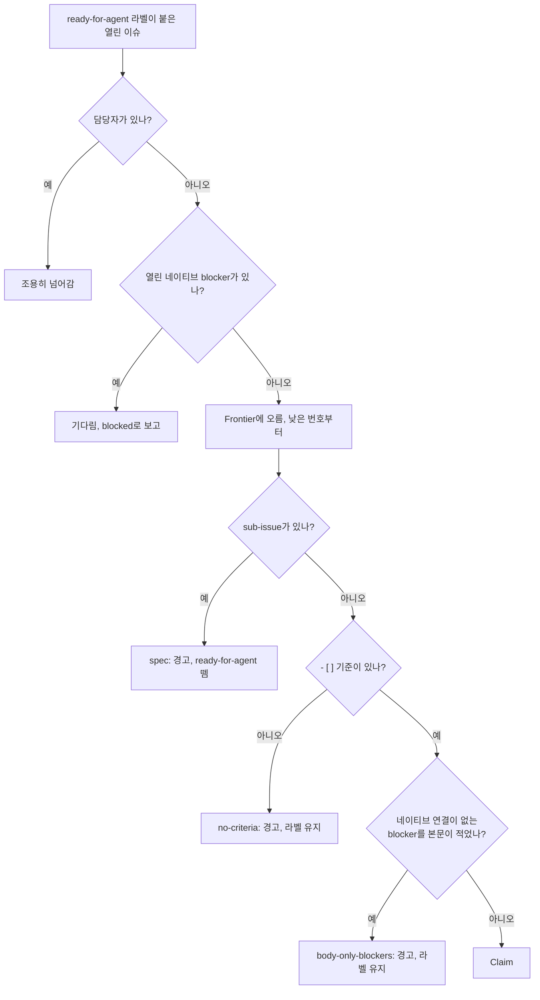

# 일 계획하기

파이프라인은 계획하지 않습니다. 무엇을 만들지 정하는 데는 판단이 필요하고, 계획하면서 잘못 세운 가정은 Spec과 Ticket, merge된 코드로 굳어져 버려 중간에 잡아낼 관문이 남지 않습니다. 그래서 계획은 사람 몫으로 두고, 파이프라인은 계획이 넘겨준 것만 받아 갑니다([ADR-0001](https://github.com/jjongs2/ticket-runner/blob/main/docs/adr/0001-humans-plan-the-pipeline-executes.md)). 넘겨받은 것을 믿고 일하는 만큼, 이슈에서 읽는 것은 몇 가지뿐이고 그것도 엄격하게 읽습니다. 그중 하나라도 어긋난 이슈는 짐작하지 않고 거절합니다.

| Ticket에 필요한 것 | 이유 |
|---|---|
| `ready-for-agent` 라벨 | Run이 Ticket을 찾는 방법 |
| 담당자 없음 | 누군가 지정되어 있으면 이미 claim한 것 |
| Acceptance Criteria: 본문이나 코멘트의 `- [ ]` 줄 | verify Stage가 채점하는 유일한 대상 |
| 네이티브 `blocked by` 연결로 적은 blocker, 모두 닫힘 | 어떤 Ticket을 어떤 순서로 돌릴지 정함 |
| 네이티브 sub-issue 없음 | sub-issue가 있는 이슈는 Ticket이 아니라 Spec |

출처: [`frontier.ts` · `selectFrontier`](https://github.com/jjongs2/ticket-runner/blob/main/src/frontier.ts), [`acceptance-criteria.ts` · `UNCHECKED_BOX`](https://github.com/jjongs2/ticket-runner/blob/main/src/acceptance-criteria.ts), [`gh-tracker.ts` · `listCandidates`](https://github.com/jjongs2/ticket-runner/blob/main/src/adapters/gh-tracker.ts), [`guards.ts` · `skipReason`](https://github.com/jjongs2/ticket-runner/blob/main/src/guards.ts).

계획을 맡는 에이전트를 위해 같은 목록을 적어 둔 문서가, `init`이 모든 Target에 넣어 두는 conventions 문서 [`docs/agents/pipeline-conventions.md`](https://github.com/jjongs2/ticket-runner/blob/main/docs/agents/pipeline-conventions.md)입니다.

## Spec과 Ticket {#specs-and-tickets}

계획은 `mattpocock-skills` 플러그인의 스킬을 차례로 쓰는 일이고, 내 세션에서 직접 돌립니다.

| 스킬 | 만드는 것 |
|---|---|
| `grilling` | 에이전트가 아니라 내가 질문에 답한 계획 |
| `to-spec` | **Spec**: 기능 하나를 통째로 설명하는 부모 이슈 |
| `to-tickets` | **Ticket**: Spec의 네이티브 sub-issue. 하나가 에이전트 세션 하나 분량이고, `ready-for-agent` 라벨이 붙음 |
| `triage` | 다른 경로로 들어온 이슈를 Ticket으로. 브리프(와 그 기준)는 코멘트로 올라감 |

[Spec](https://github.com/jjongs2/ticket-runner/blob/main/CONTEXT.md)은 그 자체로 구현하지 않고, 그 아래 Ticket만 구현합니다. Spec에 `ready-for-agent` 라벨이 남아 있으면 아래의 `spec` Guard가 떼어 냅니다. [Ticket](https://github.com/jjongs2/ticket-runner/blob/main/CONTEXT.md)은 implement Stage 한 번에 끝날 만큼 작아야 합니다. implement Stage는 기본으로 300턴, 60분입니다([설정](./configuration.md#stages)).

부모와 blocker까지 달아서 직접 만들려면:

```bash
gh issue create --title "Drain the Frontier" --parent 12 --blocked-by 14,15 --label ready-for-agent
```

## Acceptance Criteria {#acceptance-criteria}

기준 하나는 줄 맨 앞에 있는, 체크되지 않은 task list 항목입니다. 들여쓰기(있어도 되고 없어도 됨), `-`, `*`, `+` 중 하나의 불릿, 공백 하나, 그리고 `[ ]`. 아무리 약속처럼 읽혀도 그 밖의 것은 기준이 아닙니다.

```markdown
- [ ] `run 3 7` takes only #3 and #7            ← 기준
  * [ ] a nested item counts too                ← 기준
- [x] already ticked                            ← 아님: 더 채점할 게 없음
The command must refuse bad input.              ← 아님: 산문
1. [ ] a numbered item                          ← 아님: 불릿이 없음
```

기준은 이슈 본문에 있어도 되고 어느 코멘트에 있어도 됩니다. `triage`가 브리프를 코멘트로 올리기 때문입니다. verify Stage는 기준마다 `met`, `unmet`, `unverifiable` 중 하나로 채점합니다. Ticket이 merge되면 `met`인 기준은 적힌 자리에서 체크되고, `unverifiable`인 기준은 증거를 모은 사람이 없으니 체크하지 않은 채 둡니다. 채점 과정은 [Ticket 하나가 merge되기까지](./ticket-to-merge.md)에서 다룹니다.

기준은 세션이 코드를 돌려 보거나 읽어서 확인할 수 있게 쓰세요. 사람의 눈이 필요한 기준(스크린샷, 느낌)은 `unverifiable`로 돌아옵니다.

## Blocker {#blockers}

GitHub의 네이티브 `blocked by` 연결만 셉니다([ADR-0003](https://github.com/jjongs2/ticket-runner/blob/main/docs/adr/0003-github-native-relations-only.md)). 그래서 Run이 가져가는 것은 GitHub 화면에서 막힘이 풀렸다고 보이는 것과 같습니다. 본문까지 읽으면 진실의 출처가 둘이 되고, 오래된 본문이 조용히 일을 막거나 풀어 버릴 수 있습니다.

```bash
gh issue edit 23 --add-blocked-by 14,15      # 기존 이슈에 연결 추가
gh issue edit 23 --remove-blocked-by 15      # 하나 떼기
```

blocker 중 하나라도 열려 있으면 Ticket은 기다립니다. 같은 Run의 다른 Lane이 아직 작업 중인 blocker도 열려 있는 것이고, 두 Ticket이 서로 방해하지 않게 하는 장치는 이것뿐입니다. 어떤 Ticket끼리 나란히 돌려도 되는지를 따로 판단하는 것은 없습니다. blocker가 merge되는 순간, 그것 때문에 기다리던 Ticket은 같은 Run 안에서 가져갈 수 있게 됩니다.

본문의 `Blocked by` 섹션은 사람이 읽을 사본으로 두어도 괜찮습니다. 다만 거기 적힌 이슈마다 네이티브 연결도 있어야 합니다. 연결이 없는 이슈를 적어 두면 `body-only-blockers` Guard가 Ticket을 거절합니다. Guard는 그 섹션만 읽으니, 본문의 다른 곳에 있는 이슈 참조는 그냥 산문입니다.

| 쓰는 방식 | 섹션이 끝나는 곳 |
|---|---|
| 한 줄에 `Blocked by: #14, #15` | 그 줄 끝 |
| `## Blocked by` 제목 다음의 목록 | 제목 아래 첫 목록의 끝 |

다른 저장소를 가리키는 참조(`other/repo#12`)는 blocker로 읽지 않습니다.

## 라벨 {#labels}

라벨은 triage 상태 기계입니다. 이슈 하나에는 한 번에 상태 라벨 하나만 붙습니다. `init`이 여섯 개를 모두 만들고, [`labels`](./configuration.md#labels)로 이름을 바꿀 수 있습니다.

| 라벨 | 붙이는 쪽 | 파이프라인이 하는 일 |
|---|---|---|
| `needs-triage` | 사람. 파이프라인은 상설 Notes 이슈에 | 그 라벨로 Notes 이슈를 여는 것 말고는 없음 |
| `needs-info` | 사람 | 없음 |
| `ready-for-agent` | 계획, Release, Ticket을 돌려주는 사람 | 후보로 가져감. Claim할 때 뗌 |
| `in-progress` | Run만, Claim할 때 | Run이 쥐고 있는 Ticket 표시. merge, Hand-off, Release 때 뗌 |
| `ready-for-human` | Hand-off | 사람이 라벨을 바꿀 때까지 건드리지 않음 |
| `wontfix` | 사람 | 없음 |

파이프라인이 어떤 Ticket을 건드리지 않게 하려면 `ready-for-agent`를 떼거나 누군가를 담당자로 지정하세요. 담당자가 있는 후보는 이미 claim된 것으로 보고 조용히 넘어갑니다.

## Guard {#guards}

계획은 몇 가지 알려진 방식으로 어긋납니다. `to-spec`이 Spec에 `ready-for-agent` 라벨을 남겨 두기도 하고, 체크박스 기준 없이 들어온 이슈도 있고, `to-tickets`가 네이티브 연결은 만들지 않고 본문에 `Blocked by: #n`만 적어 두기도 합니다. 이대로 가져가면 파이프라인은 Spec 전체를 거대한 Ticket 하나로 구현하거나, verify가 채점할 수 없는 일을 하거나, 선행 작업이 끝나기도 전에 Ticket을 시작하게 됩니다. [Guard](https://github.com/jjongs2/ticket-runner/blob/main/CONTEXT.md)는 이런 후보를 claim하기 전에 넘기고, 왜 넘겼는지 한 번 알려 줍니다. 계획 결과를 고친 뒤 다시 돌리면 됩니다.


<!-- Sources: src/frontier.ts, src/guards.ts, src/orchestrator.ts -->

| 이유 | 후보의 상태 | 파이프라인이 하는 일 |
|---|---|---|
| `spec` | 네이티브 sub-issue가 있으니 Spec | 건너뛰고 `ready-for-agent`를 뗌. 그 아래 Ticket은 하나씩 가져감 |
| `no-criteria` | 본문과 코멘트에 `- [ ]` 줄이 없어 verify가 채점할 게 없음 | 건너뛰고 라벨은 둠. 코멘트로 기준을 더할 수 있으니까 |
| `body-only-blockers` | `Blocked by` 섹션이 네이티브 연결 없는 이슈를 적음 | 건너뛰고 라벨은 둠. 본문의 줄은 blocker로 읽지 않음 |

건너뛸 때마다 무엇을 고치면 되는지 적은 경고 코멘트를 하나 달고, Run 요약에는 `skipped  #<n> <reason>`으로 남깁니다. 경고에는 숨은 `<!-- ticket-runner:guard:<reason> -->` 표시가 있어서 이유마다 한 번만 올라갑니다. 밤마다 도는 Run이 고쳐지지 않은 같은 이슈를 다시 만나도 더는 아무 말도 하지 않습니다. 이슈를 고치면 다음 Run이 가져갑니다. 코멘트 문구는 [`docs/templates/guard-comment.md`](https://github.com/jjongs2/ticket-runner/blob/main/docs/templates/guard-comment.md)에 있습니다.

Guard는 [Stranded Ticket](https://github.com/jjongs2/ticket-runner/blob/main/CONTEXT.md)도 재개하기 전에 채점합니다. Guard가 보는 것은 누가 쥐고 있느냐가 아니라 이슈 자체이기 때문입니다.

## 관련 페이지 {#related-pages}

- [실행하기](./running.md): Run이 비우는 Frontier, 그리고 지정한 Ticket으로 좁힌 Run.
- [Ticket 하나가 merge되기까지](./ticket-to-merge.md): Ticket을 claim한 다음 일어나는 일과 verify가 기준을 채점하는 방식.
- [설정](./configuration.md): 라벨 이름 바꾸기.
- [설치와 제거](./installation.md): `init`이 라벨과 conventions 문서를 만듦.

## 참고 자료 {#references}

- [`src/guards.ts`](https://github.com/jjongs2/ticket-runner/blob/main/src/guards.ts), [`src/frontier.ts`](https://github.com/jjongs2/ticket-runner/blob/main/src/frontier.ts), [`src/acceptance-criteria.ts`](https://github.com/jjongs2/ticket-runner/blob/main/src/acceptance-criteria.ts), [`src/criteria.ts`](https://github.com/jjongs2/ticket-runner/blob/main/src/criteria.ts)
- [`src/orchestrator.ts` · `passOver`](https://github.com/jjongs2/ticket-runner/blob/main/src/orchestrator.ts), [`src/labels.ts`](https://github.com/jjongs2/ticket-runner/blob/main/src/labels.ts), [`src/adapters/gh-tracker.ts`](https://github.com/jjongs2/ticket-runner/blob/main/src/adapters/gh-tracker.ts)
- [`docs/agents/pipeline-conventions.md`](https://github.com/jjongs2/ticket-runner/blob/main/docs/agents/pipeline-conventions.md), [`docs/agents/triage-labels.md`](https://github.com/jjongs2/ticket-runner/blob/main/docs/agents/triage-labels.md), [`docs/templates/guard-comment.md`](https://github.com/jjongs2/ticket-runner/blob/main/docs/templates/guard-comment.md), [`CONTRIBUTING.md`](https://github.com/jjongs2/ticket-runner/blob/main/CONTRIBUTING.md)
- [ADR-0001](https://github.com/jjongs2/ticket-runner/blob/main/docs/adr/0001-humans-plan-the-pipeline-executes.md), [ADR-0003](https://github.com/jjongs2/ticket-runner/blob/main/docs/adr/0003-github-native-relations-only.md)
