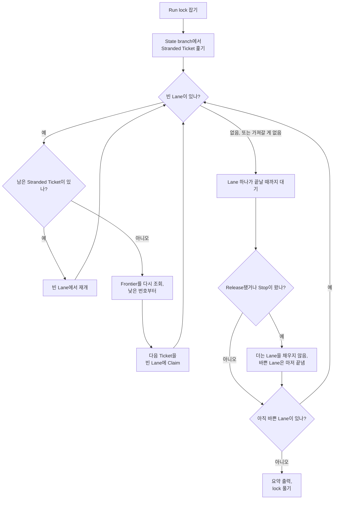

# 실행하기

[Run](https://github.com/jjongs2/ticket-runner/blob/main/CONTEXT.md)은 명령 하나 걸어 두고 자리를 떠도 되게 하려고 있습니다. 준비된 Ticket을 모두 가져가 하나하나 merge나 사람에게까지 데려가고, 가져갈 게 더 없으면 알아서 끝납니다. 나중에 궁금할 만한 것은 요약과 보드, 그리고 디스크에 남긴 transcript에 다 있습니다.

| 명령 | 하는 일 | 종료 코드 |
|---|---|---|
| `ticket-runner run` | Frontier를 비움 | `0` · `1` Hand-off 있음 · `2` 가져간 것 없음 |
| `ticket-runner run 3 7` | 같은 Run을 #3과 #7로 좁힘 | 위와 같음 |
| `ticket-runner run --lanes 2` | 같은 Run을 Ticket 두 개씩 동시에 | 위와 같음 |
| `ticket-runner stop` | 이 Target의 Run에게 쥔 것만 마치고 더 가져가지 말라고 요청 | `0` 보냄 · `2` 보낼 상대 없음 |
| `ticket-runner -v` | 이 사본의 Version을 출력 | `0` |
| `ticket-runner -h` | 사용법을 출력 | `0` (명령 없이 실행하면 `2`) |

출처: [`start.ts` · `startRun`](https://github.com/jjongs2/ticket-runner/blob/main/src/start.ts), [`run.ts` · `processRun`](https://github.com/jjongs2/ticket-runner/blob/main/src/run.ts), [`command-line.ts` · `readCommandLine`, `USAGE`](https://github.com/jjongs2/ticket-runner/blob/main/src/command-line.ts), [`stop.ts` · `requestStop`](https://github.com/jjongs2/ticket-runner/blob/main/src/stop.ts), [`adapters/version.ts` · `pipelineVersion`](https://github.com/jjongs2/ticket-runner/blob/main/src/adapters/version.ts).

`init`과 `remove`는 [설치와 제거](./installation.md)에 있습니다. 모르는 명령이나 옵션, 잘못된 인자는 사용법과 함께 종료 코드 `2`로 거절합니다.

## `run` {#run}

`run`은 [Frontier](https://github.com/jjongs2/ticket-runner/blob/main/CONTEXT.md)를 비웁니다. Frontier는 `ready-for-agent` 라벨이 붙은 열린 Ticket 중 담당자가 없고 네이티브 blocker가 모두 닫힌 것들입니다([계획](./planning.md)). 무언가를 가져가기 전에 Run이 마주칠 수 있는 거절을 순서대로 모두 통과합니다. [Target readiness](./installation.md#target-readiness-what-run-refuses), 남아 있는 로컬 State 파일, Check 없음, 그리고 Run lock입니다. 어느 것이든 종료 코드 `2`로 끝나고 아무것도 남기지 않습니다.

그다음 [Lane](https://github.com/jjongs2/ticket-runner/blob/main/CONTEXT.md)으로 Ticket을 가져갑니다. Lane 하나에 Ticket 하나, 기본은 Lane 하나입니다.


<!-- Sources: src/run.ts, src/start.ts, src/stranded.ts, src/frontier.ts -->

- **Frontier는 Lane을 채울 때마다 다시 조회합니다.** 한 번 찍어 둔 목록을 쓰지 않습니다. 그래서 blocker를 닫는 merge가 일어나면, 그것 때문에 기다리던 Ticket이 같은 Run에 들어옵니다.
- **실패한 Ticket은 Hand-off되고** 그 Lane은 다음 Ticket을 가져갑니다. 나쁜 Ticket 하나 때문에 밤 전체를 잃지는 않습니다.
- **Release가 일어나면 채우기를 멈춥니다.** rate limit에 걸린 Ticket은 Release되고, 같은 한도가 다음 Stage도 막을 테니 Run은 더 claim하지 않습니다. 아직 바쁜 Lane은 쥔 것을 마저 끝냅니다.
- **Run이 끝나는 때**는 바쁜 Lane이 없고 가져갈 것도 남지 않았을 때입니다. Frontier가 비었거나, 남은 것이 모두 막혀 있을 때죠.

Lane 안에서 Ticket 하나에 일어나는 일은 [Ticket 하나가 merge되기까지](./ticket-to-merge.md)에 있습니다. Stranded Ticket과 Release는 [멈추고 이어 하기](./stopping-and-resuming.md)에 있습니다.

### `--lanes` {#lanes}

Lane이 하나면 Run은 Frontier에서 Ticket을 하나씩 가져갑니다. Ticket 하나에 드는 시간은 대부분 implement와 verify Stage인데, 최대 1시간 20분 동안 도는 이 세션들은 Frontier의 다른 Ticket과 부딪힐 일이 없습니다. 그런데도 차례로 줄을 서니, 서로 무관한 Ticket 여섯 개는 하나일 때의 여섯 배가 걸립니다. Frontier의 Ticket끼리는 서로 막지 않으니 Lane을 늘리면 여러 개를 한꺼번에 가져갈 수 있고, rebase부터 merge까지의 [Landing](./ticket-to-merge.md#the-landing)만 한 번에 Lane 하나씩 지나갑니다.

`--lanes <n>`은 이번 Run에만 Lane `n`개를 주고, `ticket-runner.json`의 [`lanes`](./configuration.md#lanes)보다 우선합니다. 머신 하나가 Ticket을 몇 개까지 동시에 감당할지는 저장소가 아니라 그 머신이 정할 일이라, 이 값만은 명령줄에서 덮어씁니다. Ticket 번호 앞에 둬도 뒤에 둬도 되고, 지정한 Ticket 수보다 큰 값도 거절하지 않습니다.

Lane들은 각자의 worktree에서 Check를 동시에 돌립니다. Check가 포트나 데이터베이스처럼 함께 써야 하는 것을 필요로 하는 Target은 Lane을 하나로 두세요.

### 좁힌 Run {#a-narrowed-run}

`ticket-runner run 12 13 14`는 모든 면에서 같은 Run입니다(Lane, Landing, Run lock, Release, Stop 모두). 다만 Stranded Ticket에서든 Frontier에서든 #12, #13, #14만 가져갑니다. 다른 Ticket은 Stranded Ticket까지 포함해 있던 그대로 둡니다.

- 번호는 어떤 Ticket인지를 말할 뿐 순서를 정하지 않습니다. Stranded Ticket이 먼저, 나머지는 낮은 번호부터입니다.
- `#12`는 `12`로 읽고, 같은 번호를 두 번 줘도 한 번만 가져갑니다.
- 1 이상의 정수가 아닌 것은 lock을 잡기 전에 종료 코드 `2`로 거절합니다.
- blocker는 그대로 유효합니다. 지정한 Ticket이 지정한 다른 Ticket에 막혀 있으면, 그 Ticket이 같은 Run에서 merge된 뒤에 가져갑니다.

지정했는데 Run이 가져가지 않은 Ticket에는 이유를 적은 `skipped` 줄이 붙습니다. 이슈에 코멘트까지 다는 것은 Guard의 이유뿐입니다.

| 줄 | 뜻 |
|---|---|
| `blocked` | Run이 끝날 때까지 열린 blocker가 막고 있었음 |
| `claimed` | 다른 누군가가 담당자로 지정되어 있음 |
| `not-ready` | `ready-for-agent` 라벨이 없거나 이미 닫힘 |
| `no-issue` | 그 번호의 이슈가 없음 |
| `pull-request` | 그 번호는 pull request |
| `spec`, `no-criteria`, `body-only-blockers` | [Guard](./planning.md#guards)가 거절함 |

Stop이나 Release 때문에 Run이 손대지 못한 지정 Ticket에는 줄이 없습니다. Run이 왜 멈췄는지는 요약의 마지막 줄이 말해 줍니다.

## `stop` {#stop}

```bash
ticket-runner stop
```

Stop은 Run에게 Lane이 쥐고 있는 Ticket만 merge나 Hand-off까지 마치고 더는 가져가지 말라고 하는 요청입니다. `stop`은 GitHub에서 Run lock을 읽어 거기 적힌 프로세스에 SIGTERM을 보내고, 어느 Run에게 요청했는지 알려 줍니다.

```text
`ticket-runner run` (run 2026-09-17T09-00-00-000, pid 4321) will stop once the Tickets it holds are finished. It claims no more.
Ctrl+C in that Run's own terminal stops it at once instead, at the cost of killing the Stages it is running and leaving their Tickets stranded for the next Run.
```

Target에서는 lock 말고 아무것도 필요 없습니다. 설정도, `gh` 로그인도, readiness도요. lock을 잡은 Run이 없을 때, 이 Host에서 lock이 가리키는 Run이 이미 사라졌을 때, Run이 다른 Host에 있을 때(그 Host만 신호를 보낼 수 있음)는 아무것도 보내지 않고 `2`로 끝납니다. `stop`을 두 번 해도 같은 내용을 출력하고, Run은 두 번째 신호를 무시합니다. Stop은 신호이고 Ctrl+C는 kill인 이유, 그리고 각각이 남기는 것은 [멈추고 이어 하기](./stopping-and-resuming.md)에 있습니다.

## `-v` {#v}

`-v` 또는 `--version`은 한 줄을 출력합니다. 설치한 사본은 번호만 출력합니다. 머신은 Version 태그를 설치하니, `0.5.2`라고 말하는 두 머신은 같은 코드를 돌립니다. 개발용 체크아웃은 어떤 commit이든 가진 그대로 돌리니 그 commit을 덧붙이고, 트리에 commit하지 않은 변경이 있으면 `dirty`도 붙입니다.

```text
0.5.2
0.5.2+331d79c
0.5.2+331d79c.dirty
```

같은 문자열이 Run 요약의 머리, 모든 Progress comment, `init` 보고서, 각 State 파일, 각 Run의 `version.txt`에 들어갑니다. 그래서 파이프라인이 쓴 것은 무엇이든 그걸 쓴 파이프라인까지 거슬러 올라갈 수 있습니다([ADR-0007](https://github.com/jjongs2/ticket-runner/blob/main/docs/adr/0007-a-version-is-cut-by-a-human-and-installs-follow-tags.md)).

## 시작 전에 거절되는 경우 {#refused-before-it-starts}

| 상황 | 보게 되는 것 |
|---|---|
| 이 Host의 다른 Run이 Target을 쥐고 있음 | ``Another ticket-runner is running on this Host: `ticket-runner run` as run … Wait for it to finish, or ask it to with `ticket-runner stop`.`` |
| 다른 Host의 Run이 Target을 쥐고 있음 | 그 Host, Run, 시작 시각, 그리고 그 Run이 사라졌을 때 lock을 푸는 방법 |
| 셸이 Stage의 것임 | ``Refusing to start: TICKET_RUNNER_STAGE is set to `implement`, …`` |

Target 하나에는 한 번에 Run 하나뿐입니다. 어느 Host에서 돌든 마찬가지입니다. 같은 Host에서 프로세스가 사라진 Run(Ctrl+C로 끝난 Run)이 남긴 lock은 그 Host의 다음 Run이 알아서 넘겨받습니다. lock에 대해서, 그리고 다른 Host가 남긴 lock을 푸는 방법은 [멈추고 이어 하기](./stopping-and-resuming.md)에 있습니다.

Stage 세션은 모두 `TICKET_RUNNER_STAGE`를 자기 Stage 이름으로 설정한 채 돌고, 이 변수가 있는 동안 명령은 `--help`와 `--version`까지 모든 것을 거절합니다. 그래서 Stage가 Run 안에서 또 Run을 시작할 수 없습니다. 이건 선의의 실수를 막는 인계철선이지, 샌드박스는 아닙니다.

## 요약 {#the-summary}

Run이 끝나면 Ticket마다 한 줄씩, Ticket이 끝난 순서대로 출력하고, 왜 멈췄는지 한 줄로 마무리합니다.

```text
ticket-runner 0.5.2 run 2026-09-17T09-00-00-000 · 84m

  merged   #4 Planning guards (PR #12)
  noted    #8 comment · from #4 implement · the CLI help drifts
  handed   #5 Fix Stage with a single retry · verify · 1 unmet
  skipped  #7 no-criteria
  skipped  #9 blocked

Frontier blocked.
```

새 Version 안내가 있으면 머리 줄 위에 붙습니다([설치와 제거](./installation.md#install)). 아무것도 가져가지 않은 Run은 줄 대신 `  nothing to do`를 출력합니다.

| 줄 | 뜻 |
|---|---|
| `merged` | merge됨. pull request 번호가 붙음 |
| `handed` | 사람에게 Hand-off됨. 멈춘 Stage와 이유가 붙음 |
| `released` | rate limit 때문에 해당 Stage에서 Release됨. 누구도 할 일이 없음 |
| `skipped` | 이유와 함께 넘어감([Guard](./planning.md#guards), 또는 위의 표) |
| `noted` | 바로 윗줄이 남긴 [Note](https://github.com/jjongs2/ticket-runner/blob/main/CONTEXT.md)와 간 곳. 이미 있는 이슈(열려 있던 Notes 이슈 포함)면 `comment`, Notes 이슈를 새로 연 Note 하나만 `new` |

| 마지막 줄 | Run이 끝난 이유 |
|---|---|
| `Frontier empty.` | 가져갈 것이 남지 않음 |
| `Frontier blocked.` | 남은 것에 모두 열린 blocker가 있음 |
| `Rate limited.` | Release가 멈춤 |
| `Stopped at 22:07 · finishing #4 #9.` | 그 시각(UTC)에 Stop이 왔고, 그때 그 Ticket들이 Lane에 있었음 |

Stop이나 Release로 끝난 Run은 Frontier 끝까지 가 보지 못했으니 `blocked` 줄을 출력하지 않습니다.

## 종료 코드 {#exit-codes}

| 코드 | `run` |
|---|---|
| `0` | Hand-off된 것이 없음. Release도 가져간 것으로 치고, 번호 없이 시작해 모두 건너뛴 Run도 마찬가지 |
| `1` | Hand-off된 Ticket이 하나 이상 |
| `2` | 아무것도 가져가지 않음: Run이 거절됐거나, 번호를 받았는데 하나도 가져가지 않음 |

멈춘 Run도 평소처럼 결과에 따른 코드로 끝납니다. `stop`은 Stop을 보냈으면 `0`, 보낼 상대가 없으면 `2`로 끝납니다. `-v`와 `-h`는 `0`, 거절된 명령줄은 모두 `2`입니다. `init`과 `remove`의 종료 코드는 [설치와 제거](./installation.md)에 있습니다. 출처: [`cli.ts` · `main`](https://github.com/jjongs2/ticket-runner/blob/main/src/cli.ts).

## 로그와 transcript {#logs-and-transcripts}

Run 자신의 출력은 터미널로 갑니다. 첫 줄은 `ticket-runner run <runId> · 1 lane`이고, 좁힌 Run이면 지정한 Ticket이 덧붙습니다. Ticket에 관한 줄은 모두 그 번호로 시작하니, Lane들의 출력이 섞여 있어도 Ticket 하나씩 따라 읽을 수 있습니다. 경고와 거절은 stderr로 갑니다.

Stage가 한 일은 모두 Target의 gitignore된 `.ticket-runner/` 아래 디스크에 남습니다. run id는 UTC 시작 시각입니다. 예를 들면 `2026-09-17T09-00-00-000`.

| `.ticket-runner/runs/<runId>/` 아래 경로 | 담는 것 |
|---|---|
| `version.txt` | 돌린 Version. 첫 Stage 전에 씀 |
| `<n>/<stage>.command` | 환경 변수까지 포함한 정확한 명령줄. 그대로 붙여 넣으면 Stage를 다시 돌릴 수 있음 |
| `<n>/<stage>.stdout`, `<n>/<stage>.stderr` | Stage가 출력하는 대로 실시간으로 덧붙인 출력 |
| `<n>/<stage>.transcript.jsonl` | 세션의 stream-json 이벤트 |
| `<n>/retry/` | fix Stage와, 그 덕에 한 번 더 도는 시도. 실패한 시도의 파일은 옆에 그대로 남음 |

명령줄은 Stage가 시작되기 전에, 출력은 나오는 대로 쓰니, Stage 도중에 kill된 Run도 거기까지 한 것은 남깁니다. Hand-off된 Ticket은 Stage들의 명령줄과 transcript, 그리고 `version.txt`를 Target의 원격에도 남깁니다. `ticket-runner/state` branch의 `ticket-<n>/<runId>/` 아래입니다. 그걸 쓴 Host는 사람이 들여다볼 즈음이면 없을 수도 있기 때문입니다. Hand-off 코멘트가 그 디렉터리를 알려 줍니다([멈추고 이어 하기](./stopping-and-resuming.md)).

출처: [`run-log.ts`](https://github.com/jjongs2/ticket-runner/blob/main/src/run-log.ts), [`adapters/claude-agent-runner.ts` · `startStageLog`](https://github.com/jjongs2/ticket-runner/blob/main/src/adapters/claude-agent-runner.ts).

## Claude 앱에서 실행하기 {#from-the-claude-app}

워크스테이션에서는 Run이 그 머신이 켜져 있는 동안만 돕니다. 머신이 잠들거나, 재부팅되거나, 꺼지면 다시 돌아올 때까지 Frontier가 줄지 않고, Run을 들여다보거나 멈추는 것도 시작한 터미널에서만 할 수 있습니다. Claude 앱에서 시작한 Run에는 이런 제약이 없습니다. 앱에서 Target으로 Claude Code 클라우드 세션을 열고 "run it"이라고 말하면 됩니다. 그 세션의 Claude가 [Operator](https://github.com/jjongs2/ticket-runner/blob/main/CONTEXT.md)입니다. 클라우드 세션은 저장소 말고는 아무것도 가져오지 않으니, Operator는 `init`이 Target에 써 둔 스킬 `.claude/skills/ticket-runner/SKILL.md`를 따릅니다([ADR-0008](https://github.com/jjongs2/ticket-runner/blob/main/docs/adr/0008-a-cloud-host-is-a-claude-code-cloud-session.md)).

| 이렇게 말하면 | Operator는 |
|---|---|
| "run it" | Host를 준비한 뒤 `ticket-runner run`을 백그라운드로 시작 |
| "12번이랑 14번 돌려 줘" | `ticket-runner run 12 14`를 시작 |
| "세 개씩 동시에" | `--lanes 3`을 넘김. 그래서 클라우드는 워크스테이션과 다른 수를 감당할 수 있음 |
| "멈춰" | `ticket-runner stop`을 실행하고, Run이 끝날 때까지 계속 보고 |
| "lock 풀어 줘" | 자기 Run이 돌고 있지 않을 때만, `ticket-runner/lock`에 빈 `lock.json`을 commit |

Host 준비는 클라우드 환경의 setup script가 설치하지 않은 것만 채웁니다.

1. **파이프라인.** setup script가 설치한 사본이 있으면 Version과 상관없이 그대로 씁니다. 없으면 Target의 conventions 문서에 찍힌 Version을 설치합니다. 찍힌 Version이 없으면 아무것도 설치하지 않고, 워크스테이션에서 `init`을 실행해 달라고 합니다.
2. **`mattpocock-skills` 플러그인**, 공식 마켓플레이스에서.
3. **`gh`**, apt에서. 파이프라인은 `gh api`로만 GitHub에 닿으니 apt의 오래된 버전으로 충분합니다.
4. **Target 자체의 의존성**, 메인 체크아웃에. 모든 worktree의 Check가 거기서 찾아 씁니다.

Run이 Ticket을 끝낼 때마다 보고하고, 끝나면 요약과 종료 코드의 뜻을 전합니다. 자기 Run이 Target을 쥐고 있는 동안 체크아웃과 `.worktrees/`는 건드리지 않고, 이슈나 pull request에도 손대지 않습니다. Ticket에 관한 그 밖의 일은 보드를 통해 합니다.

클라우드 Host는 몇 가지가 워크스테이션과 다르고, 파이프라인은 그것을 감안합니다.

- **원격에서 아무것도 지울 수 없습니다.** 그래서 `init`이 merge 때 pull request branch를 지우는 설정을 켜고, `remove`는 클라우드 Host에서 실행을 거절합니다.
- **이슈 본문, 코멘트, pull request 본문마다 "Generated by Claude Code" 줄이 붙습니다.** 프록시가 덧붙이는 것이라 끌 수 없습니다. squash commit은 파이프라인이 직접 작성하니 base branch에는 들어가지 않습니다.
- **회수된 VM은 kill입니다.** Stranded Ticket을 남기고, 다음 Run이 어느 Host에서든 재개합니다. 남은 lock은 다른 Host가 죽었다고 단정하지 않으니 사람이 풀어야 합니다. Operator를 통해서든 GitHub에서든요.
- **transcript는 VM과 함께 사라집니다.** Hand-off된 Ticket의 것만 State branch에 남습니다.

## 관련 페이지 {#related-pages}

- [일 계획하기](./planning.md): Ticket이 Frontier에 오르려면.
- [설정](./configuration.md): Run이 쓰는 `lanes`, Check, Stage 한도.
- [Ticket 하나가 merge되기까지](./ticket-to-merge.md): Lane이 Ticket 하나로 하는 일.
- [멈추고 이어 하기](./stopping-and-resuming.md): Stop과 kill, Release, Stranded Ticket, Run lock.
- [설치와 제거](./installation.md): 시작하기 전에 Run이 거절하는 것.

## 참고 자료 {#references}

- [`src/cli.ts`](https://github.com/jjongs2/ticket-runner/blob/main/src/cli.ts), [`src/command-line.ts`](https://github.com/jjongs2/ticket-runner/blob/main/src/command-line.ts), [`src/start.ts`](https://github.com/jjongs2/ticket-runner/blob/main/src/start.ts), [`src/run.ts`](https://github.com/jjongs2/ticket-runner/blob/main/src/run.ts)
- [`src/stop.ts`](https://github.com/jjongs2/ticket-runner/blob/main/src/stop.ts), [`src/lock.ts`](https://github.com/jjongs2/ticket-runner/blob/main/src/lock.ts), [`src/stage-guard.ts`](https://github.com/jjongs2/ticket-runner/blob/main/src/stage-guard.ts), [`src/host.ts`](https://github.com/jjongs2/ticket-runner/blob/main/src/host.ts)
- [`src/templates.ts` · `runSummary`](https://github.com/jjongs2/ticket-runner/blob/main/src/templates.ts), [`src/run-log.ts`](https://github.com/jjongs2/ticket-runner/blob/main/src/run-log.ts), [`src/adapters/version.ts`](https://github.com/jjongs2/ticket-runner/blob/main/src/adapters/version.ts)
- [`docs/templates/run-summary.txt`](https://github.com/jjongs2/ticket-runner/blob/main/docs/templates/run-summary.txt), [`docs/templates/stop-report.txt`](https://github.com/jjongs2/ticket-runner/blob/main/docs/templates/stop-report.txt), [`docs/templates/operator-skill.md`](https://github.com/jjongs2/ticket-runner/blob/main/docs/templates/operator-skill.md)
- [ADR-0006](https://github.com/jjongs2/ticket-runner/blob/main/docs/adr/0006-stop-is-a-signal-and-ctrl-c-is-a-kill.md), [ADR-0007](https://github.com/jjongs2/ticket-runner/blob/main/docs/adr/0007-a-version-is-cut-by-a-human-and-installs-follow-tags.md), [ADR-0008](https://github.com/jjongs2/ticket-runner/blob/main/docs/adr/0008-a-cloud-host-is-a-claude-code-cloud-session.md)
