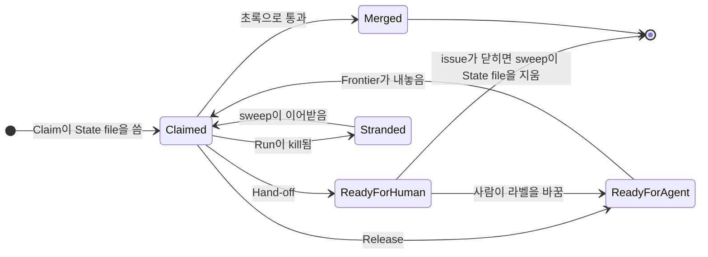
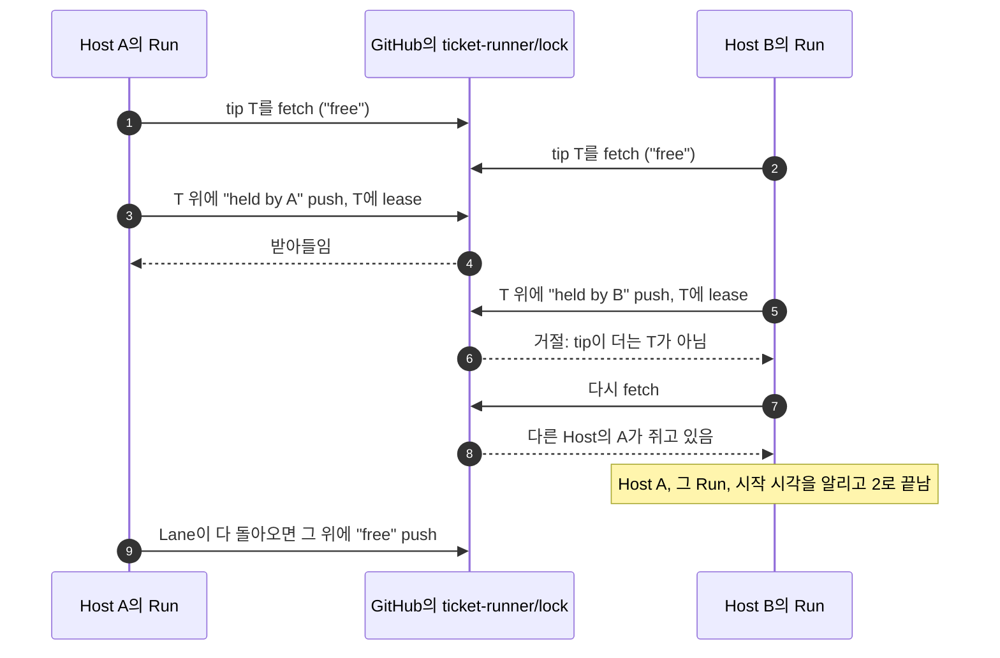
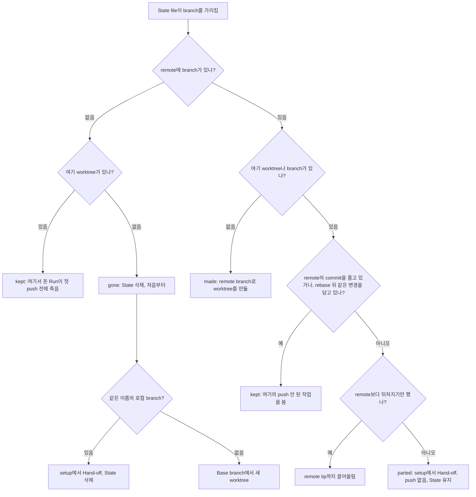

# 멈추고 이어 하기

Run은 아무도 지켜보지 않는 사이에 돌아가니, 일이 틀어졌을 때도 깔끔하게 끝나야 합니다. 끝내지 못한 Ticket, 바닥난 구독 한도, 그만 멈추라는 사람의 요청, 갑자기 사라진 머신 같은 경우 말이지요. 어느 경우든 Ticket은 다음 Run이 이어받을 수 있는 자리에 남습니다. 같은 Host든 다른 Host든 상관없습니다. 이어받은 Run은 이미 끝낸 Stage에 비용을 다시 치르지 않고, 사람이 라벨을 먼저 손봐 줄 필요도 없습니다.

이 페이지에서는 각 끝맺음이 무엇을 남기는지, 그리고 파이프라인이 거기서 어떻게 돌아오는지를 다룹니다.

## 한눈에 보기 {#at-a-glance}

| 끝맺음 | 원인 | 남는 것 |
|---|---|---|
| merge | 모든 관문을 초록으로 통과 | 닫힌 issue. branch와 State file은 사라짐 |
| [Hand-off](#hand-off) | Fix budget으로 감당할 수 없는 실패 | `ready-for-human`, 댓글, draft pull request. 작업과 State 유지 |
| [Release](#release-on-a-rate-limit) | 구독 rate limit | `ready-for-agent`, 댓글 없음. 작업과 State 유지 |
| [Stop](#stop-and-kill) | `ticket-runner stop`(SIGTERM) | 새로 남는 것 없음 |
| [Kill](#stop-and-kill) | Ctrl+C, SIGKILL, 사라진 Host | Claim, 마지막 push 시점의 작업, State |

merge나 Hand-off 뒤에는 Run이 그 Lane을 다시 채웁니다. Release나 Stop 뒤에는 더 claim하지 않고, 바쁜 Lane만 쥔 일을 마칩니다. kill이면 그 자리에서 끝납니다.

아직 끝나지 않은 Ticket은 저마다 한 갈래 길로 돌아옵니다. 어느 길인지는 보드가 정합니다.


<!-- Sources: src/orchestrator.ts, src/stranded.ts, src/run.ts, src/resume.ts -->

이어받은 Ticket은 처음부터가 아니라, 도달해 있던 상태에서 계속합니다.

## Hand-off {#hand-off}

[Hand-off](https://github.com/jjongs2/ticket-runner/blob/main/CONTEXT.md)는 Ticket을 사람에게 넘기는 일입니다. merge도 Release도 아닌 끝맺음은 모두 이렇게 끝납니다. Fix budget을 쓴 뒤의 두 번째 실패, 시간을 넘긴 Stage, 끝나지 않은 CI, setup에서 앞을 막은 branch 같은 경우입니다. 이 가운데 누군가의 결함이 아닌 경우도 있습니다.

[`orchestrator.ts` · `handOff`](https://github.com/jjongs2/ticket-runner/blob/main/src/orchestrator.ts)가 이 순서로 처리합니다.

1. pull request를 열거나 기존 것을 씁니다. 이미 열려 있는 pull request는 draft로 되돌립니다. 그렇지 않고 이 Run이 push해도 되는 worktree라면, branch를 push하고 Ticket 제목으로 draft pull request를 엽니다. 여기서 실패하면 로그만 남기고, 라벨 변경은 어떻게든 이뤄집니다.
2. State file을 기록합니다. draft pull request 번호를 담고 Fix budget은 쓰지 않은 것으로 돌려 둡니다. 이 Run의 어떤 Stage도 작업을 남겼을 수 없는 경우라면 대신 파일을 지웁니다(아래 참고).
3. transcript를 remote에 남겨 둡니다. 각 Stage의 `.command`와 `.transcript.jsonl` 파일(재시도분은 `retry/` 아래), Run의 `version.txt`를 `ticket-runner/state` branch의 `ticket-<n>/<runId>/` 아래에 올립니다.
4. transcript 위치가 드러나도록 draft 본문을 다시 씁니다.
5. hand-off 댓글을 답니다.
6. `in-progress`를 떼고, `ready-for-human`을 붙이고, 담당자를 해제합니다.

댓글은 [`docs/templates/handoff-comment.md`](https://github.com/jjongs2/ticket-runner/blob/main/docs/templates/handoff-comment.md)의 모양을 따릅니다.

```md
<!-- ticket-runner:handoff -->
**Handed off.** Failed at **verify**, after the fix budget was used.

- Failure: 1 of 6 criteria unmet
- Branch `agent/8-rate-limit-release` on the remote · worktree `/home/me/acme/.worktrees/ticket-8` · PR #31 (draft)
- Transcripts: `ticket-8/2026-09-17T09-00-00-000/` on the `ticket-runner/state` branch

<details><summary>Evidence</summary>
…
</details>
```

"on the remote"는 remote에 branch가 있을 때만 붙습니다. worktree, pull request, transcript, evidence 부분도 가리킬 것이 없으면 각각 빠집니다.

### Hand-off가 덜 하는 경우 {#when-a-hand-off-does-less}

`setup`에서의 Hand-off는 아무것도 push하지 않습니다. push할 것이 없거나, 앞을 막은 것이 사람의 작업이거나 다른 Host의 작업일 수 있기 때문입니다.

| 경우 | Draft pull request | State file |
|---|---|---|
| 처음부터 시작했는데 worktree를 만들기 전에 실패 | 없음: push할 것이 없음 | **삭제**: 만들어진 branch가 없음 |
| 처음부터 시작했는데 같은 이름의 로컬 branch가 있음 | 없음 | **삭제**: 이 Run의 Stage가 거기서 일한 적 없음 |
| 이어받았는데 이 Host의 branch가 remote의 것과 갈라짐 | 새로 열지 않음. 열린 것은 draft로 | 유지: 양쪽 다 파이프라인의 작업 |
| worktree가 준비된 뒤의 모든 실패 | 새로 열거나, 열린 것을 draft로 되돌림 | 유지 |

댓글은 worktree가 있으면 늘 알려 줍니다. 이 Run의 worktree이거나, 앞을 막은 branch가 checkout된 worktree입니다. 실패 문구에 해야 할 일이 적혀 있습니다. 예를 들면 `delete it with git branch -D <branch> if the work on it is abandoned, or finish it by hand, then relabel the Ticket ready-for-agent` 같은 식입니다. State file은 이 Run의 어떤 Stage도 그 branch에서 일하지 않았을 때만 지웁니다. 앞을 막은 branch 위에 파일을 남겨 두면, 다음 Run이 사람의 작업 위로 이어받아 implement Stage를 돌려 버릴 수 있기 때문입니다.

### 무엇이 어디에 남나 {#what-stays-where}

사람이 들여다볼 즈음에는 작업하던 Host가 이미 없을 수도 있습니다. cloud Host의 VM이 그렇습니다. 그래서 사람이나 다음 Run에 필요한 것은 모두 Target의 remote에 둡니다.

| 무엇 | 어디 | 언제까지 |
|---|---|---|
| Ticket의 commit | remote의 `agent/<n>-<slug>` branch | merge되며 삭제될 때까지 |
| State file | `ticket-runner/state`의 `ticket-<n>.json` | 작업이 merge되거나 파이프라인의 몫이 아니게 될 때까지([아래](#the-state-file)) |
| Hand-off된 Stage의 transcript | `ticket-runner/state`의 `ticket-<n>/<runId>/` | State file이 사라질 때까지 |
| Worktree | 그 Host의 `.worktrees/ticket-<n>` | merge되거나 사람이 지울 때까지 |
| 모든 Stage의 전체 로그(stdout, stderr 포함) | 그 Host의 `.ticket-runner/runs/<runId>/<n>/` | 사람이 지울 때까지 |

commit하는 Stage는 매번 branch를 push합니다. 그래서 Run이 돌고 있지 않을 때는 `.worktrees/`와 `.ticket-runner/`를 언제 지워도 괜찮습니다. Run에 필요한 것은 모두 remote에 있고, 다음 Run이 거기서 worktree를 다시 만듭니다.

## Ticket 돌려주기 {#handing-a-ticket-back}

Ticket을 파이프라인에 돌려주려면 라벨을 `ready-for-human`에서 `ready-for-agent`로 바꾸면 됩니다. 다음 Run이 Frontier에서 그 Ticket을 찾아 State file을 읽고, 도달해 있던 곳에서 이어 갑니다. `implemented`까지 갔던 Ticket은 바로 Check로 가니, implement Stage에 두 번 비용을 치르지 않습니다.

넘겼던 Run 때와 달라지는 점이 몇 가지 있습니다.

- **Fix budget**: 새로 채워집니다. Ticket이 사람 손을 거쳤으니, 그 사람이 한 일에 새 budget을 쓰라는 뜻입니다. 예전 댓글에는 budget을 썼다고 그대로 남습니다. 실제로 썼으니까요.
- **Draft pull request**: CI를 기다리기 전에 draft를 풉니다. draft에서는 workflow가 아예 돌지 않는 일이 많아서, 그대로 기다리면 "check 없음"으로 읽히기 때문입니다. 사람이 닫아 버린 pull request처럼 draft가 풀리지 않으면 `pr`에서 Hand-off합니다. 닫았다는 건 이어 가지 말라는 뜻이니까요.
- **Hand-off 댓글**: 각 댓글의 marker 바로 아래에 `_Taken again by a later Run; this hand-off is history._`가 붙습니다. 수정이라서 알림은 가지 않습니다.
- **Progress comment**: 새로 하나 답니다. 사람이 읽었던 댓글은 읽은 모습 그대로 둡니다.

라벨을 바꾸기 전까지 State file은 가만히 있습니다. 어떤 Frontier도 `ready-for-human` Ticket을 내놓지 않고, sweep은 아무 말 없이 지나가며, 번호를 지정한 Run은 `not-ready`로 건너뜁니다. issue가 닫히면 sweep이 파일을 지우니, 손으로 마무리한 Ticket은 아무것도 남기지 않습니다.

Hand-off가 State를 남기는 이유가 있습니다. 예전에 Run이 rate limit을 평범한 실패로 잘못 읽어서 손에 닿은 Ticket을 모조리 Hand-off한 적이 있습니다. 그때는 Ticket마다 사람이 branch를 하나씩 지워야 했습니다. State를 남기면 라벨 한 번 바꾸는 것으로 끝납니다([ADR-0004](https://github.com/jjongs2/ticket-runner/blob/main/docs/adr/0004-resume-state-is-a-local-file.md)의 두 번째 amendment).

## rate limit에 걸렸을 때의 Release {#release-on-a-rate-limit}

구독 rate limit에 걸린 Stage는 무언가를 잘못한 게 아닙니다. 이걸 Hand-off로 처리하면 아무 문제 없는 Ticket의 라벨을 사람이 다시 바꿔야 하고, fix Stage를 돌려 봐야 같은 한도에 또 걸릴 뿐입니다. 그래서 Ticket을 [Release](https://github.com/jjongs2/ticket-runner/blob/main/CONTEXT.md)합니다. Ticket은 보드로 돌아가고, 다음 Run은 마지막으로 끝낸 Stage에서부터 Fix budget도 그대로인 채 이어 갑니다.

판단은 [`claude-agent-runner.ts` · `rateLimited`](https://github.com/jjongs2/ticket-runner/blob/main/src/adapters/claude-agent-runner.ts)가 하고, 실패한 세션에 대해서만 합니다. 아래 셋 중 하나만 있어도 됩니다.

| 신호 | 왜 보나 |
|---|---|
| `result` 이벤트에 `api_error_status: 429`가 있음 | API 자신의 답 |
| status가 `rejected`인 `rate_limit_event` | 경고만 하는 이벤트는 멈춤이 아닙니다. 한도 근처의 세션은 그런 이벤트를 찍고도 끝까지 갑니다. |
| result나 stderr에 `usage limit`, `session limit`, `rate limit`, `rate_limit`이 있음 | 문구가 바뀐 적이 있어서 마지막에 봅니다 |

성공한 세션은 rate limit 이야기를 아무리 많이 해도 rate-limited로 보지 않습니다.

Release가 하는 일([`orchestrator.ts` · `release`](https://github.com/jjongs2/ticket-runner/blob/main/src/orchestrator.ts)):

- Progress comment에 `⏸ rate limited` 줄을 하나 남깁니다. 보고는 이게 전부입니다.
- State file을 최신으로 맞춥니다. implement Stage가 멈췄으면 `claimed`, 그 뒤의 Stage가 멈췄으면 `implemented`입니다. Fix budget은 그대로 가져가되, 한도에 걸린 게 fix Stage 자신이면 쓴 것으로 치지 않습니다.
- Claim을 되돌립니다. `ready-for-agent`를 붙이고, `in-progress`를 떼고, 마지막으로 담당자를 해제합니다. 다른 Run은 담당자를 보고 가져간 Ticket인지 판단하니, 담당자를 맨 마지막에 뗍니다.
- 댓글을 달지 않고, draft pull request도 열지 않습니다.

그 뒤로 Run은 더 claim하지 않습니다. 한 Stage를 멈춘 한도는 다음 Stage도 멈출 테니까요. 이미 바쁜 Lane은 자기 Ticket을 끝까지 마치고, 마지막 Lane이 돌아오면 Run이 끝납니다. 한도가 풀리기를 기다리지는 않습니다. 요약은 `Rate limited.`로 끝납니다. Release된 Ticket도 가져간 것으로 치니, Hand-off가 없으면 exit code는 `0`입니다.

한도가 풀린 뒤 Run을 시작하면 그 Ticket이 Frontier에 돌아와 있고, State file에서 이어 갑니다.

## Stop과 kill {#stop-and-kill}

Run을 일찍 끝내는 방법은 두 가지이고, 남기는 것은 정반대입니다([ADR-0006](https://github.com/jjongs2/ticket-runner/blob/main/docs/adr/0006-stop-is-a-signal-and-ctrl-c-is-a-kill.md)).

| | Stop | Kill |
|---|---|---|
| 보내는 방법 | SIGTERM. `ticket-runner stop`이나 Operator가 보냄 | Ctrl+C, SIGKILL, 메모리 부족, 사라진 Host |
| 바쁜 Lane | merge, Hand-off, Release까지 마무리 | Run과 함께 끝남 |
| 새 Ticket | Frontier에서도 Stranded Ticket에서도 가져가지 않음 | 없음 |
| 남는 것 | stranded된 것 없음 | 바빴던 Lane마다 [Stranded Ticket](#stranded-tickets-and-the-sweep) 하나, 그리고 Run lock |
| 보드에 쓰는 것 | 없음 | 없음. Claim이 그대로 남을 뿐 |
| Exit code | 평소처럼 결과대로 | 없음 |

`ticket-runner stop`은 Run이 도는 그 Host에서만 통하고, cloud Host라면 Operator가 신호를 보냅니다. kill이 남긴 lock은 같은 Host의 다음 Run이 스스로 넘겨받고, 다른 Host에서는 사람이 풀어 줄 때까지 기다립니다([Run lock](#the-run-lock)).

Stop을 받으면 Run은 Lane이 들고 있는 것을 한 줄로 남깁니다. `#4 #9 left to finish · stopped`. 요약은 `Stopped at 22:07 · finishing #4 #9.`로 끝나고, 시각은 run id처럼 UTC입니다. 두 번째 SIGTERM은 kill로 키우지 않고 무시합니다. Stop은 되돌릴 수 없습니다. Lane이 다 돌아올 때까지 lock을 쥐고 있으니, 이어 하려면 새 Run을 시작하면 됩니다. 번호를 지정한 Run이 그중 하나도 가져가기 전에 Stop되면 `2`로 끝납니다.

Ctrl+C는 일부러 kill로 남겨 두었습니다. Stage는 Run과 같은 process group에서 돌아서, 터미널이 SIGINT를 Run뿐 아니라 모든 `claude` 세션에도 보냅니다. Run의 pid에만 보낸 신호는 Stage를 아무도 읽지 않는 채로 남겨 둡니다. Ctrl+C를 부드럽게 만들려면 Stage를 별도 group으로 떼어 내야 하는데, 그러면 버그 두 개를 거쳐서야 바로잡은 kill 경로가 다시 열립니다.

### `ticket-runner stop` {#ticket-runner-stop}

[`stop.ts` · `requestStop`](https://github.com/jjongs2/ticket-runner/blob/main/src/stop.ts)은 Run lock을 읽고, 거기 적힌 프로세스에 신호를 보냅니다. config도, `gh`도, Target readiness도 필요 없습니다. 멈출 Run이 시작할 때 이미 다 통과했으니까요.

```
$ ticket-runner stop
`ticket-runner run` (run 2026-09-17T09-00-00-000, pid 4321) will stop once the Tickets it holds are finished. It claims no more.
Ctrl+C in that Run's own terminal stops it at once instead, at the cost of killing the Stages it is running and leaving their Tickets stranded for the next Run.
```

| 찾은 것 | 출력 | Exit |
|---|---|---|
| 이 Host의 Run | 위의 두 줄 | `0` |
| lock을 쥔 쪽이 없거나, 이 Host의 그 Run이 이미 없음 | `No Run to stop: …`. 죽은 lock은 다음 Run이 넘겨받도록 그대로 둠 | `2` |
| 다른 Host의 Run | Host, Run, 시작 시각을 알려 주고 `Nothing was sent.` | `2` |
| 신호를 전할 수 없음 | `Could not ask … to stop: <reason>` | `2` |

stop file이 없으니, `stop`을 두 번 해도 처음과 같은 내용을 출력합니다.

## Stranded Ticket과 sweep {#stranded-tickets-and-the-sweep}

kill된 Run은 아무것도 놓아주지 않습니다. 그 Ticket들은 Claim을 그대로 달고 있고, 작업은 마지막으로 push한 시점까지 remote에 있습니다. 그래서 State file은 Release가 아니라 Claim과 함께 씁니다. kill된 Run에게는 파일을 쓸 기회가 없으니까요.

[Stranded Ticket](https://github.com/jjongs2/ticket-runner/blob/main/CONTEXT.md)은 State file이 아직 있고, 이 파이프라인의 Claim(현재 `gh` 사용자에게 할당 + `in-progress` 라벨)도 그대로 달린 Ticket입니다. 이미 claim된 상태라 Frontier는 이런 Ticket을 내놓지 않습니다. 그래서 모든 Run은 Frontier를 보기 전에 State file부터 훑습니다([`stranded.ts` · `strandedTickets`](https://github.com/jjongs2/ticket-runner/blob/main/src/stranded.ts)).

| State file의 Ticket | sweep이 하는 일 |
|---|---|
| 아직 이 사용자의 Claim을 달고 있음 | stranded. 줄을 세워 그 자리에서 이어받음. Claim은 건드리지 않고 아무에게도 알리지 않음 |
| Claim이 떨어짐(`ready-for-agent`나 `ready-for-human`) | 아무것도 안 함. 앞의 것은 Frontier가 가져가고, 뒤의 것은 사람을 기다림 |
| 닫힘 | State file과 남겨 둔 transcript를 지움 |
| 다른 사람에게 할당됨 | `#<n> is resumable, but <user> holds it now`를 로그에 남기고 그대로 둠 |
| tracker에 물어볼 수 없음 | 로그만 남기고 그대로 둠. 짐작으로 Ticket을 이어받거나 잊지 않음 |
| State file을 읽을 수 없음 | `#<n> has a State file this Version cannot use, written by <version>`를 로그에 남기고 파일도 Claim도 그대로 둠 |

읽을 수 없는 State file은 아마 더 새 파이프라인이 쓴 파일입니다.

Stranded Ticket은 Frontier가 내놓는 것보다 먼저, 번호가 낮은 것부터 빈 Lane을 채웁니다. 이들로 Lane이 다 차는 동안에는 Frontier를 아예 묻지 않습니다. Lane이 여럿이면 Stranded Ticket과 Frontier의 Ticket이 나란히 돌 수 있습니다. 번호를 지정한 Run은 그 번호만 훑고, 다른 Stranded Ticket은 번호를 지정하지 않은 다음 Run에 남겨 둡니다.

process id는 어디에도 기록하지 않습니다. [Run lock](#the-run-lock)은 한 번에 한 Run만 쥡니다. lock을 쥔 Run이 어떤 Ticket에서 이 파이프라인의 Claim을 보면, 그 Claim을 건 Run은 지금 돌고 있지 않다는 걸 압니다. 같은 Host라면 lock의 생존 확인이 그렇게 말해 주었고, 다른 Host라면 그 Run이 남긴 lock을 사람이 풀어 준 것이니까요.

그래도 kill은 Stop보다 비쌉니다. Stage가 아직 commit하고 push하지 못한 것은 사라집니다. rebase 도중에 남은 worktree는 Check가 채점하기 전에 branch 끝으로 rebase를 abort합니다.

## State file {#the-state-file}

Ticket이 어디까지 갔는지 기록이 없으면, Release되거나 stranded된 Ticket은 돌아올 때마다 처음부터 다시 시작합니다. implement Stage 비용을 또 치르고, 이미 쓴 Fix budget도 새로 채워지겠지요. State file이 바로 그 기록입니다.

파일의 모양은 [`resume.ts`](https://github.com/jjongs2/ticket-runner/blob/main/src/resume.ts)가 정하고, 읽고 쓰는 일은 [`Workspace`](https://github.com/jjongs2/ticket-runner/blob/main/src/ports/workspace.ts) port가 합니다. 파이프라인 없이도 사람이 읽을 수 있는 JSON입니다.

```json
{
  "ticket": 8,
  "branch": "agent/8-rate-limit-release-and-resume",
  "state": "implemented",
  "fixUsed": false,
  "pullRequest": 31,
  "title": "feat: release a rate-limited Ticket (#8)",
  "runId": "2026-09-17T09-00-00-000",
  "version": "0.5.2",
  "updatedAt": "2026-09-17T10:14:02.511Z"
}
```

| 필드 | 뜻 |
|---|---|
| `ticket` | 파일만 봐도 알 수 있게 한 번 더 적은 Ticket 번호 |
| `branch` | 작업이 있는 곳. 제목에서 다시 만들지 않고 이 값을 그대로 씀 |
| `state` | `claimed`(implement Stage가 끝나지 않음) 또는 `implemented`(그 작업이 branch에 있음) |
| `fixUsed` | Fix budget을 썼는지. 이어받는다고 기회가 한 번 더 생기지는 않음. 단, Hand-off 뒤는 예외 |
| `pullRequest` | 이미 열린 pull request. 이어받은 Run이 하나를 더 열지 않도록 |
| `title` | implement나 fix Stage가 branch 전체에 대해 마지막으로 준 제목. pull request 제목이 됨 |
| `runId`, `version`, `updatedAt` | 어느 Run과 어느 [Version](./internals.md#versions)이 언제 썼는지 |

상태는 둘뿐입니다. implement Stage 다음의 모든 것(Check, Verify, rebase, pull request, CI, merge)은 `implemented`에서 이어받은 Run이 Check부터 다시 돌립니다. 이 가운데 중간에 멈춰 섰다가 이어받을 만한 단계는 없습니다.

| 언제 | 파일에 일어나는 일 |
|---|---|
| Claim 때, 라벨을 바꾸기 전 | 씀. remote가 받아 주지 않으면 아무것도 claim하지 않은 채 `setup`에서 Ticket이 끝남 |
| implement Stage가 commit함 | `state`가 `implemented`로 |
| code Stage가 제목을 줌 | `title` |
| pull request가 열림 | `pullRequest` |
| fix Stage가 돌아옴 | `fixUsed: true` |
| Release, Hand-off | 위에서 말한 대로 갱신 |
| merge, sweep이 닫힌 issue를 봄, branch가 여기 worktree에도 remote에도 없음, 앞을 막은 branch로 인한 Hand-off | 삭제 |

첫 번째를 뺀 쓰기는 실패해도 로그만 남깁니다. 그러면 remote에는 같은 Ticket의 조금 이전 상태가 남는데, 더 앞에서부터 이어 가면 Stage 하나를 더 치를 뿐 틀린 결과가 되지는 않습니다.

### `ticket-runner/state` branch {#the-ticket-runner-state-branch}

checkout 하나에 둔 State file은 그 머신에서만 이어받을 수 있습니다. cloud Run이 Release했거나, stranded로 남겼거나, Hand-off한 Ticket은 VM과 함께 사라지고, workstation의 Run은 그런 Ticket이 있는 줄도 모릅니다. 그래서 State는 Target의 remote에 둡니다. 어느 Host의 Run이든 다른 Host가 남긴 Ticket을 이어받을 수 있도록요([ADR-0004](https://github.com/jjongs2/ticket-runner/blob/main/docs/adr/0004-resume-state-is-a-local-file.md)의 마지막 amendment). issue에 두지 않는 이유는 보드가 사람을 위한 곳이기 때문입니다. 기계용 기록이 거기 있으면 소음이 되고, 라벨 옆에 진실의 원천이 하나 더 생깁니다.

- 바뀔 때마다 branch를 부모 없는 snapshot commit 하나로 다시 씁니다. 그 이력은 아무도 읽지 않고, Stage마다 자라는 branch는 Target도 같이 키우게 됩니다.
- push에는 읽어 온 tip에 대한 `--force-with-lease`를 씁니다. 그래서 다른 쪽이 먼저 올린 더 새 snapshot을 덮어쓰지 않고, 다시 읽어서 변경을 얹습니다. 최대 세 번 시도합니다.
- git object와 임시 index만으로 만들기 때문에 main checkout의 tree는 건드리지 않습니다. 코드가 없는 branch라 서명 없이, `--no-verify`로 push합니다.
- 한 Run 안에서는 변경이 차례를 지키니, 두 Lane이 서로의 Ticket을 빠뜨린 snapshot을 올리는 일이 없습니다.

Run이 도는 동안에는 이 branch에 손으로 commit하지 마세요.

State file을 `.ticket-runner/state/`에 두던 파이프라인에서 업그레이드한 Target은, 해당 Ticket 번호를 알려 주며 Run이 거절됩니다. 옮겨 주는 기능은 없습니다. 그 Ticket들을 예전 Version으로 끝내거나 사람에게 넘긴 뒤, 디렉터리를 지우세요.

## Run lock {#the-run-lock}

두 Run이 한 Target을 나눠 쓰면 Base branch와 Frontier와 worktree를 두고 부딪칩니다. 그래서 어느 Host에서 돌든 한 Target은 한 번에 한 Run만 쥡니다. 한 머신의 프로세스만 볼 수 있는 lock으로는 다른 Host의 Run을 막을 수 없으니, lock은 모든 Host와 모든 사람이 볼 수 있는 Target의 GitHub 저장소에 둡니다([ADR-0008](https://github.com/jjongs2/ticket-runner/blob/main/docs/adr/0008-a-cloud-host-is-a-claude-code-cloud-session.md), [`lock.ts`](https://github.com/jjongs2/ticket-runner/blob/main/src/lock.ts)).

lock은 `ticket-runner/lock` branch tip의 `lock.json`입니다. 이 branch는 Run이 한 번 시작된 뒤로 늘 존재합니다. 파일에는 쥔 쪽이 적힙니다. `host`(kind, id, name), `pid`, `command`, `runId`, `startedAt`, 그리고 OS가 알려 주는 프로세스 시작 시각입니다. 아무도 쥐지 않았다면 `{ "held": false }`입니다. commit 메시지도 같은 내용을 말로 적습니다. 예를 들면 ``Held by run 2026-09-17T09-00-00-000 on the workstation `desk`: ticket-runner run``이나 `Free`입니다.

잡는 방식은 compare-and-swap입니다. state branch와 달리 lock은 이력을 남기니, GitHub에서 누가 언제 Target을 쥐었는지 볼 수 있습니다.


<!-- Sources: src/adapters/git-workspace.ts, src/lock.ts, src/start.ts -->

누군가 쥐고 있는 lock을 Run이 어떻게 보느냐는 쥔 쪽이 어디 있느냐에 달려 있습니다([`lock.ts` · `holderStanding`](https://github.com/jjongs2/ticket-runner/blob/main/src/lock.ts)).

| 쥔 쪽 | 판정 | 새 Run은 |
|---|---|---|
| 이 Host, 프로세스가 살아 있고 시작 시각도 같음 | running | 거절: `Another ticket-runner is running on this Host: …` |
| 이 Host, 프로세스가 없음(또는 그 pid를 다른 프로그램이 다시 씀) | abandoned | 스스로 넘겨받음. Ctrl+C로 끝난 Run은 아무 비용도 남기지 않음 |
| 다른 Host | elsewhere | 거절. 죽었다고 넘겨짚지 않음 |

한 Host에서는 다른 Host의 프로세스를 볼 수 없습니다. 갱신하지 않으면 만료되는 lease 방식은 채택하지 않았습니다. 살아 있는 Run이 heartbeat 한 번 놓쳤다고 Target을 빼앗기게 되니까요. 그래서 다른 Host가 남긴 lock은 사람이 풀 때까지 그대로 있습니다. Operator에게 부탁하거나, GitHub에서 그 branch에 `{ "held": false }`인 `lock.json`을 commit하면 됩니다. 단, 돌고 있는 Run이 없을 때만 그렇게 하세요. Run 도중 cloud VM이 회수되면 딱 이 한 번의 해제가 필요합니다.

Host는 바뀌지 않는 id로 구별합니다([`host.ts` · `currentHost`](https://github.com/jjongs2/ticket-runner/blob/main/src/host.ts)). workstation은 machine id를, 없으면 hostname을 씁니다. cloud Host는 session id를 씁니다. session을 알려 주지 않는 cloud Host는 무작위 id를 받으니, 그 Host의 다음 Run조차 그 lock을 남의 것으로 봅니다.

Run의 거절은 lock보다 먼저 옵니다. `init`이 준비하지 않은 Target, checkout에 남은 State file, 돌릴 Check가 없는 경우 등이 그렇습니다. 어느 것도 lock을 남기지 않습니다. 끝날 때 lock을 풀지 못한 Run은 그렇다고 알리되, 자기 exit code는 그대로 지킵니다.

## worktree로 이어받기 {#resuming-into-a-worktree}

Ticket의 작업을 Host 사이로 옮기는 것은 remote의 branch입니다. 그래서 이어받은 Ticket은 이 Host에 있는 것이 아니라 remote branch에서 출발합니다. commit하는 Stage(implement, fix, conflict)는 Stage가 어떻게 끝났든 곧바로 branch를 push합니다. 한도에 걸려 멈춘 세션도 이미 commit했을 수 있으니까요. push가 실패하면 로그만 남깁니다.

이어받기 전에, kill된 Run이 남긴 진행 중인 rebase를 abort합니다. 그다음 [`git-workspace.ts` · `worktreeFromRemote`](https://github.com/jjongs2/ticket-runner/blob/main/src/adapters/git-workspace.ts)가 이 Host의 사본과 remote branch를 비교합니다.


<!-- Sources: src/adapters/git-workspace.ts, src/orchestrator.ts -->

"parted"는 양쪽이 서로에게 없는 commit을 하나씩 들고 있다는 뜻입니다. 이 Host가 push하지 못한 작업을 쥐고 있는 사이, 다른 Host가 앞으로 나아간 것이지요. 파이프라인은 한쪽을 조용히 고르지 않습니다. Hand-off 문구가 두 사본을 모두 알려 주고, 하나로 합치는 두 가지 방법을 안내합니다. 이 Host의 사본을 버리거나, 손으로 remote 위에 force-push하면 됩니다. 그런 다음 Ticket의 라벨을 바꾸세요. 두 사본 모두 파이프라인의 작업이라 State file은 남아 있고, 다음 Run은 사람이 남긴 쪽에서 이어 갑니다.

push는 `--force-with-lease`를 쓰니, rebase가 branch를 다시 쓸 수는 있어도 다른 Host의 더 새 작업을 덮어쓰지는 못합니다.

## 관련 페이지 {#related-pages}

- [Ticket 하나가 merge되기까지](./ticket-to-merge.md): 이 끝맺음들이 끊고 들어가는 lifecycle, Fix budget, Landing
- [실행하기](./running.md): `run`, `stop`, 번호를 지정한 Run, 요약과 exit code, cloud Host의 Operator
- [설정](./configuration.md): Stage가 "끝나지 않았다"를 정하는 Stage 한도와 timeout
- [내부 구조](./internals.md): State와 lock을 맡는 `Workspace` port, 그리고 이 페이지 뒤의 ADR

## 참고 {#references}

- [`src/orchestrator.ts`](https://github.com/jjongs2/ticket-runner/blob/main/src/orchestrator.ts): `takeTicket`, `resumable`, `ResumeRecord`, `release`, `handOff`
- [`src/run.ts`](https://github.com/jjongs2/ticket-runner/blob/main/src/run.ts): `processRun`
- [`src/stranded.ts`](https://github.com/jjongs2/ticket-runner/blob/main/src/stranded.ts): `strandedTickets`, `holdsClaim`
- [`src/resume.ts`](https://github.com/jjongs2/ticket-runner/blob/main/src/resume.ts): `readStateFile`, `STATE_BRANCH`, `localStateTickets`
- [`src/handoff.ts`](https://github.com/jjongs2/ticket-runner/blob/main/src/handoff.ts): `markHandoffsTaken`, `carriesCurrentHandoff`
- [`src/stop.ts`](https://github.com/jjongs2/ticket-runner/blob/main/src/stop.ts): `requestStop`, `StopSignal`, `listenForStop`
- [`src/lock.ts`](https://github.com/jjongs2/ticket-runner/blob/main/src/lock.ts), [`src/host.ts`](https://github.com/jjongs2/ticket-runner/blob/main/src/host.ts), [`src/start.ts`](https://github.com/jjongs2/ticket-runner/blob/main/src/start.ts): `startRun`
- [`src/adapters/git-workspace.ts`](https://github.com/jjongs2/ticket-runner/blob/main/src/adapters/git-workspace.ts): `worktreeFromRemote`, `changeState`, `acquireLock`, `keepTranscripts`
- [`src/adapters/claude-agent-runner.ts`](https://github.com/jjongs2/ticket-runner/blob/main/src/adapters/claude-agent-runner.ts): `rateLimited`
- [`src/run-log.ts`](https://github.com/jjongs2/ticket-runner/blob/main/src/run-log.ts): `transcriptFiles`
- [`docs/templates/handoff-comment.md`](https://github.com/jjongs2/ticket-runner/blob/main/docs/templates/handoff-comment.md), [`docs/templates/draft-pr-body.md`](https://github.com/jjongs2/ticket-runner/blob/main/docs/templates/draft-pr-body.md), [`docs/templates/stop-report.txt`](https://github.com/jjongs2/ticket-runner/blob/main/docs/templates/stop-report.txt)
- [ADR-0004](https://github.com/jjongs2/ticket-runner/blob/main/docs/adr/0004-resume-state-is-a-local-file.md), [ADR-0006](https://github.com/jjongs2/ticket-runner/blob/main/docs/adr/0006-stop-is-a-signal-and-ctrl-c-is-a-kill.md), [ADR-0008](https://github.com/jjongs2/ticket-runner/blob/main/docs/adr/0008-a-cloud-host-is-a-claude-code-cloud-session.md)
