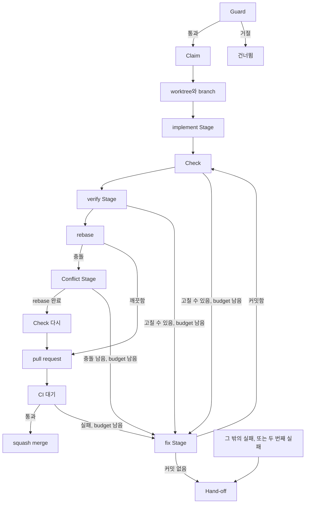
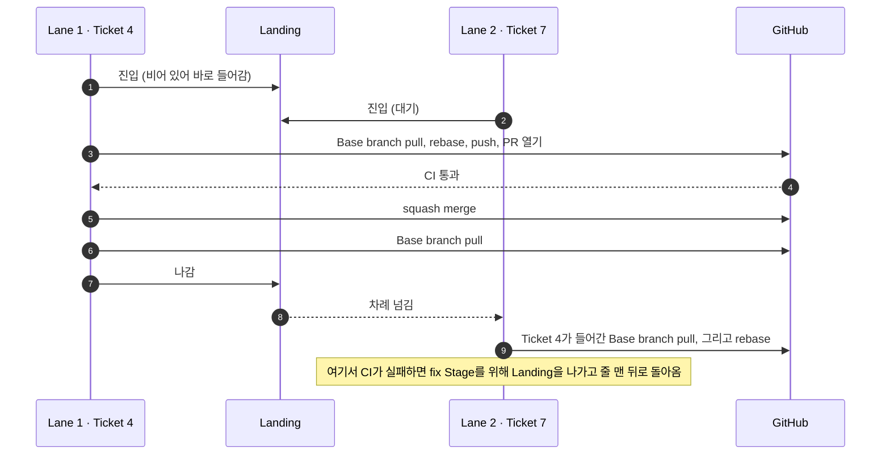

# Ticket 하나가 머지되기까지

Run은 아무도 지켜보지 않으니, 세션 하나의 말만 믿고 머지할 수는 없습니다. 그래서 모든 [Ticket](https://github.com/jjongs2/ticket-runner/blob/main/CONTEXT.md)은 같은 관문을 같은 순서로 지납니다. 결정적인 Check, 작업이 틀렸음을 증명하려 드는 두 번째 세션, 그리고 CI입니다. 새 세션이 고칠 수 있는 실패라면 fix Stage를 딱 한 번 얻고, 그 밖의 실패는 사람에게 넘어갑니다. 한 Run의 Ticket들은 나란히 구현되지만 머지는 하나씩 하므로, CI가 채점한 코드가 그대로 Base branch에 들어갑니다.

이 페이지는 Ticket 하나를 Claim부터 머지까지 따라갑니다. 중간에 멈추는 경우 — Hand-off, Release, Stop, 돌아오지 못한 Run — 는 [멈추고 이어 하기](./stopping-and-resuming.md)에서 다룹니다.

| 단계 | 하는 일 | 판단 주체 | 소스 |
|---|---|---|---|
| Claim | Guard, State file, assign, `ready-for-agent` → `in-progress` | 파이프라인 | [`orchestrator.ts` · `takeTicket`](https://github.com/jjongs2/ticket-runner/blob/main/src/orchestrator.ts) |
| worktree | `.worktrees/ticket-<n>`에 `agent/<n>-<slug>` | git | [`branch.ts` · `branchName`](https://github.com/jjongs2/ticket-runner/blob/main/src/branch.ts) |
| implement Stage | worktree에서 `/mattpocock-skills:implement` 실행 | 에이전트 | [`prompts.ts` · `implementPrompt`](https://github.com/jjongs2/ticket-runner/blob/main/src/prompts.ts) |
| Check | 커밋 안 된 변경이 없는지 본 뒤 Check 명령을 하나씩 실행 | 종료 코드 | [`orchestrator.ts` · `runChecks`](https://github.com/jjongs2/ticket-runner/blob/main/src/orchestrator.ts) |
| verify Stage | Acceptance Criteria를 적대적으로 채점 | Verdict를 읽은 파이프라인 | [`verdict.ts` · `passes`](https://github.com/jjongs2/ticket-runner/blob/main/src/verdict.ts) |
| fix Stage | 실패 내용을 받은 새 세션, Ticket당 한 번 | Fix budget | [`orchestrator.ts` · `fix`](https://github.com/jjongs2/ticket-runner/blob/main/src/orchestrator.ts) |
| Landing | rebase, Conflict Stage, pull request, CI, squash merge | 한 번에 Lane 하나 | [`landing.ts` · `Landing`](https://github.com/jjongs2/ticket-runner/blob/main/src/landing.ts) |
| 머지 이후 | 충족된 기준에 체크, 정리 | 파이프라인 | [`criteria.ts` · `tickMetCriteria`](https://github.com/jjongs2/ticket-runner/blob/main/src/criteria.ts) |


<!-- Sources: src/orchestrator.ts, src/lifecycle.ts -->

fix Stage로 가는 화살표는 Ticket당 한 번만 탈 수 있습니다. 종류와 상관없이 두 번째 실패, 또는 fix Stage가 손쓸 수 없는 실패는 Hand-off입니다. rate limit에 걸린 Stage는 이 그림을 아예 벗어나 Ticket을 release합니다([멈추고 이어 하기](./stopping-and-resuming.md) 참고).

## Claim

아무것도 쓰기 전에 [Guard](./planning.md)부터 돕니다. 파이프라인이 맡지 않을 이슈에 '가져감' 표시가 남는 일은 없습니다. Frontier가 이미 claim된 이슈를 걸러냈더라도 Guard는 다시 확인합니다. 목록을 받은 뒤 Claim하기 전 사이에 Ticket의 주인이 바뀔 수 있기 때문입니다.

그다음 이 순서로 진행합니다.

1. **State file**을 씁니다. Ticket의 branch, 도달한 상태(`claimed`), Fix budget을 썼는지가 담깁니다. 이게 가장 먼저인 이유는, 어떤 State file에도 이름이 없는 Claim만큼은 반드시 막아야 하기 때문입니다. 기록 작업 중 실패하면 Ticket을 실패시키는 건 이것뿐이고, 이후의 기록은 실패해도 로그만 남기고 Run은 계속됩니다.
2. Ticket을 `gh` 사용자에게 assign하고, `in-progress`를 붙이고 `ready-for-agent`를 뗍니다. Stranded Ticket은 이미 이 Claim을 달고 있으니 다시 쓰지 않습니다.
3. Ticket에 아직 유효한 hand-off 댓글이 있으면, 지난 일이라는 표시 한 줄을 덧붙입니다. _Taken again by a later Run; this hand-off is history._

소스: [`orchestrator.ts` · `ResumeRecord`](https://github.com/jjongs2/ticket-runner/blob/main/src/orchestrator.ts), [`handoff.ts` · `markHandoffsTaken`](https://github.com/jjongs2/ticket-runner/blob/main/src/handoff.ts).

## worktree와 branch

| | 값 | 소스 |
|---|---|---|
| branch | `agent/<n>-<slug>`: 제목을 소문자 kebab-case로 바꾸고, 40자 이내에서 단어 경계로 자름 | [`branch.ts` · `branchName`](https://github.com/jjongs2/ticket-runner/blob/main/src/branch.ts) |
| worktree | Target 루트 아래 `.worktrees/ticket-<n>`, gitignore됨 | [`branch.ts` · `worktreePath`](https://github.com/jjongs2/ticket-runner/blob/main/src/branch.ts) |
| 분기 기준 | 방금 fetch한 remote의 Base branch, upstream은 설정하지 않음 | [`git-workspace.ts` · `createWorktree`](https://github.com/jjongs2/ticket-runner/blob/main/src/adapters/git-workspace.ts) |

같은 이름의 branch가 이미 있으면 절대 재사용하지 않습니다. Ticket은 `setup`에서 Hand-off되고, 댓글에 누구의 branch인지와 치우는 명령이 적힙니다. 재개되는 Ticket은 State file에 적힌 branch에서 이어 갑니다. 자세한 내용은 [멈추고 이어 하기](./stopping-and-resuming.md)를 보세요.

## Stage가 도는 방식

[Stage](https://github.com/jjongs2/ticket-runner/blob/main/CONTEXT.md)는 일 하나만 맡는 `claude -p` 자식 프로세스입니다([ADR-0002](https://github.com/jjongs2/ticket-runner/blob/main/docs/adr/0002-claude-p-child-process-per-stage.md)). headless 모드는 프롬프트 안의 `/plugin:skill`을 펼쳐 주는데, `mattpocock-skills` 플러그인(버전 1.2.3)의 사용자 호출형 skill을 구동하는 방법은 이것뿐입니다. Stage마다 프로세스를 따로 두면 Stage별 한도, 답변용 JSON schema, 사람이 붙여 넣어 그대로 재현할 수 있는 명령줄도 함께 얻습니다.

모든 Stage는 Ticket의 worktree에서 `--permission-prompts none`, 설정된 `permissionMode`, 그리고 Stage별 `model`, `effort`, `maxTurns`, `maxMinutes`로 실행됩니다([설정](./configuration.md) 참고). 시간 한도는 프로세스를 kill해서 지킵니다.

| Stage | 프롬프트 첫머리 | 구조화된 답변 | Note |
|---|---|---|---|
| implement | `/mattpocock-skills:implement <issue URL>` | `title`과 `notes`, 선택 | 있음 |
| verify | `Ticket: <issue URL>`, skill 없음 | Verdict, `notes`는 선택 | 있음 |
| fix | `Ticket: <issue URL>`, skill 없음 | `title`과 `notes`, 선택 | 있음 |
| conflict | `/mattpocock-skills:resolving-merge-conflicts` | 없음 | 없음 |

모든 프롬프트에는 같은 self-hosting 안내(파이프라인 자신의 명령을 실행하지 말 것, Stage가 띄우지 않은 프로세스를 kill하지 말 것)가 붙고, 마지막에 설정의 Stage별 `extraPrompt`가 붙습니다. implement 프롬프트에는 무인 세션에서 skill의 약점을 피해 가는 안내가 더 붙습니다. 리뷰 전에 먼저 커밋할 것, `/mattpocock-skills:code-review`를 전체 이름으로 부를 것, 리뷰 sub-agent를 foreground로 돌릴 것, worktree를 깨끗이 남길 것 등입니다. 소스: [`prompts.ts`](https://github.com/jjongs2/ticket-runner/blob/main/src/prompts.ts).

**Stage mark.** 모든 Stage의 셸에는 `TICKET_RUNNER_STAGE=<stage>`가 설정되고, 이 변수가 있으면 CLI는 시작을 거부합니다. 그래서 Stage가 실수로 Ticket을 claim하거나 중첩 Run을 띄울 수 없습니다. 다만 sandbox가 아니라 걸림줄일 뿐이라, 변수를 지운 세션은 통과합니다. 그래서 프롬프트에서도 같은 내용을 말로 한 번 더 전합니다. 소스: [`stage-guard.ts`](https://github.com/jjongs2/ticket-runner/blob/main/src/stage-guard.ts).

**Transcript.** Stage마다 `.ticket-runner/runs/<runId>/<n>/` 아래에 `<stage>.command`, `.stdout`, `.stderr`, `.transcript.jsonl`을 씁니다. 명령줄은 프로세스가 시작하기 전에, 출력은 도착하는 대로 쓰기 때문에 Run이 kill되어도 파일은 남습니다. fix Stage와 그 덕에 얻은 한 바퀴는 `<n>/retry/`에 쓰므로, 실패한 바퀴의 파일도 보존됩니다. 읽는 법은 [실행하기](./running.md)를 보세요.

**Stage가 끝나는 방식.** runner는 세션이 무슨 말을 했는지가 아니라 마지막 `result` 이벤트를 읽습니다.

| 실패 | Progress 칸 | 뜻 |
|---|---|---|
| `timed-out` | `❌ timed out` | `maxMinutes`에서 kill됨 |
| `turn-capped` | `❌ turn capped` | `maxTurns`에 도달함 |
| `rate-limited` | `⏸ rate limited` | 429, 거절된 `rate_limit_event`, 또는 한도를 언급한 메시지. Ticket을 release함 |
| `nonzero-exit` | `❌ exited non-zero` | 그 밖에 실패한 세션 |
| `invalid-result` | `❌ invalid result` | verify Stage가 Verdict를 아예 내놓지 않음 |

소스: [`claude-agent-runner.ts` · `classify`](https://github.com/jjongs2/ticket-runner/blob/main/src/adapters/claude-agent-runner.ts).

## implement Stage

implement skill이 Ticket을 읽고, 만들고, 리뷰합니다. 세션이 끝나면 파이프라인은 [Note](#note)를 보내고, `title`을 기록하고, 커밋이 있으면 branch를 push합니다. 다른 Host의 Run도 거기서 이어 갈 수 있게 하려는 것입니다. 그다음은 이렇습니다.

- 끝까지 가지 못한 Stage는 `implement`에서 Hand-off됩니다.
- Base branch보다 커밋이 하나도 늘지 않은 branch도 Hand-off됩니다. 조용히 포기한 에이전트는 채점할 거리를 남기지 않기 때문입니다.
- 그 외에는 State file이 `implemented`로 넘어가, 이후 어떤 Run도 이 Stage 비용을 다시 치르지 않습니다.

## Check

에이전트가 아니라 파이프라인이 직접 여는 관문이 둘 있습니다.

1. **커밋 안 된 변경 없음.** 어떤 커밋에도 없는 변경이 worktree에 있으면 실패이고, 해당 경로를 전부 알려 줍니다. 설치한 의존성 같은 gitignore 파일은 세지 않습니다.
2. **Check 명령**을 순서대로, worktree의 셸에서, 각각 `checkTimeoutMinutes`(기본 15분) 안에 실행합니다. 처음 실패한 곳에서 멈춥니다. 한도에서 kill된 명령은 timed out으로 보고되고, 실패가 아니라 멈춰 있었다는 한 줄이 출력 뒤에 붙습니다.

명령은 설정의 `checks`에서 가져오고, 없으면 `package.json`에 정의된 쪽의 `npm test`와 `npm run typecheck`를 씁니다. `gates.checks`가 켜져 있는데 명령이 하나도 없으면 Run은 시작을 거부합니다. `gates.checks`를 끄면 명령 없이도 Run을 시작할 수 있게 될 뿐이고, 코드상 설정된 명령은 여전히 실행됩니다. 소스: [`startup.ts` · `startupMessages`](https://github.com/jjongs2/ticket-runner/blob/main/src/startup.ts).

두 실패 모두 Fix budget을 씁니다. Check는 branch 자신의 코드를 돌리므로, 멈춰 버리는 것도 그 코드의 결함이고, 바로 fix Stage가 할 일이기 때문입니다.

## verify Stage와 Verdict

plugin skill 없이 새로 띄운 세션이 각 Acceptance Criterion이 충족되지 **않았음**을 증명하려고 합니다. 세션을 따로 두는 건 코드를 쓴 세션과 채점을 떼어 놓기 위해서입니다. 이 세션은 본문과 댓글에서 기준을 읽고, 코드를 돌려 보고, 버릴 테스트를 써도 되지만 커밋은 하면 안 됩니다. 끝나면 파이프라인이 worktree에서 `git reset --hard`와 `git clean -fd`를 실행해, 임시 파일이 pull request에 섞이지 않게 합니다. 그 정리로 임시 작업이 사라지니, Note는 그보다 먼저 보냅니다.

**Verdict**는 기준마다 `text`, `status`(`met`, `unmet`, `unverifiable`), `evidence`를 담고, 에이전트 자신의 `pass`도 담습니다. 에이전트의 `pass`는 참고일 뿐이고, 파이프라인이 직접 판단합니다. 기준은 **`unmet`이 하나도 없고 `met`이 하나 이상**일 것입니다.

| Verdict | Progress 칸 | 결과 |
|---|---|---|
| 통과 | `✅ <k> met · <v> unverifiable` | Landing으로 |
| `unmet`이 있음 | `❌ <u> unmet` | Fix budget을 씀. fix Stage는 충족되지 않은 기준과 그 evidence를 받음 |
| 전부 `unverifiable` | `❌ no evidence` | Hand-off. 머지할 근거가 없음 |
| 없거나 형식이 틀림 | `❌ no Verdict` | Hand-off |

소스: [`orchestrator.ts` · `verify`](https://github.com/jjongs2/ticket-runner/blob/main/src/orchestrator.ts), [`verdict.ts`](https://github.com/jjongs2/ticket-runner/blob/main/src/verdict.ts).

## fix Stage와 Fix budget

[Fix budget](https://github.com/jjongs2/ticket-runner/blob/main/CONTEXT.md)은 Ticket당 fix Stage 한 번입니다. fix Stage는 같은 branch에서 plugin skill 없이 새로 띄운 세션입니다. implement skill을 쓰면 Ticket을 다시 읽고 처음부터 시작해 버리는데, 여기서 바라는 건 구체적인 결함 하나를 고치는 것이기 때문입니다. 프롬프트에는 실패의 종류, 한 줄 요약, 그리고 코드 블록에 담긴 evidence가 들어갑니다. 실패를 재현하고, 원인을 고치고, 충족되지 않은 기준에는 회귀 테스트를 더하고, Ticket 범위를 벗어나지 말라고 요청합니다.

새 세션이 고칠 수 있는 결함만 budget을 씁니다.

| 실패 | 위치 | budget을 쓰나? |
|---|---|---|
| 어떤 커밋에도 없는 변경 | checks | 예 |
| Check가 실패하거나 시간 초과 | checks | 예 |
| `unmet` 기준 | verify | 예 |
| Conflict Stage가 rebase를 끝내지 못함 | rebase | 예 |
| pull request check 실패 | ci | 예 |
| 끝까지 가지 못한 Stage(시간 초과, turn 한도, non-zero, invalid result) | 해당 Stage | 아니요, Hand-off |
| implement가 커밋을 남기지 않음 | implement | 아니요, Hand-off |
| evidence가 없는 Verdict, 또는 Verdict 없음 | verify | 아니요, Hand-off |
| Conflict Stage를 띄우지 못했거나 git에 상태를 물을 수 없음 | rebase | 아니요, Hand-off |
| Base branch를 pull하지 못함 | rebase | 아니요, Hand-off |
| push나 pull request 열기가 실패 | pr | 아니요, Hand-off |
| CI 시간 초과, conflicting, check 없음 | ci | 아니요, Hand-off |
| 머지 실패 | merge | 아니요, Hand-off |
| 어디서든 rate limit | 어디든 | 아니요, Release |

fix Stage가 끝나면 Ticket은 Check부터 다시 시작합니다. verify Stage를 포함해 모든 관문이 수정본을 다시 채점합니다. fix Stage 후 branch가 자라지 않았다면 곧바로 Hand-off입니다. 아무도 건드리지 않은 branch를 다시 채점해 봐야 똑같이 실패할 뿐이기 때문입니다. squash나 amend로 짧아진 branch도 자라지 않은 것으로 봅니다. 종류와 상관없이 두 번째 실패는 Hand-off이고, hand-off 댓글에 budget을 이미 썼다고 적힙니다.

budget 사용 여부는 fix Stage가 돌아온 뒤 State file에 기록됩니다. rate limit으로 멈춘 fix Stage는 아무것도 쓰지 않습니다. Release는 이미 쓴 budget을 다음 Run으로 그대로 넘기고, Hand-off는 budget을 되돌려 줍니다. Ticket은 사람 손을 거쳐야만 돌아오기 때문입니다.

소스: [`lifecycle.ts` · `FailureKind`](https://github.com/jjongs2/ticket-runner/blob/main/src/lifecycle.ts), [`orchestrator.ts` · `takeTicket`](https://github.com/jjongs2/ticket-runner/blob/main/src/orchestrator.ts).

## Lane과 Frontier 다시 채우기

Run은 [Lane](https://github.com/jjongs2/ticket-runner/blob/main/CONTEXT.md) 수만큼 Ticket을 동시에 쥡니다. `--lanes`, 없으면 설정의 `lanes`, 그것도 없으면 하나입니다. 시작할 때 빈 Lane을 모두 채우고, Lane의 Ticket이 끝나는 즉시 다시 채웁니다.

1. 먼저 [Stranded Ticket](./stopping-and-resuming.md). 첫 채우기 전에 한 번 찾아 둡니다.
2. 그다음 Frontier. **채울 때마다 새로 계산**합니다. 아무도 assign되지 않은 열린 `ready-for-agent` 이슈 중 native blocker가 모두 닫힌 것을, 번호가 낮은 순으로 고릅니다.

매번 다시 계산하는 게 Ticket끼리 부딪히지 않게 하는 장치입니다. blocker를 닫은 머지가 있으면 그 덕에 풀린 Ticket이 같은 Run에 들어오고, 다른 Lane이 아직 작업 중인 Ticket은 여전히 열린 blocker로 남습니다. 어떤 Ticket끼리 함께 돌려도 안전한지 휴리스틱으로 정하지 않고, `blocked by` 관계가 정합니다. Ticket 번호를 받은 Run은 같은 규칙을 그 번호들에만 적용합니다([실행하기](./running.md)).

Lane들은 서로 다른 worktree에서 동시에 Check를 돌리므로, Check가 포트나 데이터베이스를 공유하는 Target은 Lane을 하나로 두세요. Release나 Stop이 오면 더는 채우지 않고, 바쁜 Lane은 쥔 일을 마칩니다. 소스: [`run.ts` · `processRun`](https://github.com/jjongs2/ticket-runner/blob/main/src/run.ts), [`frontier.ts` · `selectFrontier`](https://github.com/jjongs2/ticket-runner/blob/main/src/frontier.ts).

## Landing

[Landing](https://github.com/jjongs2/ticket-runner/blob/main/CONTEXT.md)은 rebase 직전의 Base branch pull부터 머지 직후의 pull까지입니다. 한 번에 Ticket 하나만, 도착한 순서대로 들어가므로, Ticket의 rebase와 머지 사이에 Base branch가 움직일 수 없습니다([ADR-0005](https://github.com/jjongs2/ticket-runner/blob/main/docs/adr/0005-landing-is-a-serialized-section.md)). 시간이 많이 드는 implement와 verify는 계속 병렬로 돕니다. 대신 한 Lane의 Conflict Stage나 느린 CI가 다른 Lane의 Landing을 붙잡아 둡니다. GitHub merge queue는 저장소 설정 하나를 Target readiness의 일부로 만들어 버리기 때문에 채택하지 않았습니다.


<!-- Sources: src/landing.ts, src/orchestrator.ts -->

Ticket은 fix Stage, Hand-off, Release 때도 Landing을 나가므로, 누구도 세션 하나를 기다리며 서 있지 않습니다. 소스: [`landing.ts` · `Landing`](https://github.com/jjongs2/ticket-runner/blob/main/src/landing.ts).

### rebase

먼저 Base branch를 remote에 맞춥니다. checkout되어 있으면 `git pull --ff-only`, 아니면 ref만 fetch합니다. 그다음 worktree에서 `git rebase <base>`를 실행합니다. 깨끗하게 끝나면 바로 pull request로 갑니다. 충돌이 나면 git이 멈춘 그 자리에 그대로 두고 Conflict Stage에 넘깁니다.

### Conflict Stage

충돌은 branch의 결함이 아닙니다. 그 아래에서 Base branch가 앞으로 나간 것뿐입니다. 그래서 멈춘 rebase 안에서 [Conflict Stage](https://github.com/jjongs2/ticket-runner/blob/main/CONTEXT.md) 하나가 git 출력과 함께 `/mattpocock-skills:resolving-merge-conflicts`를 구동하고, **Fix budget은 쓰지 않습니다.** 이 Stage에는 rebase를 끝까지 마치고 절대 abort하지 말 것, 양쪽이 양립하면 두 의도를 모두 살리고 아니면 Ticket 쪽을 따를 것, 충돌하지 않은 파일은 건드리지 말 것을 요청합니다.

**판단은 세션의 종료 상태가 아니라 worktree가 합니다.** 다음을 모두 만족해야 rebase가 해결된 것으로 봅니다.

- 진행 중인 rebase가 없다.
- Base branch가 branch의 조상이다. 조용히 `git rebase --abort`를 실행한 세션을 여기서 잡아냅니다.
- Base branch와 branch 사이에 머지 커밋이 없다. 머지로도 조상 조건은 채울 수 있기 때문입니다.
- unmerged 경로가 없다.
- 추적 여부와 상관없이 어떤 파일에도 충돌 마커가 없다(ignore된 파일과 바이너리는 제외).

| worktree 상태 | 결과 |
|---|---|
| 해결됨, 세션이 어떻게 끝났든(rate limit이어도) | `✅ rebased`. push한 뒤 **Check를 다시 돌림**. 해결 내용은 어떤 관문도 본 적 없는 코드이기 때문. verify는 다시 하지 않음. 이 Stage는 기준이 다루는 동작을 바꾸지 않도록 지시받음 |
| 해결 안 됨, 세션이 rate limit에 걸림 | rebase를 abort하고 Release |
| 그 밖의 이유로 해결 안 됨 | `❌ unresolved`. rebase를 abort하고, 충돌 내용과 남은 문제를 evidence로 Fix budget을 씀 |
| Stage를 띄우지 못했거나 git에 물을 수 없음 | `❌ unknown`. rebase를 abort하고 Hand-off |

abort는 항상 실행되므로, fix Stage나 사람이 반쯤 끝난 rebase를 물려받는 일은 없습니다. 소스: [`orchestrator.ts` · `resolveConflict`](https://github.com/jjongs2/ticket-runner/blob/main/src/orchestrator.ts), [`git-workspace.ts` · `rebaseState`](https://github.com/jjongs2/ticket-runner/blob/main/src/adapters/git-workspace.ts).

### pull request

rebase로 branch가 다시 쓰였으니 `--force-with-lease`로 push합니다. Base branch를 향한 ready(draft 아님) pull request를 새로 열거나, 이미 있는 것을 갱신합니다. 갱신할 때는 제목과 본문을 새로 쓰고 draft에서 꺼냅니다. draft에서는 workflow가 아예 돌지 않는 경우가 많아서, Hand-off 때 남은 draft를 그대로 두면 'check 없음'으로 읽히기 때문입니다.

**제목**은 다음 중 커밋 컨벤션 모양 `<type>(<scope>): <summary>`에 맞는 한 줄짜리 첫 번째 후보입니다(끝의 `(#<n>)`는 떼어 냄).

1. implement나 fix Stage가 branch 전체에 대해 마지막으로 답한 `title`. 이번 Run의 것이든, 이전 Run이 State file에 기록한 것이든 상관없습니다.
2. branch의 첫 커밋 제목.
3. Ticket 제목 그대로.

제목을 커밋에서 읽지 않고 Stage에게 답으로 받는 건, 커밋 제목은 그 커밋 하나만 설명하기 때문입니다. 그렇지 않으면 작업 대부분을 한 fix Stage도, 첫 커밋이 이미 push된 branch의 제목을 바꿀 방법이 없습니다. 소스: [`title.ts` · `pullRequestTitle`](https://github.com/jjongs2/ticket-runner/blob/main/src/title.ts).

**본문**은 `Closes #<n>`, Verdict 집계, 접힌 기준 목록(`met`이 아닌 것은 evidence 표시), 그리고 Run을 밝히는 한 줄입니다. workstation에서는 그 줄이 `.ticket-runner/runs/<runId>/<n>/`도 가리킵니다. cloud Host의 run 디렉터리는 세션과 함께 사라지므로 거기서는 Run만 밝힙니다. 소스: [`templates.ts` · `pullRequestBody`](https://github.com/jjongs2/ticket-runner/blob/main/src/templates.ts).

### CI 대기와 유예 시간

파이프라인은 head 커밋의 check run과 commit status를 15초마다 확인합니다. 결과가 정해지거나 `ciTimeoutMinutes`(기본 30분)가 다 될 때까지입니다.

| GitHub 상태 | Progress 칸 | 결과 |
|---|---|---|
| 모든 check가 통과하거나 skip됨 | `✅ passed` | 머지 |
| check가 실패, 취소, 시간 초과, action 필요, 시작 실패 중 하나 | `❌ failed` | Fix budget을 씀. evidence는 실패한 Actions job 최대 세 개의 로그 끝부분 |
| 시간 초과 시점에 check가 아직 pending | `❌ timed out` | Hand-off |
| check가 없고 GitHub가 pull request를 conflicting으로 판단 | `❌ conflicting` | 곧바로 Hand-off. GitHub가 check를 돌리지 않음. 그사이 사람이 머지한 경우에만 생김 |
| 유예 시간이 지나도 check 없음, `gates.ci` 켬 | `❌ no checks` | Hand-off |
| 유예 시간이 지나도 check 없음, `gates.ci` 끔 | `⚠️ no checks` | 경고 행과 함께 머지 |

**유예 시간.** pull request가 막 열린 직후에는 workflow의 check run이 생기기 전까지 GitHub가 한동안 'check 없음'이라고 답합니다. 3분 넘게 걸린 적도 있습니다. 그래서 'check 없음'은 `ciGraceMinutes`(기본 5분, CI 시간 한도보다 길어지지 않음)가 지난 뒤에야 인정합니다. CI workflow가 없는 Target은 Landing마다 이 시간을 한 번씩 치릅니다. 소스: [`gh-tracker.ts` · `waitForCi`](https://github.com/jjongs2/ticket-runner/blob/main/src/adapters/gh-tracker.ts).

### squash merge와 커밋 메시지

파이프라인은 GitHub REST API로 squash merge하며, 커밋 메시지는 직접 조립합니다.

```text
<title> (#<pr>)

Closes #<n>

Verdict: <k> met · <u> unmet · <v> unverifiable

- <branch commit subject>
- <branch commit subject>

Co-authored-by: <name> <email>
```

제목은 pull request 제목입니다. 커밋 제목들과 `Co-authored-by` trailer는 rebase 이후에 읽습니다. 실제로 들어가는 커밋이 그것이기 때문입니다. `git log`는 HTML을 렌더링하지 않으니, 기준별 evidence는 pull request 본문에만 둡니다. 소스: [`templates.ts` · `squashCommit`](https://github.com/jjongs2/ticket-runner/blob/main/src/templates.ts).

### 머지 이후

Ticket은 이미 머지됐으니 여기서부터는 Hand-off될 수 없습니다. 단계마다 실패하면 로그만 남기고 다음 단계로 넘어갑니다.

1. State file을 지웁니다. Ticket이 다시는 재개 가능해 보이지 않게 하려는 것입니다.
2. 충족된 기준에 체크합니다(아래 참고).
3. `in-progress`를 뗍니다. 이슈는 머지로 이미 닫혔습니다.
4. Base branch를 pull합니다. 여기서 Landing이 끝나고, 다음 Lane의 Ticket은 이 Ticket이 들어간 Base branch 위로 rebase합니다.
5. worktree와 로컬 branch를 지우고, GitHub가 아직 지우지 않았으면 remote branch도 지웁니다.

## 보드에 남기는 기록

**Progress comment.** Ticket마다 [Progress comment](https://github.com/jjongs2/ticket-runner/blob/main/CONTEXT.md)가 하나 있습니다. 숨은 마커로 다시 찾아 단계가 끝날 때마다 제자리에서 고쳐 쓰므로, 알림은 첫 작성 때만 갑니다. 첫 행이 기록될 때 처음 올라갑니다. Ticket을 다룬 Run마다 자기 섹션을 가지며, 이전 Run들의 섹션 아래에 Version, Run id, branch를 머리글로 달고 붙습니다.

```text
**ticket-runner** `0.4.0` · run `2026-09-17T09-00-00-000` · `agent/4-planning-guards`

| Stage | Outcome | Turns | Duration |
|---|---|---|---|
| implement | ✅ committed | 46 | 21m |
| checks | ❌ `npm test` failed | – | 2m |
| fix | ✅ committed | 12 | 6m |
| checks | ✅ passed | – | 2m |
| verify | ✅ 6 met · 1 unverifiable | 9 | 4m |
| ci | ✅ passed | – | 3m |
| merge | ✅ #31 | – | – |
```

행에는 몇 단어만 적습니다. 사람이 행동해야 하는 것은 알림을 받을 가치가 있으니 따로 댓글로 올립니다. hand-off, guard 경고, Note가 그렇습니다. 사람에게서 Ticket을 되가져오는 Run은 새 Progress comment를 시작하고, 사람이 읽은 댓글은 그대로 둡니다. 댓글 작성이 실패해도 Ticket에는 영향이 없습니다. 소스: [`progress.ts` · `Progress`](https://github.com/jjongs2/ticket-runner/blob/main/src/progress.ts).

**충족된 기준에 체크.** 머지 뒤에는 Verdict가 `met`으로 판정한 기준마다, 그것이 적힌 곳이 본문이든 댓글이든(예: triage가 brief를 올린 댓글) 찾아서 체크합니다(`- [ ]` → `- [x]`). 공백과 대소문자 차이만 봐줍니다. `unverifiable` 기준은 아무도 근거를 모으지 않았으니 체크하지 않습니다. Stage가 문구를 크게 바꿔 맞출 수 없는 기준도 그대로 두고, 몇 개를 맞추지 못했는지 Run 로그에 남깁니다. 소스: [`criteria.ts` · `tickMetCriteria`](https://github.com/jjongs2/ticket-runner/blob/main/src/criteria.ts).

## Note

Stage는 자기 Ticket과 상관없는 결함을 자주 만납니다. 고치면 verify가 채점하는 범위를 넘어 Ticket이 넓어지고, 무시하면 transcript 속에 묻혀 버립니다. 그래서 implement, verify, fix Stage는 [Note](https://github.com/jjongs2/ticket-runner/blob/main/CONTEXT.md) 목록을 남기며 끝나고, 파이프라인은 각 Note를 사람이 볼 만한 곳에 올립니다. Note는 결함이어야 하고, 취향이나 리팩터링, 있으면 좋을 테스트는 Note가 아닙니다. 지금 Ticket 안에서 손대지도 않습니다. verify의 경우, 기준에 대한 판단은 Note가 아니라 Verdict에 들어갑니다.

Note에는 `summary`(필수)와 선택 항목 `evidence`, `impact`, `next`, `ticket`이 있습니다. Note는 Stage 자체의 결과를 판정하기 전에 보내므로, turn이 바닥난 Stage도 알아챈 것은 전합니다.

| Note가 가리키는 곳 | 가는 곳 |
|---|---|
| 열려 있고, claim되지 않았고, Spec이 아닌 Ticket | 그 Ticket의 댓글 |
| Ticket 없음, 또는 Stage 자신의 Ticket(곧 닫힐 것) | standing Notes 이슈 |
| 닫혔거나, claim됐거나(`in-progress`), Spec인 이슈 | standing Notes 이슈. 원래 어느 Ticket 몫이었고 왜 그쪽으로 가지 않았는지 함께 적음 |
| 댓글을 받지 않는 번호(지어낸 번호, 잠긴 이슈) | standing Notes 이슈. 원래 가려던 번호와 함께 |

**standing Notes 이슈**는 Note를 댓글로 모으는, 열린 `needs-triage` 이슈 하나입니다. 제목은 "Notes from the pipeline"입니다. 제목이 아니라 본문의 마커로 찾으므로, 이름을 바꿔도 두 번째 이슈가 생기지 않습니다. 필요한 첫 Note가 열고, Run의 모든 Lane이 함께 씁니다. triage가 손으로 비운 뒤 닫으면, 다음 Note가 새로 엽니다. 열려 있는 동안에는 Note를 쓰는 Stage의 프롬프트에 그 번호가 들어가, 이미 보고된 내용을 읽고 읽는 사람의 판단을 바꿀 만한 것만 더하게 합니다.

Note 댓글은 출처(`From #<origin> <stage>`)로 시작하고, 이어서 굵은 요약과 항목별 라벨이 붙은 내용이 옵니다. 줄 머리의 `- [ ]`는 escape되므로, Note가 Acceptance Criteria로 읽히는 일은 없습니다. 올리지 못한 Note는 그 Note 하나만 잃을 뿐, Ticket에는 영향을 주지 않습니다. Run 요약에는 각 Note가 그것을 만든 Ticket 아래 `noted` 행으로 나옵니다.

소스: [`notes.ts` · `routeNotes`](https://github.com/jjongs2/ticket-runner/blob/main/src/notes.ts), [`templates.ts` · `noteComment`](https://github.com/jjongs2/ticket-runner/blob/main/src/templates.ts).

## 관련 페이지

- [계획하기](./planning.md): Claim 전에 도는 Guard, verify가 채점할 수 있는 Acceptance Criteria 쓰는 법.
- [실행하기](./running.md): Run 시작, `--lanes`, 범위를 좁힌 Run, 요약, 종료 코드, transcript.
- [설정](./configuration.md): `checks`, `gates`, Stage 한도, `ciTimeoutMinutes`, `ciGraceMinutes`.
- [멈추고 이어 하기](./stopping-and-resuming.md): Hand-off, Release, Stop, Stranded Ticket, Ticket 되돌려 주기.
- [내부 구조](./internals.md): 각 단계 뒤의 port와 adapter.

## 참고 자료

- [`src/orchestrator.ts`](https://github.com/jjongs2/ticket-runner/blob/main/src/orchestrator.ts): `processTicket`, `takeTicket`, `verify`, `fix`, `resolveConflict`, `requireGreenCi`
- [`src/run.ts`](https://github.com/jjongs2/ticket-runner/blob/main/src/run.ts), [`src/frontier.ts`](https://github.com/jjongs2/ticket-runner/blob/main/src/frontier.ts), [`src/landing.ts`](https://github.com/jjongs2/ticket-runner/blob/main/src/landing.ts)
- [`src/prompts.ts`](https://github.com/jjongs2/ticket-runner/blob/main/src/prompts.ts), [`src/verdict.ts`](https://github.com/jjongs2/ticket-runner/blob/main/src/verdict.ts), [`src/title.ts`](https://github.com/jjongs2/ticket-runner/blob/main/src/title.ts), [`src/lifecycle.ts`](https://github.com/jjongs2/ticket-runner/blob/main/src/lifecycle.ts)
- [`src/progress.ts`](https://github.com/jjongs2/ticket-runner/blob/main/src/progress.ts), [`src/criteria.ts`](https://github.com/jjongs2/ticket-runner/blob/main/src/criteria.ts), [`src/notes.ts`](https://github.com/jjongs2/ticket-runner/blob/main/src/notes.ts), [`src/templates.ts`](https://github.com/jjongs2/ticket-runner/blob/main/src/templates.ts), [`src/handoff.ts`](https://github.com/jjongs2/ticket-runner/blob/main/src/handoff.ts)
- [`src/stage-guard.ts`](https://github.com/jjongs2/ticket-runner/blob/main/src/stage-guard.ts), [`src/run-log.ts`](https://github.com/jjongs2/ticket-runner/blob/main/src/run-log.ts), [`src/startup.ts`](https://github.com/jjongs2/ticket-runner/blob/main/src/startup.ts), [`src/config.ts`](https://github.com/jjongs2/ticket-runner/blob/main/src/config.ts)
- [`src/adapters/claude-agent-runner.ts`](https://github.com/jjongs2/ticket-runner/blob/main/src/adapters/claude-agent-runner.ts), [`src/adapters/git-workspace.ts`](https://github.com/jjongs2/ticket-runner/blob/main/src/adapters/git-workspace.ts), [`src/adapters/gh-tracker.ts`](https://github.com/jjongs2/ticket-runner/blob/main/src/adapters/gh-tracker.ts)
- [ADR-0002](https://github.com/jjongs2/ticket-runner/blob/main/docs/adr/0002-claude-p-child-process-per-stage.md): Stage마다 `claude -p` 자식 프로세스 하나
- [ADR-0005](https://github.com/jjongs2/ticket-runner/blob/main/docs/adr/0005-landing-is-a-serialized-section.md): Landing은 직렬화된 구간
- [`docs/templates/`](https://github.com/jjongs2/ticket-runner/blob/main/docs/templates/README.md): Progress comment, pull request 본문, squash 커밋, Note 댓글의 정확한 모양
