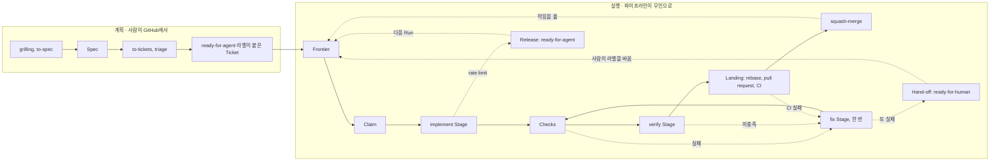

# ticket-runner

계획은 사람이, 실행은 파이프라인이.

기능을 계획하는 일에는 판단이 필요하니 사람 몫으로 남겨 둡니다. 사람은 GitHub에 이슈를 쓰고, 이슈마다 체크박스로 된 [Acceptance Criteria](https://github.com/jjongs2/ticket-runner/blob/main/CONTEXT.md)를 달고, 막는 이슈를 연결한 뒤 `ready-for-agent` 라벨을 붙입니다. 그다음부터 merge까지는 되풀이되는 일이라 파이프라인이 무인으로 처리합니다. [Ticket](https://github.com/jjongs2/ticket-runner/blob/main/CONTEXT.md)마다 헤드리스 Claude Code 세션에 구현을 맡기고, 저장소의 테스트를 직접 돌리고, 두 번째 세션에게 기준이 충족되지 않았음을 증명해 보라고 시킨 다음, pull request를 열고 CI를 기다려 squash-merge합니다. 끝내지 못한 일은 draft pull request와 코멘트를 남겨 사람에게 돌려줍니다.

::: warning 있는 그대로 공개합니다
ticket-runner는 개인 도구이며, MIT 라이선스로 있는 그대로 공개합니다. 지원이나 수정, Version 사이의 호환을 약속하지 않습니다. 소중한 저장소에 쓰기 전에 코드를 먼저 읽어 보세요.
:::

## 빠르게 시작하기 {#quick-start}

Node 22 이상, `git`, 인증된 [`gh`](https://cli.github.com/), 그리고 `mattpocock-skills` 플러그인 1.2.3 버전이 설치된 `claude`가 필요합니다. 전체 목록은 [설치](./guide/installation.md)에 있습니다.

```bash
npm install -g ticket-runner   # 먼저 써 보려면: npx ticket-runner init

cd ~/code/acme                 # 파이프라인이 일할 저장소
ticket-runner init             # 준비해 두고, 사람이 고칠 것을 알려 줌
ticket-runner run              # 준비된 Ticket을 모두 merge까지
```

`init`은 알려 준 항목 중 하나라도 아직 사람이 고칠 게 남아 있으면 `1`로 끝납니다. 그래서 `ticket-runner init && ticket-runner run`은 어차피 안 될 Run을 시작하기 전에 멈춥니다. Run은 [계획](./guide/planning.md)이 쓸 수 있게 만들어 둔 이슈만 가져갑니다. `ready-for-agent` 라벨이 있고, `- [ ]` 기준이 있고, GitHub 자체의 `blocked by` 연결로만 막혀 있는 이슈입니다.

## 전체 흐름 {#the-whole-flow}


<!-- Sources: src/run.ts, src/orchestrator.ts, src/frontier.ts, src/guards.ts -->

rate limit은 implement만이 아니라 어느 Stage에서든 걸릴 수 있고, 어디서 걸리든 Release로 끝납니다. 실행 쪽 절반은 [Ticket 하나가 merge되기까지](./guide/ticket-to-merge.md)에서 한 단계씩 따라가 봅니다.

## 가이드 {#the-guide}

| 페이지 | 이런 걸 볼 때 |
|---|---|
| [설치와 제거](./guide/installation.md) | 요구 사항, npm 설치, `init`, Run이 Target에 요구하는 것, `remove`, 삭제 |
| [일 계획하기](./guide/planning.md) | 이슈를 Ticket으로 만드는 것: Spec, Acceptance Criteria, 네이티브 blocker, 라벨, Guard |
| [실행하기](./guide/running.md) | `run`, `--lanes`, 좁힌 Run, `stop`, `-v`, 요약과 종료 코드, 로그, Claude 앱에서 실행하기 |
| [설정](./guide/configuration.md) | `ticket-runner.json`의 모든 필드 |
| [Ticket 하나가 merge되기까지](./guide/ticket-to-merge.md) | Stage, Fix budget, Lane과 Landing, rebase 충돌, 보드에 남기는 것, Note |
| [멈추고 이어 하기](./guide/stopping-and-resuming.md) | Hand-off, Release, Stop과 kill, Stranded Ticket, Ticket 돌려주기, Run lock과 State branch |
| [내부 구조](./guide/internals.md) | 포트와 어댑터, 모듈 지도, Version, ADR 요약, 파이프라인 자체를 고치는 법 |

파이프라인이 쓰는 용어(Ticket, Run, Stage, Lane 등)는 [용어집](https://github.com/jjongs2/ticket-runner/blob/main/CONTEXT.md) 한곳에 정의되어 있습니다.
